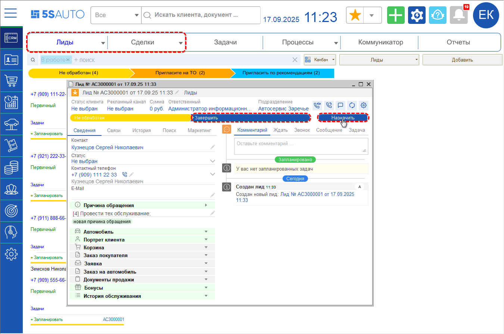
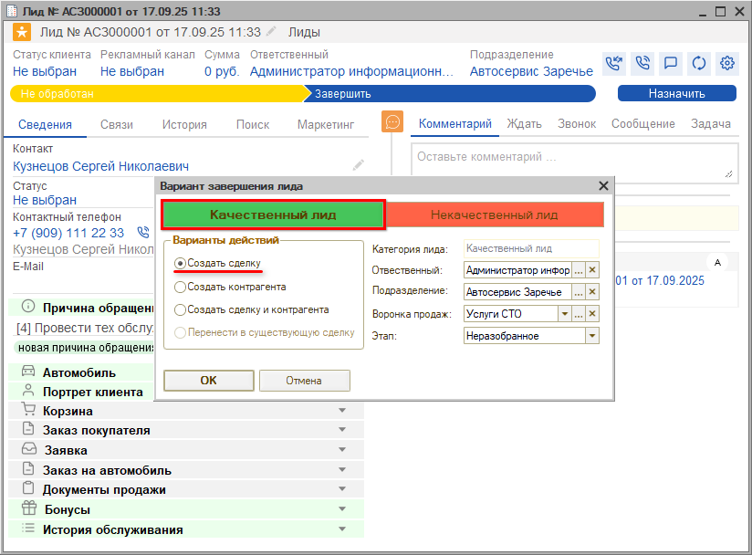
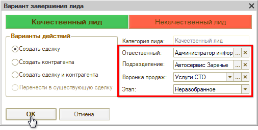
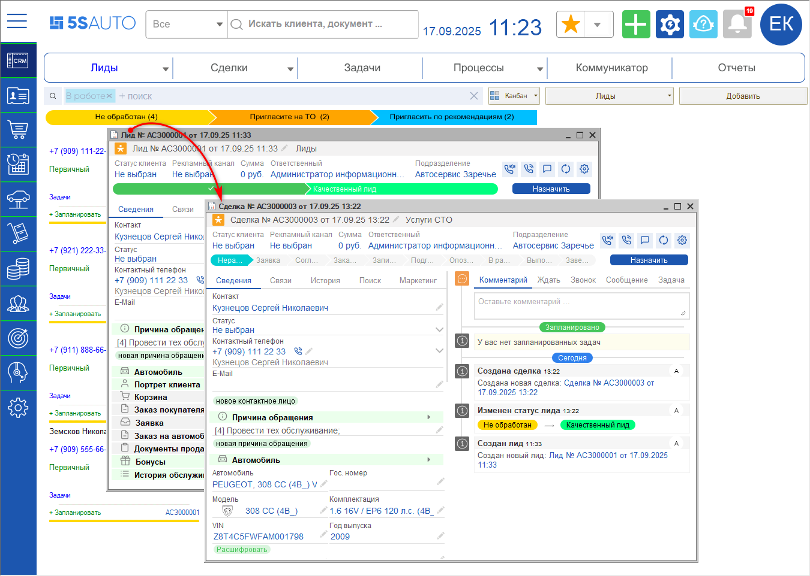
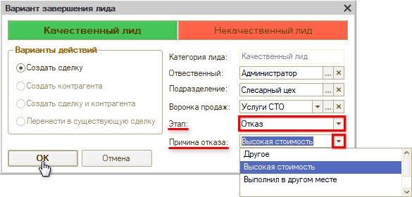
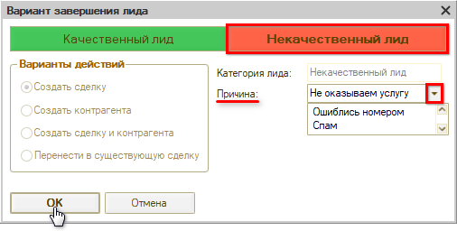

# Как квалифицировать Лид

<table><tr><td><b>Время чтения:</b> 5 мин.</td><td><b>Обновлено:</b> 17.09.2025</td></tr></table>

Источник: https://www.5systems.ru/help/kak-kvalificirovat-lid

*Лиды* на канбане отдельно выделяются при *классическом режиме работы CRM*. Подробнее см. статью *“[Режимы работы CRM](../../../articles/5S%20AUTO/CRM/Режимы%20работы%20CRM/rezhimy-raboty-crm.md)”.*

Сотрудник сервиса определяет, качественный лид или нет:

- *Некачественный лид* – это нецелевой лид, например, если ошиблись номером, или сервис не оказывает нужную клиенту услугу;
- *Качественный лид* – если клиент обратился по адресу, при этом могут быть два варианта:
  - если клиент согласился на услугу, тогда сотрудник вручную переводит этот Лид в *Сделку,* т.е. Лид успешно завершен;
  - если клиент подходящий, но отказывается от услуги (например, ему дорого), то Лид завершается переводом в *отказ* с указанием причины.

1. Для перевода *Лида* в *Сделку* следует на форме лида установить этап *“Завершить”* и нажать кнопку *“Назначить текущим”:*

   

   В открывшемся окне *“Вариант завершения лида”* по умолчанию будет выбран вариант *“Качественный лид”* и вариант действий *“Создать сделку”:*

   

   Если клиент первичный, можно выбрать вариант действий "Создать сделку и контрагента".

   Далее следует выбрать параметры:

   - *ответственного;*
   - *подразделение* и *воронку продаж, –* например, если у компании помимо автосервиса есть магазин автозапчастей или мойка;
   - *этап:* по умолчанию устанавливается первый этап канбана сделок. Этап "Отказ" следует выбирать, если лид качественный, т.е. целевой, но клиент отказывается записываться на ремонт или заказывать запчасть, – например, из-за высокой стоимости.

   После установки параметров нажать *“ОК":*

   

   Из Лида будет создана *Сделка:*

   

2. Для *перевода Лида в отказ,* т.е. если Лид целевой, но клиент отказывается записываться на ремонт или заказывать запчасть, – например, из-за высокой стоимости, – следует выбрать этап "Отказ", указать причину отказа и нажать "ОК":

   

3. Если Лид *нецелевой,* следует выбрать категорию "Некачественный лид", нажав соответствующую кнопку, указать причину и нажать "ОК":

   

*Примечание:* Если лид нецелевой по причине того, что компания не оказывает услугу, за которой обращается клиент, имеет смысл вести статистику *пользующихся спросом услуг* с целью расширения перечня своих услуг в будущем.

---

**Теги:** CRM, сделка, лид, квалификация, неразобранное
