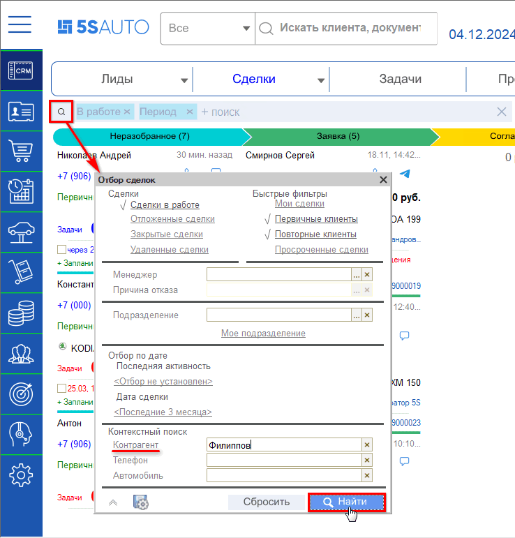
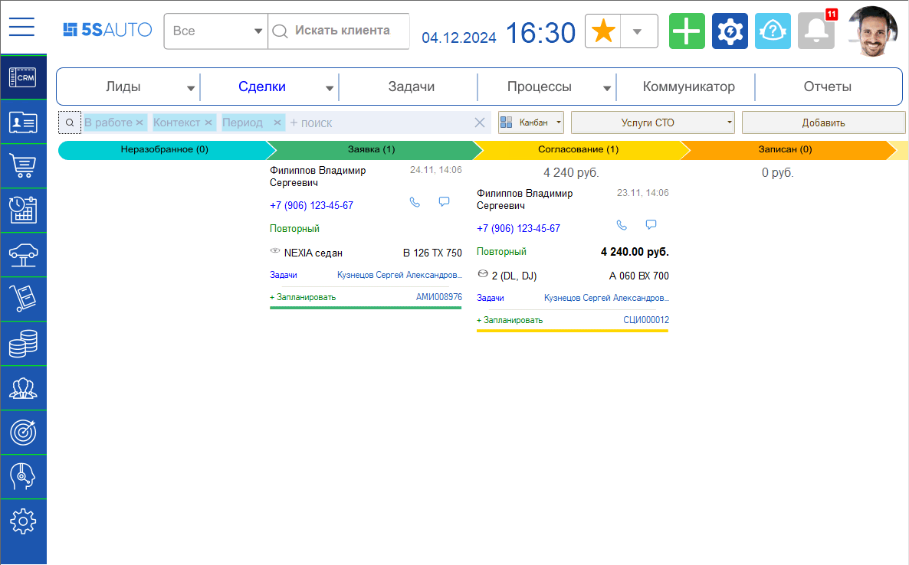

# Как найти нужную Сделку на канбане

<table><tr><td><b>Время чтения:</b> 1 мин.</td><td><b>Обновлено:</b> 04.12.2024</td></tr></table>

Источник: https://www.5systems.ru/help/kak-nayti-nuzhnuyu-sdelku-na-kanbane

В канбане можно искать сделки, используя быстрые фильтры: например, отобразить только сделки конкретного сотрудника или установить отбор по определенной дате.

Для этого требуется нажать на лупу на панели отбора, отметить нужный критерий отбора и нажать кнопку “Найти”.

В канбане останутся только те сделки, которые подходят под выбранные условия.

*Примечание:* При работе со сделками *в режиме списка* также можно использовать различные фильтры и отборы – подробнее см. в [*статье*](../../../articles/5S%20AUTO/CRM/Список%20сделок/spisok-sdelok.md#отборы-и-фильтры).

---

**Теги:** CRM, сделка, канбан, поиск сделки, отбор, список сделок

