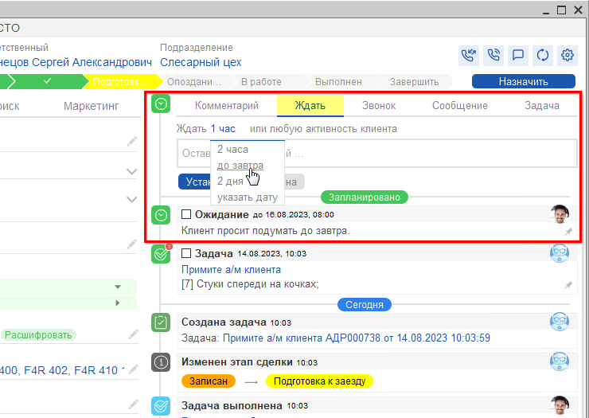

# Как отложить Сделку

<table><tr><td><b>Время чтения:</b> 1 мин.</td><td><b>Обновлено:</b> 17.09.2025</td></tr></table>

Источник: https://www.5systems.ru/help/kak-otlozhit-sdelku

В правой половине сделки расположены вкладки, предназначенные для планирования дел и коммуникации с клиентом.

Если клиент по данной сделке попросил “подумать” один или несколько дней, можно использовать функцию ожидания. Для этого требуется перейти на вкладку *"Ждать"* и в открывшемся окне выполнить следующие действия:

1. Выбрать количество дней или установить ожидание любой активности клиента;
2. Оставить комментарий при необходимости;
3. Нажать кнопку "Установить".  
   

---

**Теги:** CRM, сделка, отложенные сделки, ожидание
