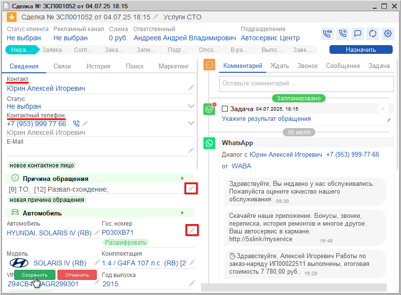

# Как отразить результат общения с клиентом

<table><tr><td><b>Время чтения:</b> 2 мин.</td><td><b>Обновлено:</b> 17.09.2025</td></tr></table>

Источник: https://www.5systems.ru/help/kak-otrazit-rezultat-obscheniya-s-klientom

Для того, чтобы отразить в программе результат общения с клиентом, необходимо:

1. Идентифицировать клиента (см. урок [*Как идентифицировать клиента в сделке*](../Как%20идентифицировать%20клиента%20в%20Сделке/kak-identificirovat-klienta-v-sdelke.md));
2. Выбрать причину обращения из справочника или ввести вручную;
3. Выбрать автомобиль клиента (или ввести новый);
4. Сохранить изменения в сделке.  
   

После этого можно перейти к [*подбору запчастей для* *ремонта*](../../Урок%206.%20Подбор%20запчастей%20и%20работ/) и [*записи клиента на ремонт*](../../Урок%208.%20Запись%20на%20ремонт/). Для этого следует нажать на кнопку *Новая корзина* в информационном блоке сделки "Корзина".

Подробнее об интерфейсе сделки см. в *статье* [*“Работа со сделкой”*](../../../articles/5S%20AUTO/CRM/Работа%20со%20сделкой/rabota-so-sdelkoy.md).

---

**Теги:** CRM, сделка, результат общения, события сделки, комментарий

