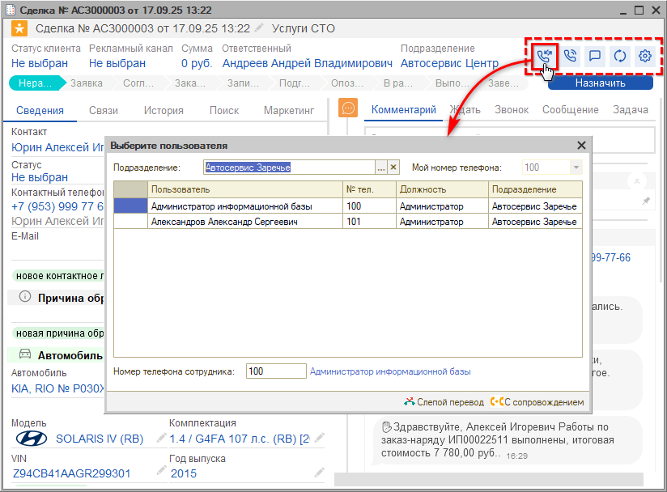

# Как перенаправить Сделку на другого сотрудника

<table><tr><td><b>Время чтения:</b> 1 мин.</td><td><b>Обновлено:</b> 17.09.2025</td></tr></table>

Чтобы перенаправить сделку на другого сотрудника, нужно нажать кнопку *Перевод звонка* на верхней панели сделки и выбрать нужного пользователя:

*Примечание:* Для этого должны быть настроены [внутренние номера телефонов](../../../articles/5S%20AUTO/Телефония/Настройка%20внутренних%20телефонов%20сотрудников/nastroyka-vnutrennikh-telefonov-sotrudnikov.md) пользователей.

---

**Теги:** CRM, сделка, ответственный, перенаправление, сотрудник
