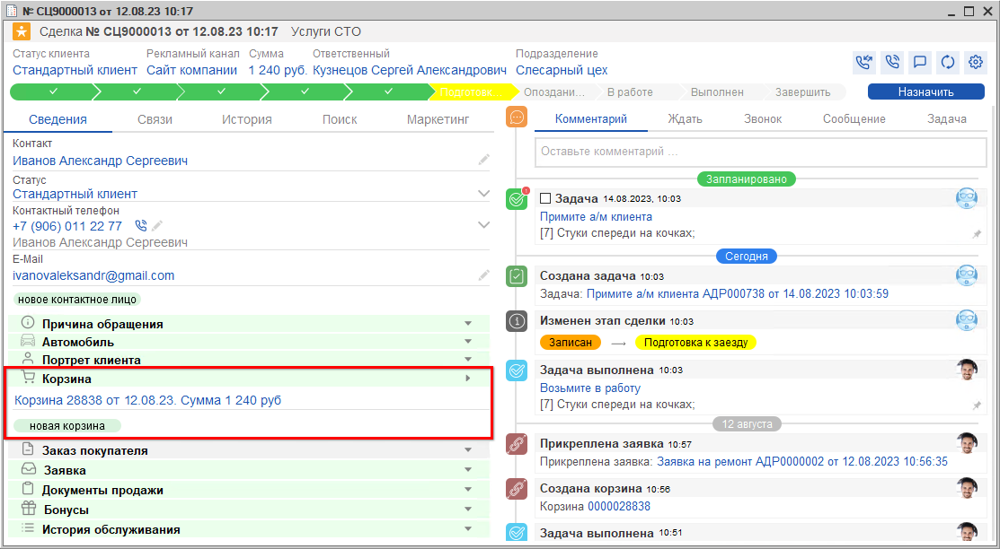

# Как создать Корзину из Сделки

<table><tr><td><b>Время чтения:</b> 1 мин.</td><td><b>Обновлено:</b> 17.09.2025</td></tr></table>

Источник: https://www.5systems.ru/help/kak-sozdat-korzinu-iz-sdelki

В левой половине формы Сделки на вкладке "Сведения" расположены блоки со всей необходимой информацией по сделке.

В блоке *"Корзина"* отображается корзина, созданная в рамках данной сделки – одна или несколько. Чтобы создать новую корзину прямо из сделки, нужно нажать кнопку *"Новая корзина"*.

Как работать с Корзиной см. курс видео-уроков по теме *[Подбор запчастей и работ](../../Урок%206.%20Подбор%20запчастей%20и%20работ/).*

---

**Теги:** CRM, сделка, корзина, подбор запчастей

