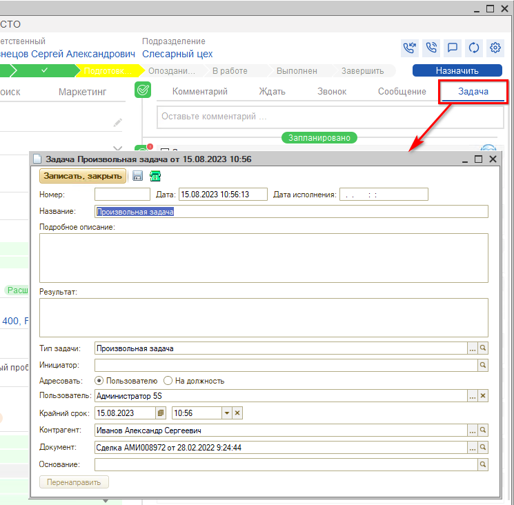

# Как создать задачу по Сделке

<table><tr><td><b>Время чтения:</b> 1 мин.</td><td><b>Обновлено:</b> 17.09.2025</td></tr></table>

Источник: https://www.5systems.ru/help/kak-sozdat-zadachu-po-sdelke

В правой половине сделки расположены вкладки, предназначенные для планирования дел и коммуникации с клиентом. Для того, чтобы *создать задачу по сделке*, требуется кликнуть на вкладку *"Задача"*.

При этом откроется форма создания произвольной задачи, которая будет привязана к данной сделке.

---

**Теги:** CRM, сделка, задача, планирование, исполнитель

