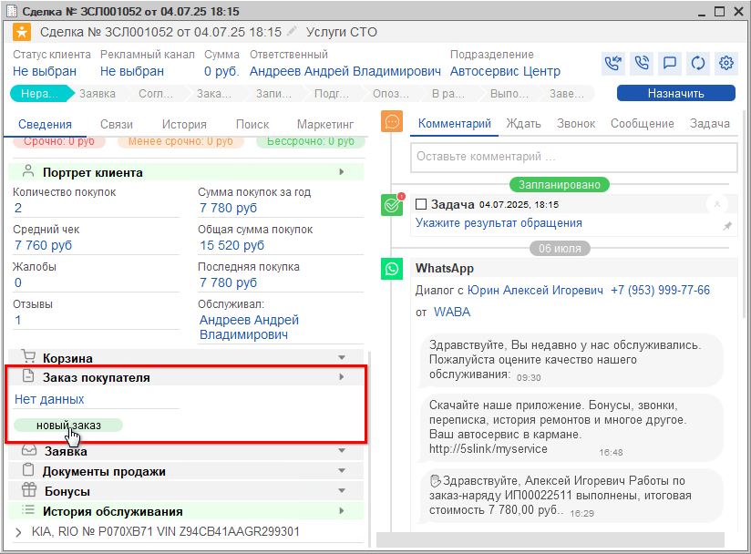

# Как создать заказ покупателя из Сделки

<table><tr><td><b>Время чтения:</b> 1 мин.</td><td><b>Обновлено:</b> 11.09.2026</td></tr></table>

Источник: https://www.5systems.ru/help/kak-sozdat-zakaz-pokupatelya-iz-sdelki

В левой половине формы Сделки на вкладке "Сведения" расположены блоки со всей необходимой информацией по сделке.

В блоке *"Заказ покупателя"* представлены все созданные по сделке *Заказы покупателя* с отображением их текущих состояний. Чтобы создать *Заказ покупателя*, нужно нажать кнопку *"Новый заказ":*

При создании нового Заказа покупателя программа предложит выбрать основание – Корзину (при наличии Корзины в Сделке).

О дальнейшей работе с Корзиной см. курс видео-уроков по теме *[Подбор запчастей и работ](../../Урок%206.%20Подбор%20запчастей%20и%20работ/).*

---

**Теги:** CRM, сделка, заказ покупателя, продажа запчастей

