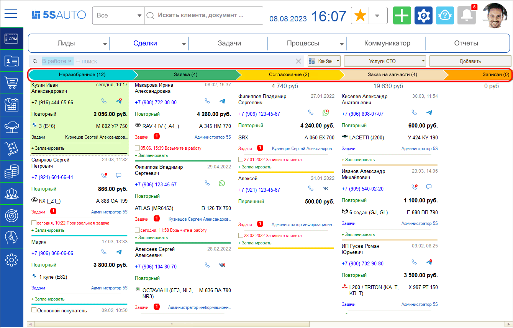

# Как установить этап Сделки

<table><tr><td><b>Время чтения:</b> 2 мин.</td><td><b>Обновлено:</b> 11.09.2026</td></tr></table>

Источник: https://www.5systems.ru/help/kak-ustanovit-etap-sdelki

## Содержание

1. [Этапы сделки](#этапы-сделки)
2. [Канбан-доска](#канбан-доска)
3. [Изменение этапа на форме Сделки](#изменение-этапа-на-форме-сделки)

## Этапы сделки

Путь продаж может быть разделен на разные **этапы** по различным критериям. По умолчанию в CRM есть набор стандартных стадий, позволяющий учитывать ключевые точки работы со сделками:

- Неразобранное;
- Заявка;
- Согласование;
- Заказ на запчасти;
- Записан;
- В работе;
- Выполнен.

Можно использовать преднастроенный набор стадий, либо изменить их, а также можно добавить новые стадии.

## Канбан-доска

Смена этапов сделки наглядно представлена на ***канбан-доске***, которая является формой отображения сделок, где всегда видно, сколько сделок и на какую сумму находятся на той или иной стадии работы, запланированы ли по ним какие-либо задачи, и т.д.

Канбан помогает выстраивать работу с большим количеством сделок и всегда видеть, с кем из клиентов нужно связаться, записать на ремонт или оформить заказ-наряд. Подробнее см. [статью](../../../articles/5S%20AUTO/CRM/Канбан%20сделок/kanban-sdelok.md).

Канбан настроен таким образом, чтобы все сделки ***автоматически*** переходили на следующий этап *в соответствии с заданными алгоритмами*, но при этом сделку можно двигать по этапам и вручную (при соблюдении определенных условий – например, созданная корзина/заявка на ремонт и т.д.).

## Изменение этапа на форме Сделки

Можно изменить этап сделки, находясь в форме самой сделки (если соблюдены условия перехода). Для этого требуется на шкале этапов сделки выбрать кликом мыши нужный этап и нажать кнопку *“Назначить этап текущим”:*

---

**Теги:** CRM, сделка, этап сделки, канбан, воронка продаж

