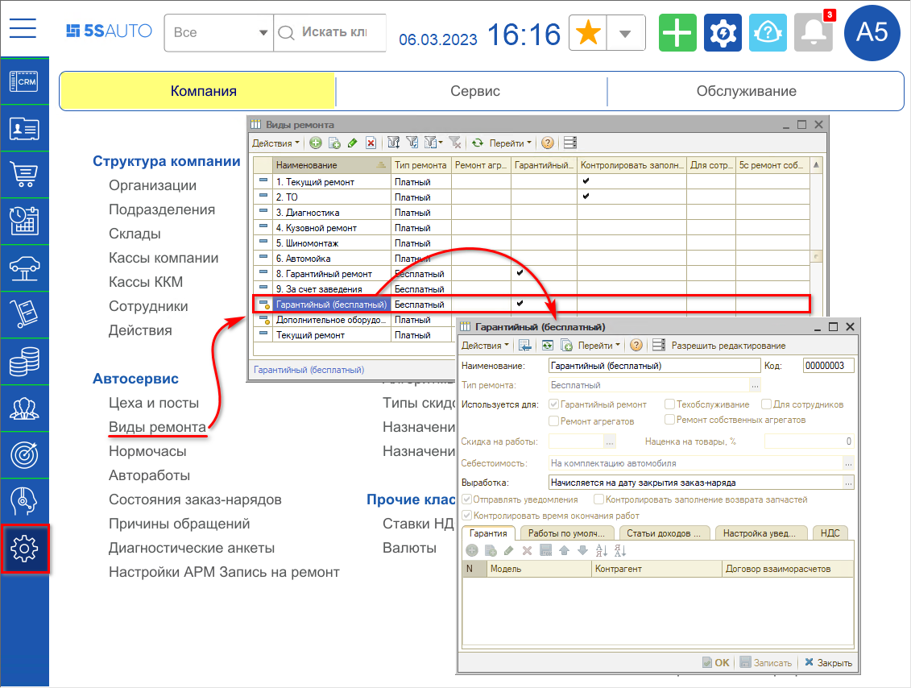
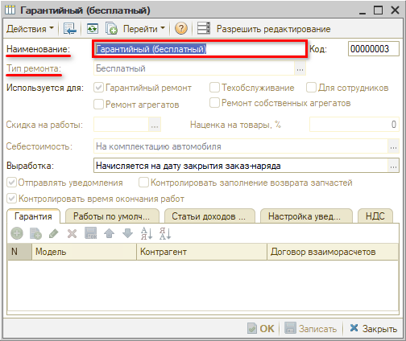
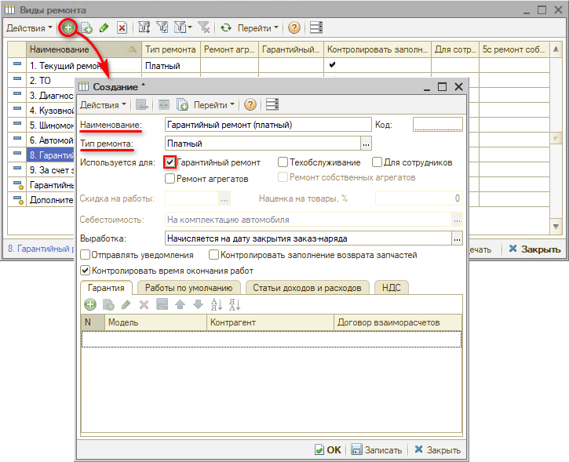
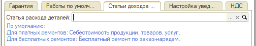
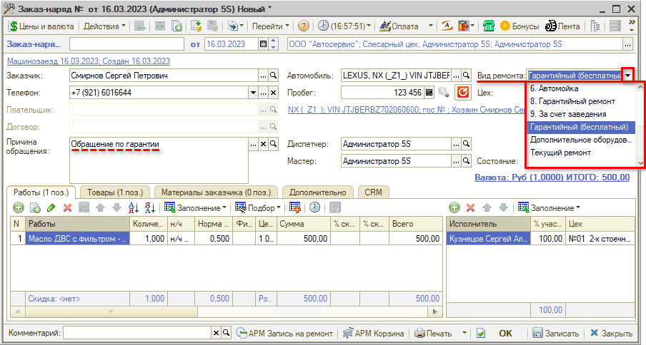

# Как оформить гарантийный заказ-наряд

<table><tr><td><b>Время чтения:</b> 6 мин.</td><td><b>Обновлено:</b> 27.05.2022</td></tr></table>

Источник: https://www.5systems.ru/help/kak-oformit-garantiynyy-zakaz-naryad

## Содержание

1. [Введение](#введение)
2. [Виды гарантийного ремонта](#виды-гарантийного-ремонта)
   - [1. Бесплатный гарантийный ремонт](#1-бесплатный-гарантийный-ремонт)
   - [2. Платный гарантийный ремонт](#2-платный-гарантийный-ремонт)
   - [Особенности настройки гарантийного вида ремонта](#особенности-настройки-гарантийного-вида-ремонта)
3. [Процесс оформления гарантийного Заказ-наряда](#процесс-оформления-гарантийного-заказ-наряда)

## Введение

***Гарантийный ремонт*** – это безвозмездное для клиента устранение недостатков, обнаруженных в товарах и/или работах в течение установленного *гарантийного срока (см. урок [Гарантийная политика](../../Урок%2021.%20Гарантийная%20политика/)).*

Для учета гарантийного ремонта в программе должны быть сделаны настройки в справочнике “Виды ремонта” – *Администрирование → Компания → Автосервис → Виды ремонта:*

Подробнее см. статью “[Виды ремонта](../../../articles/5S%20AUTO/Автосервис/Виды%20ремонта/vidy-remonta.md)”.

## Виды гарантийного ремонта

Гарантийный ремонт может быть как бесплатным, так и платным по своему типу:

### 1. Бесплатный гарантийный ремонт

*Бесплатный гарантийный ремонт* осуществляется за счет компании, т.е. автосервис за свой счет устраняет выявленные недостатки.

Для отражения в программе ремонта данного вида используется вид ремонта “Гарантийный (бесплатный)” – это предопределенный[\*](#snoska) элемент справочника “Виды ремонта”:

*\*В случае, если данный элемент отсутствует, необходимо обновиться на актуальную версию конфигурации.*

Следует иметь в виду, что при закрытии Заказ-наряда с бесплатным видом гарантийного ремонта не происходит движений по взаиморасчетам и не формируется доход компании.

Также стоит отметить, что, если требуется, чтобы сотрудникам не шла выработка за заказ-наряд с видом ремонта “Гарантийный (бесплатный)” – например, если это влияет на расчет заработной платы, – то можно назначить всем работам заказ-наряда нормочас, который равен рублю.

### 2. Платный гарантийный ремонт

*Платный гарантийный ремонт* – это ремонт, который оплачивает один из следующих контрагентов:

- *поставщик* – в случае выявления неисправности в автозапчасти в течение гарантийного периода;
- *сотрудник сервиса* – в случае выявления сотрудника, виновного в некачественном ремонте;
- *дистрибьютор* – поставщик автомобилей, актуально для дилерских сетей.

Для отражения в программе следует создать и настроить карточку платного вида гарантийного ремонта:

К видам ремонта может быть привязано ценообразование.

### Особенности настройки гарантийного вида ремонта

При необходимости следует настроить статью расхода деталей на вкладке “Статьи доходов и расходов”: при незаполненном значении будут использоваться значения по умолчанию.

Подробнее о настройках вида ремонта см. статью “[Виды ремонта](../../../articles/5S%20AUTO/Автосервис/Виды%20ремонта/vidy-remonta.md)”.

## Процесс оформления гарантийного Заказ-наряда

При обращении клиента по гарантии следует записать его на ремонт, в документе *Запись на ремонт* необходимо установить *вид ремонта* "Гарантийный". При заезде клиента следует создать Заказ-наряд, в котором также должен быть выбран вид ремонта “Гарантийный” – он может быть платный или бесплатный:

В работы и товары нового Заказ-наряда должны быть добавлены те из них из основного заказ-наряда, по которым обратился клиент по гарантии.

При необходимости можно перейти к записи на ремонт из нового гарантийного Заказ-наряда по кнопке "АРМ Запись на ремонт" на нижней панели (см. [видеоурок](../../Урок%208.%20Запись%20на%20ремонт/Как%20записать%20клиента%20из%20Заказ-наряда/kak-zapisat-klienta-iz-zakaz-naryada.md)). Также, при необходимости, следует заказать новые запчасти для выполнения гарантийного ремонта.

Дальнейшее оформление и работа с Заказ-нарядом производится в обычном порядке. См. урок “[Работа с Заказ-нарядами](../)” и статью [Заказ-наряды](../../../articles/5S%20AUTO/Автосервис/Работа%20с%20Заказ-нарядами/Заказ-наряды/zakaz-naryady.md).

Также, в случае необходимости, оформляется "Акт разногласий" и "Возврат от покупателя" по первоначальному ремонту.

Если клиент обращается по гарантии и помимо этого планирует выполнить новые платные работы, рекомендуется разделять такое обращение по отдельным сделкам.

---

**Теги:** заказ-наряд, гарантийный ремонт, гарантия

