# Методический материал по теме: "Работа с Заказ-нарядами"

<table><tr><td><b>Время чтения:</b> 10 мин.</td><td><b>Обновлено:</b> 11.09.2026</td></tr></table>

Источник: https://www.5systems.ru/help/metodicheskiy-material-po-teme-rabota-s-zakaz-naryadami

## Содержание

1. [Описания полей документа](#описания-полей-документа)
2. [Вкладки в Заказ-наряде](#вкладки-в-заказ-наряде)
3. [Состояния заказ-наряда](#состояния-заказ-наряда)
4. [Бонусная программа в Заказ-наряде](#бонусная-программа-в-заказ-наряде)
5. [Печать Заказ-наряда](#печать-заказ-наряда)
6. [Реестр Заказ-нарядов](#реестр-заказ-нарядов)

Одним из основных документов 5S AUTO является "Заказ-наряд".

**Заказ-наряд** – это чистовой вариант заполнения информации по выполнению работ, использованию в производстве запчастей, в т.ч. материалов заказчика и т.д.

Документ "Заказ-наряд" создается для оформления заезда автомобиля. Важно создавать документ на основании Записи на ремонт, так как это не нарушит логику программы и сэкономит время в дальнейшем.

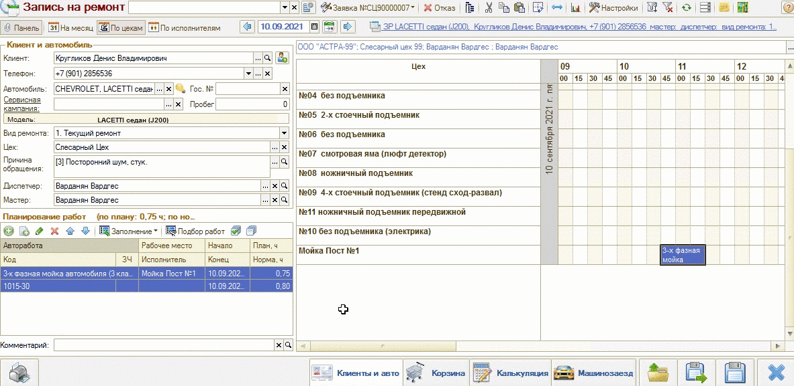*"Как ввести Заказ-наряд на основании Записи на ремонт"*

В случае создания на основании Заявки на ремонт запланированные работы, а так же контактные данные клиента и пр. переносятся из неё в Заказ-наряд.

## Описания полей документа

Отметим особенности некоторых полей документа "Заказ-наряд":

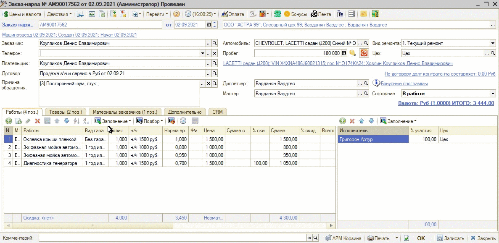*"Основные поля заказ-наряда"*

***1. Заказчик***

Тот, кто заказывает ремонт. Может отличаться от плательщика и владельца автомобиля. Например, зять приехал отремонтировать по страховому случаю автомобиль, оформленный на тещу. Таким образом, заказчик – зять, плательщик – страховая компания, а владелец автомобиля – теща.

***2. Автомобиль***

Автомобиль - это транспортное средство, которое предстоит обслуживать или ремонтировать. По умолчанию для выбора предлагаются автомобили, владельцем которых является заказчик. При необходимости такой отбор можно отключить и выбрать любой другой автомобиль.

***3. Причина обращения***

Выбирается из справочника причин или заполняется вручную. Если Заказ-наряд открывается по предварительной записи, причина обращения переносится из заявки.

***4. Цех***

Цех - это место, где выполняется ремонт. Может изменяться при прохождении автомобиля по ремонтной зоне.

***5. Мастер***

Мастером является сотрудник, сопровождающий технологический процесс выполнения ремонта. При выборе мастера в справочнике «Сотрудники» устанавливается отключаемый фильтр по должности «Мастер»;

***6. Диспетчер***

Диспетчер оформляет документы по выполнению ремонта. При выборе диспетчера в справочнике «Сотрудники» устанавливается отключаемый фильтр по должности «Диспетчер»;

***7. Вид ремонта***

Как правило, используются такие виды ремонта, как текущий и гарантийный ремонт. Гарантийный ремонт является бесплатным. 
Достаточно часто предприятия выстраивают ценообразование на работы и детали в зависимости от вида ремонта.

***8. Пробег***

Пробег автомобиля на момент выполнения ремонта. Заполняется для контроля корректности пробега.

***9. Состояние***

Текущее состояние Заказ-наряда. Необходимо для фиксации и определения стадии выполнения ремонта.

## Вкладки в Заказ-наряде

Ниже перечислены вкладки Заказ-наряда, которые доступны для работы.

***1. Работы***

На вкладке "Работы" перечислены все добавленные работы по Заказ-наряду.

Добавлять работы можно как вручную подбирая из справочника авторабот, так и через АРМ Корзина.

Каждой работе можно назначать исполнителей и указывать процент их участия.

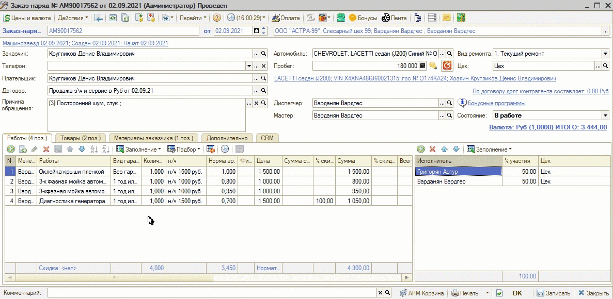*"Заказ-наряд - Вкладка Работы"*

***2. Товары***

На вкладке товары показан список товаров, которые будут использоваться в ходе выполнения работ. Добавлять товары можно из справочника, из Поиска цен, а также, как рекомендуется, через АРМ Корзина.

У пользователя есть возможность подбирать детали со склада, а также включать в Заказ-наряд позиции, отсутствующие на складе с последующим формированием на них Заказа покупателя.

Сумма по работам и товарам указана под полем состояния Заказ-наряда.

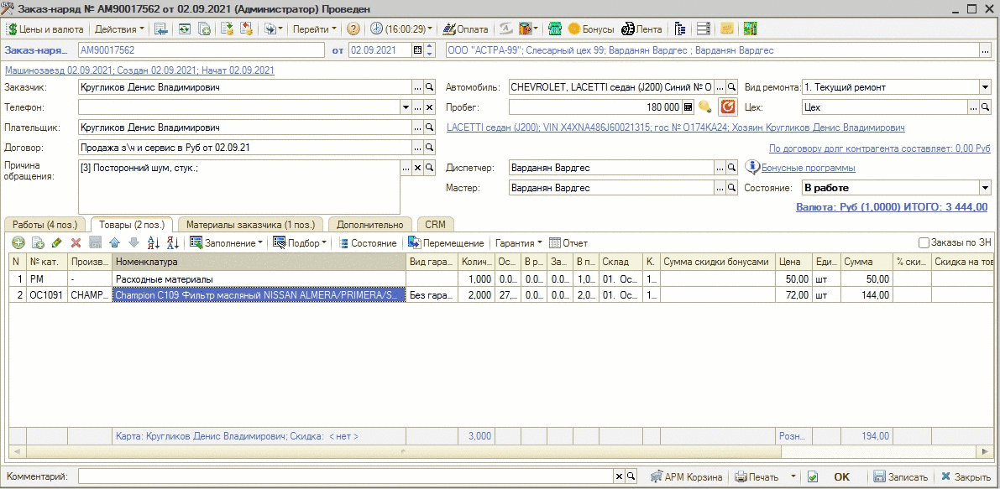*"Заказ-наряд - Вкладка Товары"*

***3. Материалы заказчика***

При необходимости на отдельной закладке "Материалы заказчика" могут быть указаны запчасти, предоставляемые клиентом.

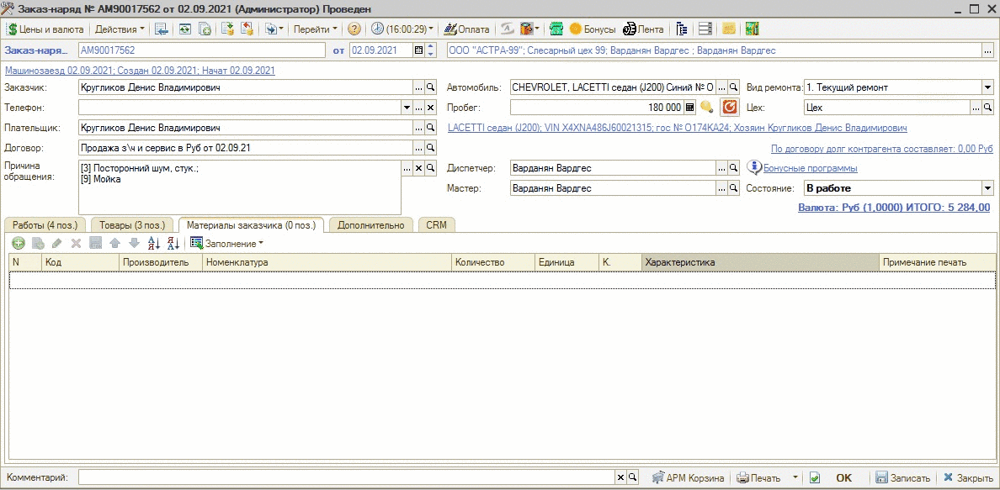*"Заказ-наряд - Вкладка Материалы заказчика"*

***4. Дополнительно***

На вкладке "Дополнительно" можно установить скидку на весь список запчастей и авторабот. В поле "Рекомендации" можно внести свои рекомендации клиенту. Поле гарантии заполняется согласно настройкам. Данные поля переносятся в печатную форму Заказ-наряда.

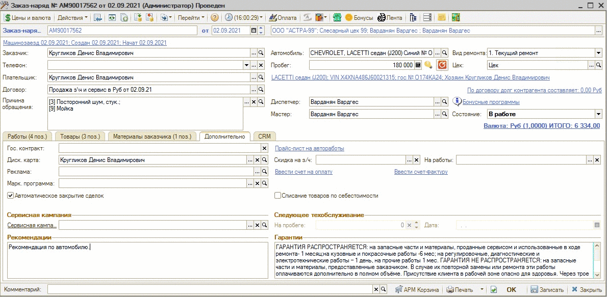*"Заказ-наряд - Вкладка Дополнительно"*

***5. CRM***

Из вкладки CRM можно перейти в сделку, к которой привязан Заказ-наряд.

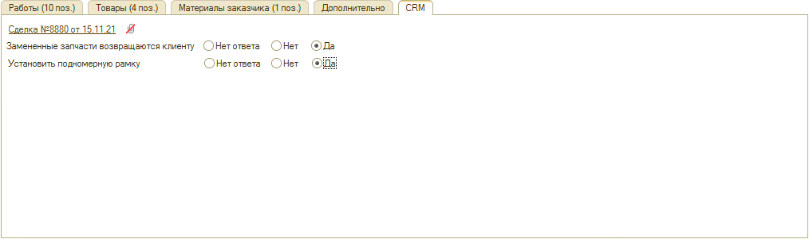*"Заказ-наряд - Вкладка CRM"*

## Состояния заказ-наряда

***Состояние*** – ключевой реквизит Заказ-наряда. Переход из одного состояния в другое не выполняется автоматически - его нужно менять вручную, в зависимости от текущей стадии ремонта.

***1. Заявка***

Состояние приема автомобиля, устанавливается при создании Заказ-наряда. Из Заказ-наряда в этом состоянии можно распечатать сопроводительный лист и другие печатные формы.

***2. Начать работу и В работе***

Состояние, когда исполнители, указанные в Заказ-наряде, приступают к работам. При переходе в это состояние рекомендуется делать перемещение в производство товаров Заказ-наряда. При переведении в это состояние Заказ-наряд проводится.

***3. Согласование***

Если требуется согласование с клиентом, можно установить данное состояние.

***4. Ожидание запчастей***

Данное состояние устанавливается, когда требуется оформить или когда уже оформлен заказ поставщику по деталям Заказ-наряда и ожидается поступление этих запчастей.

***5. Выполнен***

Данное состояние устанавливается, когда работы выполнены, все работы и товары занесены в Заказ-наряд, при этом все товары перемещены в производство. Перед выбором этого состояния настоятельно рекомендуем проверить правильность заполнения всех табличных частей, т.к. формируются рассылки сообщений, что работа выполнена на такую-то сумму.

При этом клиенту печатаются все необходимые печатные формы.

***6. Закрыт***

Состояние недоступно, если Заказ-наряд не был переведен в состояние "Выполнен". Закрывать Заказ-наряд необходимо после полной оплаты по сделке. Означает окончание ремонтных работ и оформление всех необходимых документов с клиентом.

***7. Отказ***

Перевод Заказ-наряда в это состояние осуществляется, если выполнить ремонт не удалось по каким-то причинам (клиент отказался или невозможно выполнить ремонт со стороны СТО).

***Чтобы сохранить состояние, необходимо записать Заказ-наряд.***

## Бонусная программа в Заказ-наряде

В Заказ-наряде можно использовать дисконтную карточку клиента.

В окне бонусной программы отображается количество баллов, которые будут начислены за Заказ-наряд, доступные баллы к списанию, а также суммарное количество накопленных баллов клиента.

Есть возможность задавать количество бонусов, которые клиент хочет потратить в данном Заказ-наряде для уменьшения стоимости сделки. Ограничение на процент оплаты бонусами устанавливается в настройках бонусной программы.

Используемые бонусы равномерно распределяются между всеми работами и товарами документа.

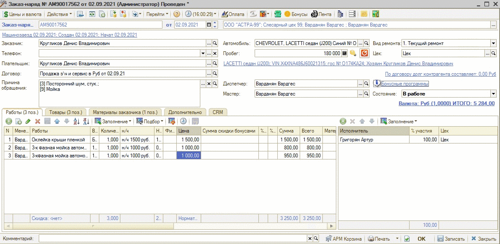*"Бонусы в Заказ-наряде"*

## Печать Заказ-наряда

Документ "Заказ-наряд" в программе имеет различные печатные формы: стандартные и внешние. Есть возможность загрузить свои.

Выбрать форму можно нажатием на стрелку рядом с кнопкой "Печать".

**Список наиболее используемых печатных форм:**

***1. Рабочая заявка***

Рабочая заявка – документ, который оформляется при заезде клиента и фиксирует список выполняемых работ и устанавливаемых деталей.

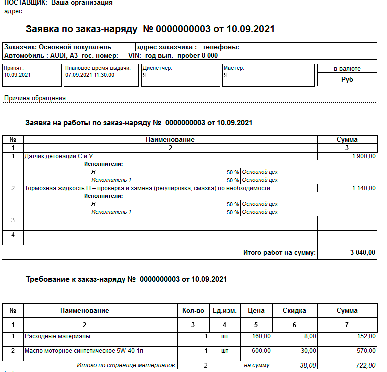*"Рабочая заявка"*

***2. Акт приема-передачи***

Акт приема-передачи используется, чтобы зафиксировать прием автомобиля автосервисом у клиента.

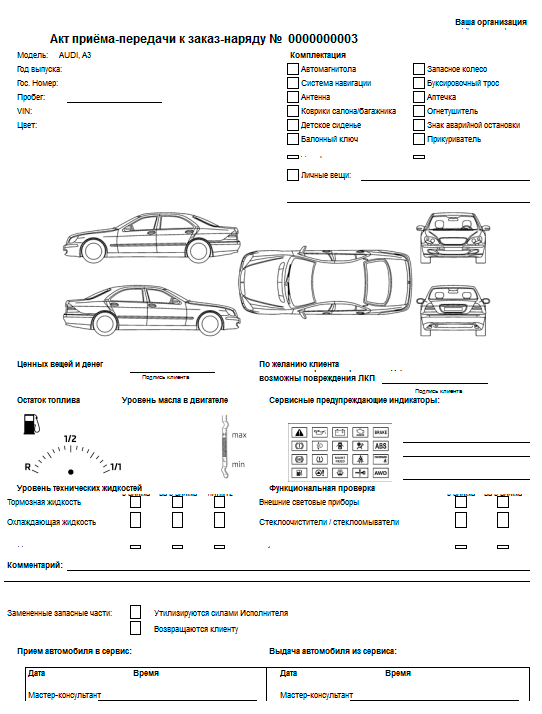*"Акт приема-передачи"*

***3. Сопроводительный лист***

Сопроводительный лист передается в цех для начала работы по Заказ-наряду. В документе отражаются работы, которые необходимо выполнить по автомобилю.

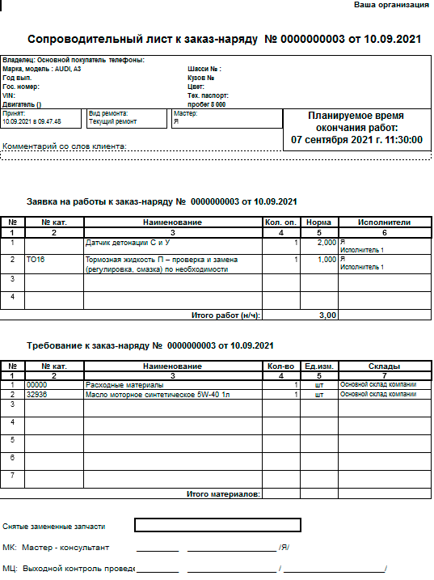*"Сопроводительный лист"*

***4. Заказ-наряд ФЛ (физ. лицам)***

Итоговая форма Заказ-наряда, печатается после перевода Заказ-наряда в состояние "Выполнен". Выводится информация по выполненным работам, гарантии, рекомендациям и др.

В основном используется для физ.лиц, но подходит и для юр. лиц.

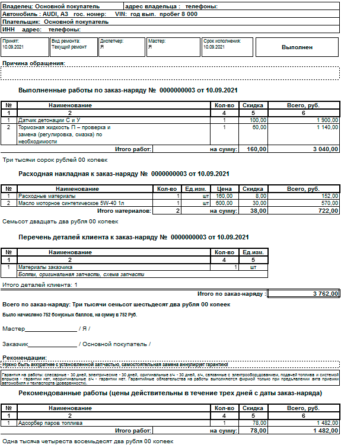*"Заказ-наряд ФЛ"*

***5. Заказ-наряд ЮЛ (юр. лицам)***

Печатается после перевода Заказ-наряда в состояние "Выполнен". Особенностью данной формы является то, что работы в Заказ-наряде отображены нормочасами, а не рублями.

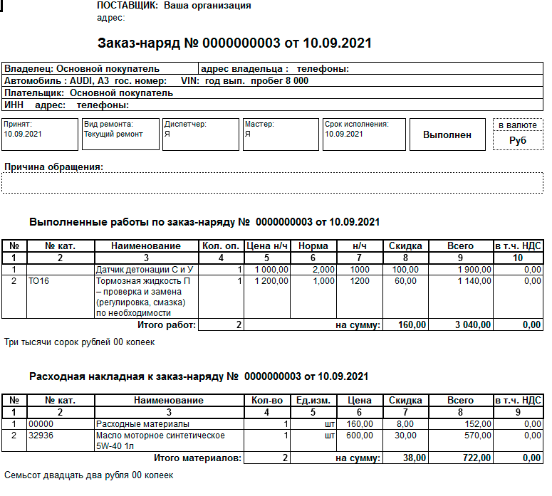*"Заказ-наряд ЮЛ"*

***6. Акт об оказании услуг***

Используется для печати выполненных работ. В основном требуется для юр. лиц.

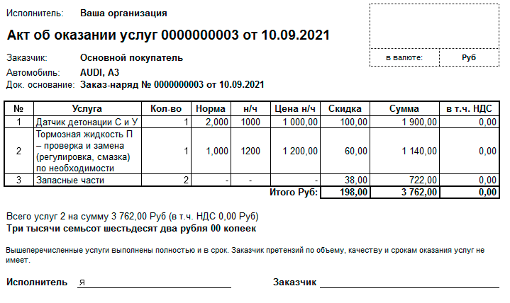*"Акт об оказании услуг"*

***7. УПД***

Совмещает в себе счет-фактуру и передаточный документ. В основном требуется для юр. лиц.

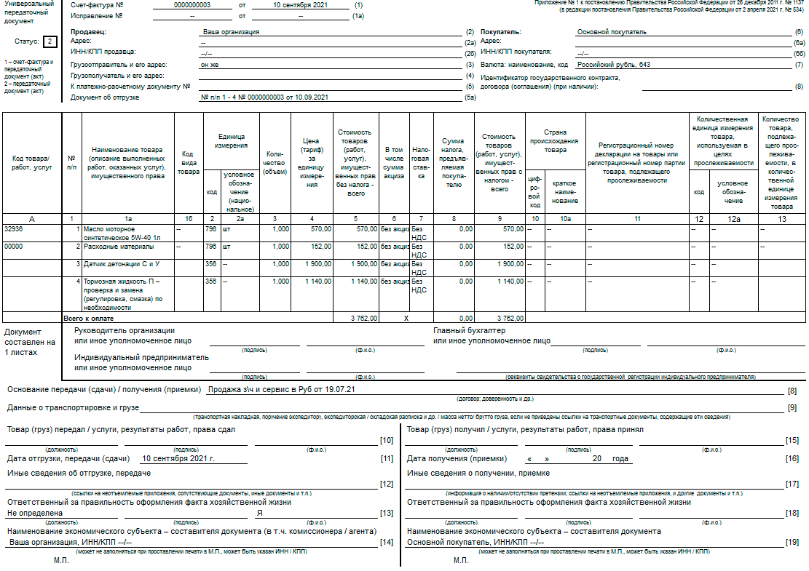*"УПД"*

## Реестр Заказ-нарядов

В реестре Заказ-нарядов документы отражаются с использованием цветовой индикации в зависимости от состояния, в котором находится Заказ-наряд.

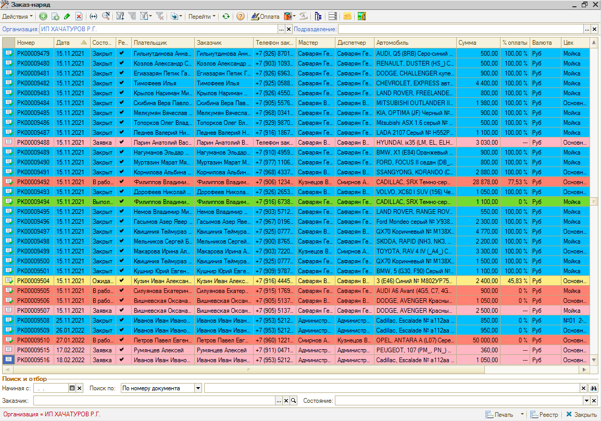*"Реестр заказ-нарядов"*

Из реестра Заказ-нарядов можно увидеть процент оплаты по определенному документу, также есть возможность принимать оплату не заходя в документ.

В нижней части реестра расположена область поиска и отбора документов. Поиск может осуществляться по различным параметрам, отдельно вынесен отбор по состоянию.

---

**Теги:** заказ-наряд, методический материал

