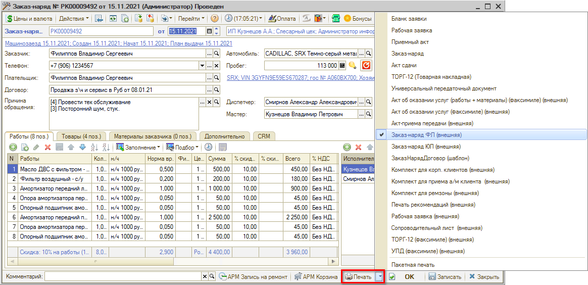

# Печать Заказ-наряда

<table><tr><td><b>Время чтения:</b> 2 мин.</td><td><b>Обновлено:</b> 14.09.2026</td></tr></table>

Источник: https://www.5systems.ru/help/pechat-zakaz-naryada

## Содержание

1. [Список наиболее используемых печатных форм](#список-наиболее-используемых-печатных-форм)
2. [Видео по теме](#видео-по-теме)

Документ **“Заказ-наряд”** в программе имеет различные стандартные и внешние *печатные формы*. Количество и перечень печатных форм определяются настройками прав пользователя.

Внешний вид документов может отличаться для различных предприятий или подразделений: довольно часто возникает необходимость корректировать эти формы – добавлять логотипы, менять шапки. Рекомендуется делать это в виде подключения *внешних печатных форм*. Это упростит в дальнейшем процесс обновления конфигурации.

Для выбора нужной печатной формы необходимо нажать на стрелку рядом с кнопкой *“Печать”:*

В печатной форме Заказ-наряда выводится информация по выполненным работам, гарантии, рекомендациям и др.

## Список наиболее используемых печатных форм

1. ***Рабочая заявка**:* печатается первой, при заезде клиента.
2. ***Сопроводительный лист**:* передается в цех для начала работы по Заказ-наряду.
3. ***Акт приема-передачи**:* в ряде случаев требуется напечатать для клиента, чтобы зафиксировать прием автомобиля.
4. ***Заказ-наряд ФЛ*** *(физ. лицам):* печатается после перевода Заказ-наряда в состояние "Выполнен" *(перед оплатой)*. В основном для физ.лиц, но подходит и для юр. лиц, *если не требуется отображение нормочасов*.
5. ***Заказ-наряд ЮЛ*** *(юр. лицам):* печатается после перевода Заказ-наряда в состояние "Выполнен". Особенностью данной формы является то, что работы в Заказ-наряде отображены нормочасами, а не рублями.
6. ***Акт об оказании услуг**:* используется для печати выполненных работ. В основном требуется для юр. лиц.
7. ***УПД**:* совмещает в себе счет-фактуру и передаточный документ. В основном требуется для юр. лиц.

## Видео по теме

См. видеоурок *"[Как распечатать заказ-наряд](../Как%20распечатать%20Заказ-наряд/kak-raspechatat-zakaz-naryad.md)":*

---

**Теги:** заказ-наряд, печатные формы, печать

