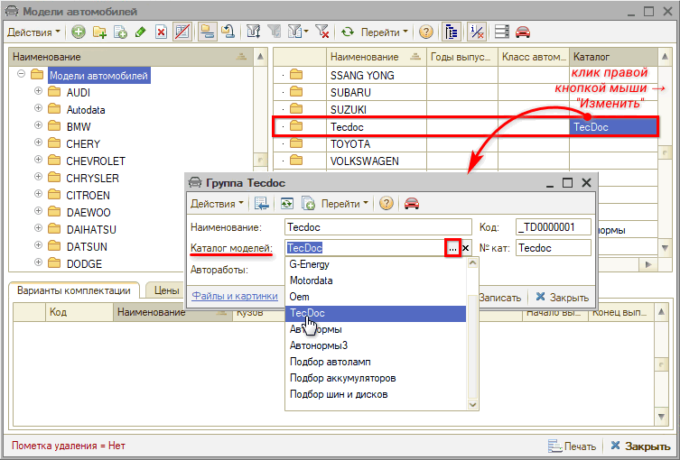
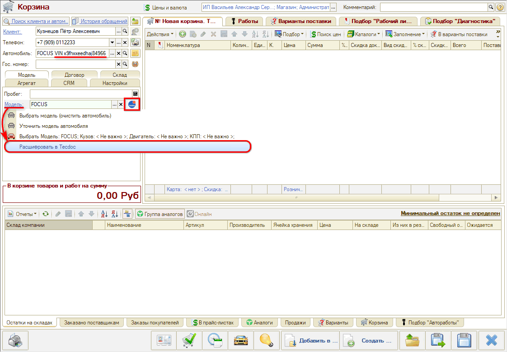
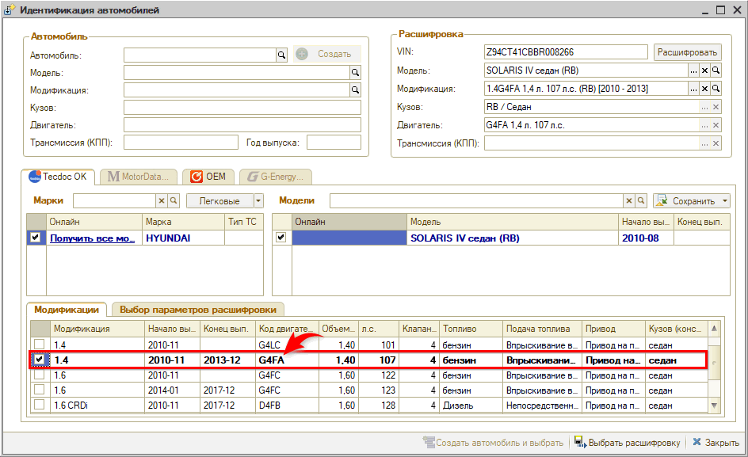
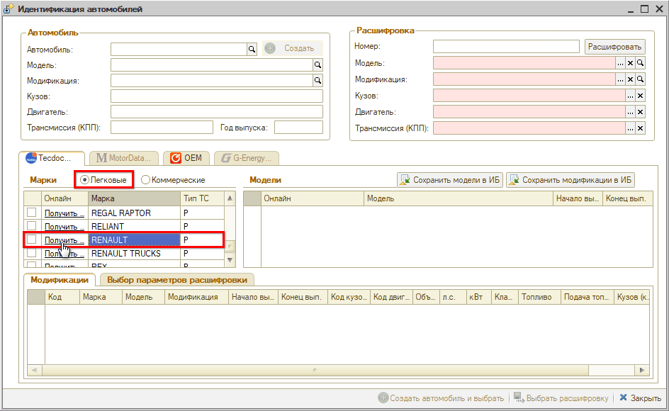
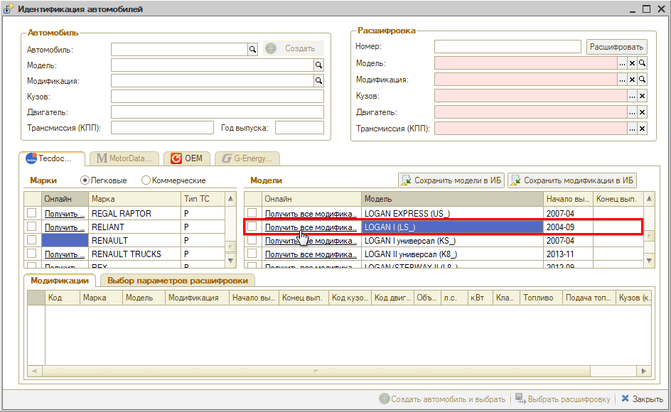
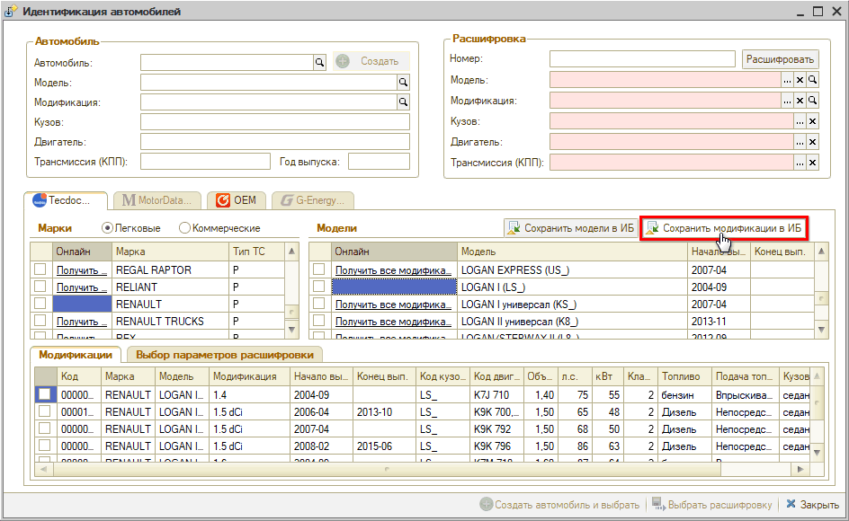

# Как расшифровать автомобиль по VIN

<table><tr><td><b>Время чтения:</b> 10 мин.</td><td><b>Обновлено:</b> 30.10.2025</td></tr></table>

Источник: https://www.5systems.ru/help/kak-rasshifrovat-avtomobil-po-vin

## Содержание

1. [Предварительная настройка](#предварительная-настройка)
2. [Переход к расшифровке по VIN](#переход-к-расшифровке-по-vin)
3. [Идентификация автомобиля по VIN](#идентификация-автомобиля-по-vin)
   - [Расшифровка в Tecdoc](#расшифровка-в-tecdoc)
   - [Идентификация в OEM каталогах](#идентификация-в-oem-каталогах)
   - [Сопоставление данных из каталогов TecDoc и OEM](#сопоставление-данных-из-каталогов-tecdoc-и-oem)
   - [Сохранение моделей и модификаций автомобилей из Tecdoc в базу 1С](#сохранение-моделей-и-модификаций-автомобилей-из-tecdoc-в-базу-1с)

В программе есть возможность по VIN-коду расшифровать автомобиль через сервисы Tecdoc и создать автомобиль на основании расшифрованных данных.

Это позволяет значительно ускорить процесс создания автомобиля и иметь более точные данные об автомобиле для дальнейшего подбора работ и запчастей.

## Предварительная настройка

Создать папку в справочнике *"[Модели автомобилей](../../../articles/5S%20AUTO/Автосервис/Модели%20автомобилей%20и%20другие%20справочники/modeli-avtomobiley-i-drugie-spravochniki.md)" (Автосервис → Приемка → Справочники → Марки и модели а/м)* для моделей Tecdoc и привязать ее к каталогу в справочнике "(пп) Каталоги подбора":

Все расшифрованные в Tecdoc модели будут сохраняться в справочнике моделей автомобилей в указанной папке:

## Переход к расшифровке по VIN

Для перехода к расшифровке по VIN необходимо ввести VIN автомобиля или выбрать автомобиль с указанным VIN и нажать кнопку "Расшифровать а/м" (универсальная обработка для расшифровки в Laximo и TecDoc). Сделать это можно в следующих местах программы:

1. Регистрация обращения через АРМ Клиенты и автомобили:  
   
2. Карточка автомобиля:  
   
3. Карточка клиента:  
   
4. Корзина:  
   
5. Сделка:  
   

## Идентификация автомобиля по VIN

После перехода к расшифровке по VIN открывается окно "Идентификация автомобилей", где происходит расшифровка автомобиля в каталогах Tecdoc и идентификация в OEM каталогах.

### Расшифровка в Tecdoc

Если автомобиль однозначно расшифрован, то в области "Расшифровка" заполняются данные и о модели, и о модификации:

*Примечание:* Если модификация определена, то на вкладке рядом с наименованием "Tecdoc" появляется отметка "OK".

Если у автомобиля не определена модификация, то можно уточнить данные автомобиля по ПТС.

Если нет ПТС под рукой, то принять решение о модификации автомобиля можно по информации из OEM каталога. Например, ознакомьтесь с информацией о двигателе:

На основе информации о двигателе выберите нужную модификацию вручную. Для этого:

1. нажмите ссылку "Получить все модификации":  
   
2. выберите из списка подходящую модификацию:  
   

Если автомобиль не расшифрован *автоматически*, то можно идентифицировать его *вручную*. Для этого:

1. Выберите тип автомобиля и получите все модели подходящей марки:  
   
2. Выберите модель и получите все модификации по модели:  
   
3. Выберите подходящую модификацию:  
   

Все выбранные параметры расшифровки (марка, модель, модификация) автоматически сохраняются (создаются или обновляются) в справочнике "Модели автомобилей" и "Варианты комплектации" со ссылкой на каталог Tecdoc.

*После автоматического или ручного выбора параметров расшифровки* выберите одно из действий:

1. *Выбрать расшифровку* - если необходимо заполнить данные по автомобилю без сохранения (карточка автомобиля, карточка клиента).
2. *Создать автомобиль и выбрать* - если необходимо заполнить данные по автомобилю и автоматически создать автомобиль.
3. *Обновить автомобиль и выбрать* - если необходимо заполнить данные по автомобилю и автоматически обновить автомобиль.

### Идентификация в OEM каталогах

Для просмотра информации об автомобиле по VIN в OEM каталоге перейдите на вкладку OEM:

Для получения информации должна быть настроена интеграция с OEM каталогами.

### Сопоставление данных из каталогов TecDoc и OEM

Каталоги содержат информацию разного предназначения:

- TecDoc используется как основной каталог для получения информации о марках, моделях и модификациях автомобилей;
- Каталог Laximo содержит данные про запчасти, применяемость деталей; в рамках расшифровки а/м идентификация в OEM-каталогах используется для уточнения модификации автомобиля.

Конкретные автоработы учитывают специфику конкретной модификации (коробка ручная/автоматическая, крыша, привод и т.д.). Некоторые работы при этом могут иметь другую трудоемкость. Также и применяемые запчасти могут отличаться. Чтобы четко подобрать нормы времени и запчасти, требуется четко определиться с комплектациями.

Сопоставление данных из каталогов позволяет выбрать наиболее точный вариант расшифровки. Например, если в TecDoc не расшифровывается VIN и выходит слишком много вариантов расшифровки – используется код двигателя и другие параметры из каталога Laximo.

### Сохранение моделей и модификаций автомобилей из Tecdoc в базу 1С

С помощью обработки "Расшифровка VIN" есть возможность загрузить расшифрованные модели и модификации автомобилей в базу 1С, не создавая автомобиль. При этом заполнится справочник "Модели автомобилей" в папке, указанной при предварительной настройке, и справочник "Варианты комплектации" для модели.

Поскольку расшифровывать VIN автомобиля не нужно, удобно перейти к обработке для данного случая через меню программы: CRM -> Обработки -> Расшифровка VIN.

Для того, чтобы сохранить модели автомобилей:

1. выберите тип автомобиля (легковые или коммерческие);
2. выберите марку автомобиля и нажмите кнопку-ссылку "Получить все модели":  
   
3. нажмите кнопку "Сохранить модели в ИБ":  
   

В результате в базу сохранятся все модели, которые были получены по марке и видны в таблице "Модели".

Для того, чтобы сохранить модификации автомобилей:

1. выберите модель автомобиля и нажмите кнопку-ссылку "Получить все модификации":  
   
2. нажмите кнопку "Сохранить модификации в ИБ":  
   

В результате в базу сохранятся все модификации, которые были получены по модели и видны в таблице "Модификации".

---

**Теги:** расшифровка автомобиля, VIN, Tecdoc, карточка автомобиля

