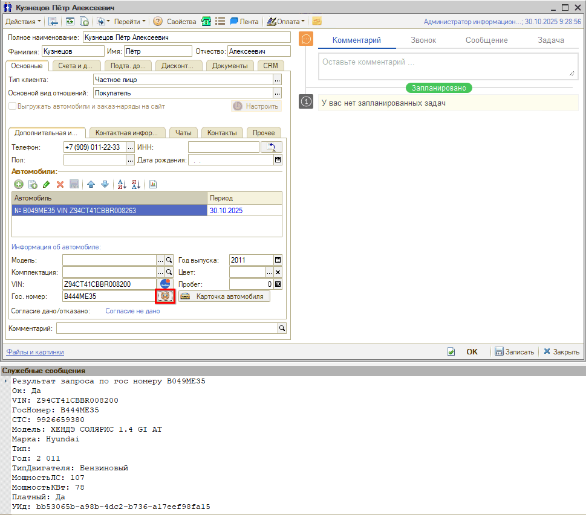
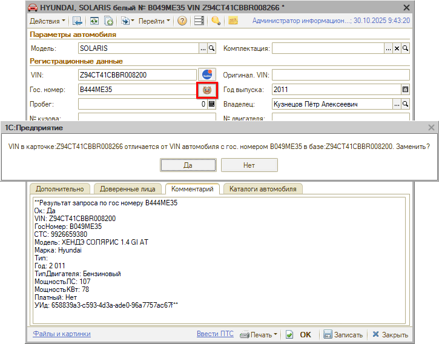
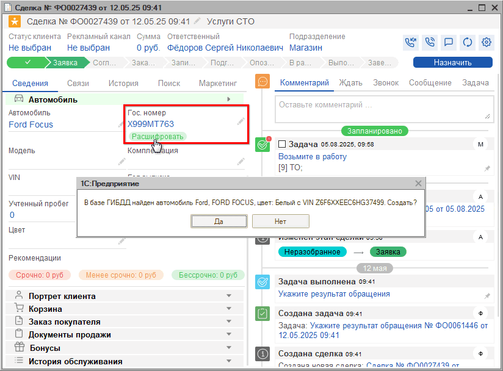

# Как расшифровать автомобиль по гос. номеру

<table><tr><td><b>Время чтения:</b> 4 мин.</td><td><b>Обновлено:</b> 29.07.2026</td></tr></table>

Источник: https://www.5systems.ru/help/kak-rasshifrovat-avtomobil-po-gos-nomeru

В программе реализована возможность подключения интеграции с базой ГИБДД.

После добавления и настройки интеграции с ГИБДД становится активной кнопка с эмблемой ГИБДД , расположенная рядом с полем гос. номера. Найти данную кнопку можно:

- В карточке контрагента
- В карточке автомобиля
- В АРМ Клиенты и автомобили
- В АРМ Корзина
- В Сделке

При нажатии на кнопку расшифровки отправляется запрос в ГИБДД на получение данных по введенному гос. номеру. Гос. номер должен состоять из шести и более символов.

**Расшифровка из карточки контрагента**

При вызове расшифровки из карточки контрагента происходит добавление автомобиля в карточку, заполнение полей VIN и "Год выпуска", в окно служебных сообщений выводится результат запроса (данные, полученные из ГИБДД). Необходимо выбрать вручную модель в соответствии с полученными данными и "Записать".

**Расшифровка из карточки автомобиля**

При вызове расшифровки из карточки автомобиля система предложит перезаполнить VIN согласно гос. номеру. В комментарий записываются данные, полученные из ГИБДД, для того, чтобы можно было использовать их при расшифровке и корректировке уже занесенных значений.

**Расшифровка из АРМ Клиенты и автомобили**

При вызове расшифровки из АРМ "Клиенты и автомобили", в случае отсутствия справочника с данным VIN, программа предложит создать карточку автомобиля.

**Расшифровка из АРМ Корзина**

При поиске гос. номера из Корзины: если автомобиль уже есть в базе, то система подставляет его, если нет - предлагает создать.

**Расшифровка из Сделки**

Также расшифровать гос. номер можно из Сделки. Для этого достаточно ввести его в поле ввода гос. номера: если его нет в базе, система предложит расшифровать.

---

**Теги:** расшифровка автомобиля, гос. номер, VIN, карточка автомобиля

