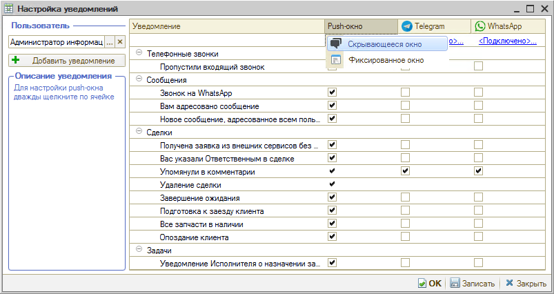
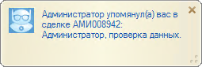
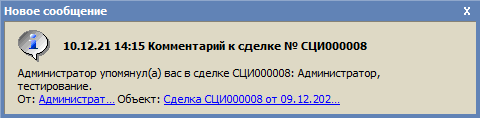

# Как изменить всплывающее окно уведомлений

<table><tr><td><b>Время чтения:</b> 3 мин.</td><td><b>Обновлено:</b> 14.09.2026</td></tr></table>

Источник: https://www.5systems.ru/help/kak-izmenit-vsplyvayuschee-okno-uvedomleniy

## Содержание

1. [Push-окно](#push-окно)
2. [Скрывающееся окно](#скрывающееся-окно)
3. [Фиксированное окно](#фиксированное-окно)

Для настройки параметров уведомлений нужно дважды кликнуть по ячейке с соответствующим видом оповещения: откроются настройки вида оповещения.

Доступны 3 вида оповещения для настройки: push-окно, Telegram и WhatsApp. Для push-окна можно изменять вид отображения, для Telegram и WhatsApp доступен выбор чата, в который будет уходить уведомление.

## Push-окно

Push-окно – это уведомление, которое появляется на экране монитора пользователя, которому оно адресовано. По умолчанию отображается в нижнем правом углу. Push-окно можно перемещать, растягивать или закрыть, пока оно не исчезнет автоматически.

Push-окно может быть фиксированным или скрывающимся – для изменения варианта нужно дважды кликнуть по ссылке под заголовком столбца “Push-окно”.

## Скрывающееся окно

Настроено по умолчанию. Уведомление в виде скрывающегося push-окна появляется на 6 секунд и постепенно исчезает, если не навести на него курсор (изменить продолжительность нет возможности).

Кликнув на текст уведомления, можно перейти в форму элемента, на основании которого оно создано, – например, в сделку.

В зависимости от настроек, заданных в карточке конкретного уведомления, – если пользователь не закрыл push-окно, то оно скроется и может остаться незамеченным, либо оно будет повторно появляться и исчезать, пока его не закроют. 
Чтобы пользователь наверняка не пропустил push-уведомление, предусмотрена возможность настроить фиксированный вариант push-окна.

## Фиксированное окно

Фиксированное окно будет висеть, пока пользователь его не закроет.

Каждый пользователь имеет возможность самостоятельно выбрать удобный для себя вариант push-уведомления.

---

**Теги:** уведомления, всплывающее окно, настройки пользователя

