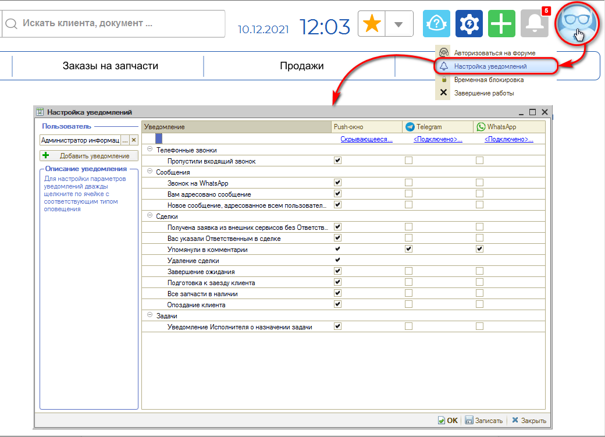

# Как настроить уведомления

<table><tr><td><b>Время чтения:</b> 1 мин.</td><td><b>Обновлено:</b> 11.07.2022</td></tr></table>

Каждый пользователь может настроить уведомления для себя. Перейти к настройкам уведомлений можно нажав на аватар на верхней панели интерфейса и выбрав соответствующий пункт выпадающего меню.

Интерфейс настройки уведомлений сделан для максимально удобного подключения чатов пользователем.

У пользователя есть возможность настроить [*виды оповещений*](../Как%20изменить%20всплывающее%20окно%20уведомлений/kak-izmenit-vsplyvayuschee-okno-uvedomleniy.md), а также [*параметры получения уведомлений*](../Как%20подписаться%20на%20уведомление/kak-podpisatsya-na-uvedomlenie.md).

---

**Теги:** уведомления, настройка уведомлений, события, подписки

