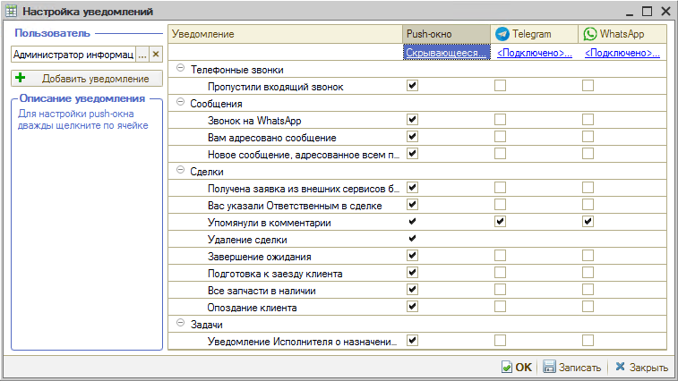
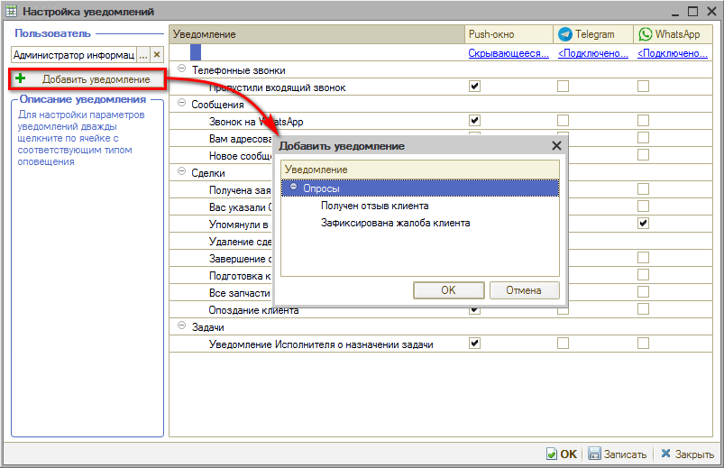
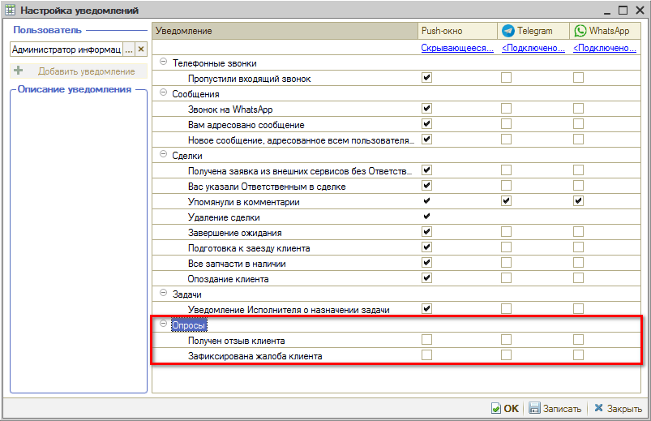

# Как подписаться на уведомление

<table><tr><td><b>Время чтения:</b> 2 мин.</td><td><b>Обновлено:</b> 11.07.2022</td></tr></table>

Система будет оповещать пользователя только о тех событиях, которые включены у него. Для включения или отключения уведомления требуется поставить или снять галочку на пересечении соответствующего типа уведомления и способа оповещения о нем.

В системе есть параметры, которые по умолчанию скрыты, но можно их добавить нажатием на кнопку “Добавить уведомление” и настроить.

Например, можно добавить уведомления по опросам: “Получен отзыв клиента” и “Зафиксирована жалоба клиента”.

---

**Теги:** уведомления, подписка, события, пользователь

