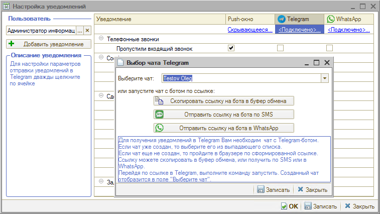

# Как получать уведомления в Telegram

<table><tr><td><b>Время чтения:</b> 1 мин.</td><td><b>Обновлено:</b> 09.11.2022</td></tr></table>

Источник: https://www.5systems.ru/help/kak-poluchat-uvedomleniya-v-telegram

Каждый сотрудник сам для себя настраивает связку со своим личным Telegram.

Для получения уведомлений нужно выбрать чат с Telegram-ботом; если он еще не создан, то требуется перейти по сформированной ссылке и запустить чат.

Уведомление о событии в программе будет присылать Telegram-бот компании в личный чат пользователя.

---

**Теги:** уведомления, Telegram, бот, настройка

