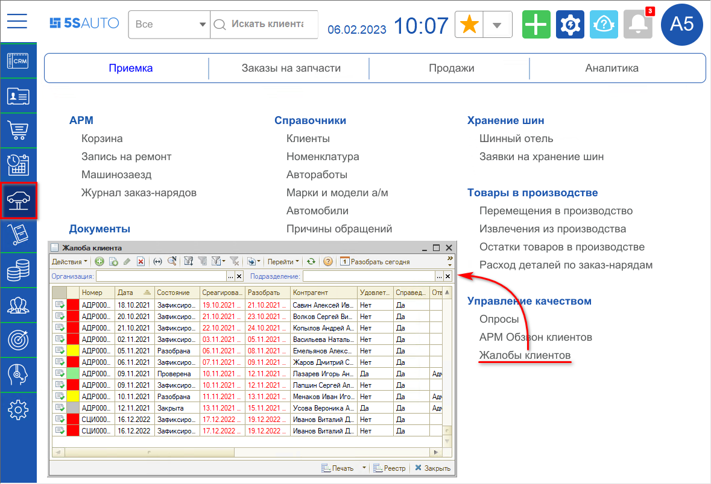
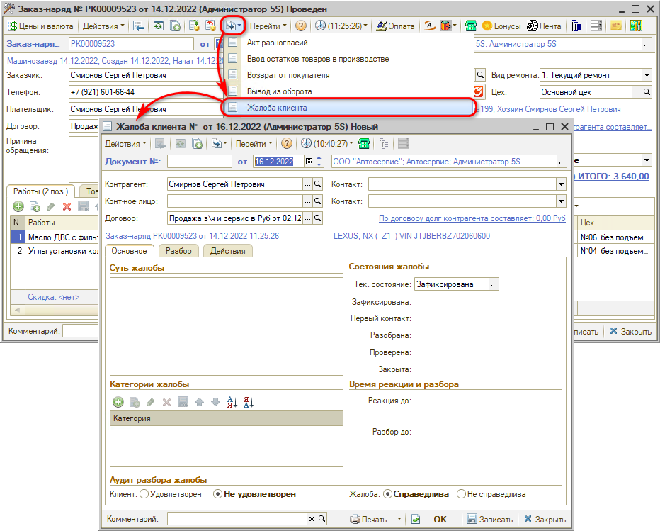
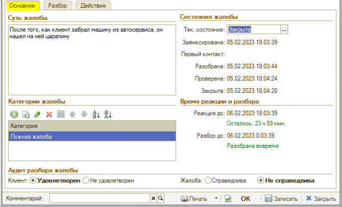
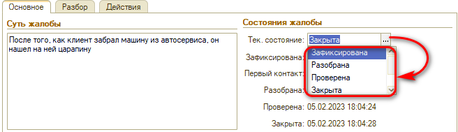
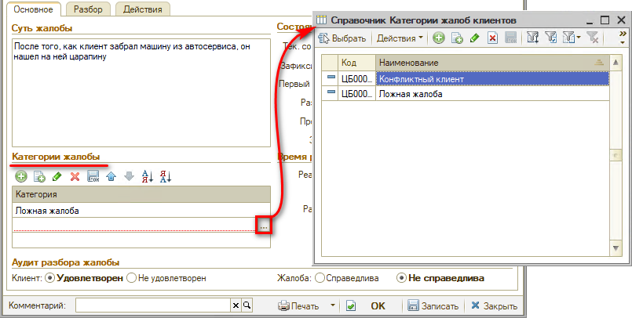
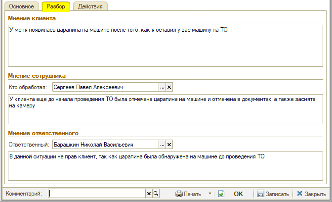
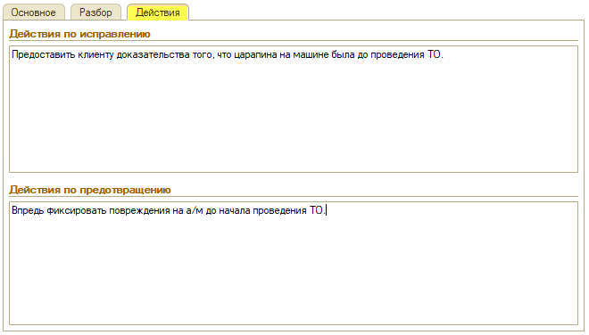
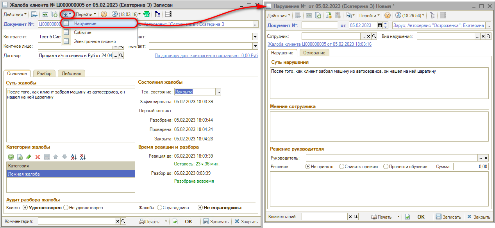

# Как зафиксировать жалобу клиента

<table><tr><td><b>Время чтения:</b> 5 мин.</td><td><b>Обновлено:</b> 08.02.2023</td></tr></table>

Документ *“Жалоба клиента”* позволяет фиксировать в программе и обрабатывать жалобы клиентов.

Перейти к реестру документов "Жалоба клиента" можно через меню: *Автосервис → Приемка → Управление качеством →* *Жалобы клиентов*

"Жалобу клиента" следует создавать вводом на основании документа при обращении клиента с жалобой на ту или иную ситуацию. Основанием жалобы могут быть следующие документы: заказ на автомобиль, заказ покупателя, заказ-наряд, заявка на ремонт, опрос, рабочий лист, рассылка, реализация товаров, резервирование автомобилей, событие.

Как правило, "Жалоба клиента" используется совместно с документом “Опрос”: при условии дополнительной настройки техподдержки, в случае неудовлетворительного ответа на опрос создается жалоба.

**Как работать с Жалобой**

Заполнение документа производится на трех вкладках:

***1. "Основное"***

*На вкладке “Основное” заполняется:*

- **Суть** - суть жалобы, которую заполняют для дальнейшего анализа.
- **Состояние** - состояние жалобы клиента: зафиксирована, разобрана, проверена или закрыта. 
  
- **Категория** - категория жалобы клиента. Заполняется элементами из справочника “Категории жалоб клиентов”: предопределенных элементов нет, заполняется самостоятельно. 
  
- **Дата и время реакции** - дата и время, до наступления которых необходимо среагировать на жалобу - связаться с клиентом первый раз. Рассчитывается как *"Дата и время регистрации жалобы" + "Значение настройки времени реакции на жалобу".*
- **Дата и время разбора** - дата и время, до наступления которых необходимо разобрать жалобу. Рассчитывается как *"Дата и время регистрации жалобы" + "Значение настройки времени разбора жалобы".*
- **Клиент удовлетворен** - признак согласия клиента, который определяется после разбора жалобы. Признак имеет два значения: "удовлетворен" и "не удовлетворен".
- **Жалоба справедлива** - признак обоснованности жалобы. Два значения: "справедлива", либо "не справедлива" – определяется после анализа жалобы.

***2. "Разбор"***

*На вкладке “Разбор” заполняется:*

- **Мнение клиента** - суть жалобы со слов клиента. *Пример: "У меня появилась царапина на машине после того, как я оставил у вас машину на ТО"*.
- **Мнение сотрудника** - ответ на жалобу со слов сотрудника. *Пример: "У клиента еще до начала проведения ТО была отмечена царапина на машине и отмечена в документах, а также заснята на камеру"*.
- **Кто обработал** - сотрудник, который отвечает по жалобе.
- **Мнение ответственного** - ответ ответственного на изученную жалобу. *Пример: "В данной ситуации неправ клиент, так как царапина была обнаружена на машине до проведения ТО"*.
- **Ответственный** - сотрудник, ответственный за обработку жалобы клиента.

***3. "Действия"***

*На вкладке “Действия” заполняются:*

- **Действия по исправлению** - действия, предпринятые сотрудниками для исправления возникшей ситуации.
- **Действия по предотвращению** - действия, предпринятые сотрудниками для исключения возникновения подобных ситуаций в будущем.

Для обработки жалобы необходимо заполнить все необходимые данные и записать документ.

В случае, если жалоба действительно справедлива, на основании нее создается документ “Нарушение”:

---

**Теги:** управление качеством, жалоба, претензия, клиент

