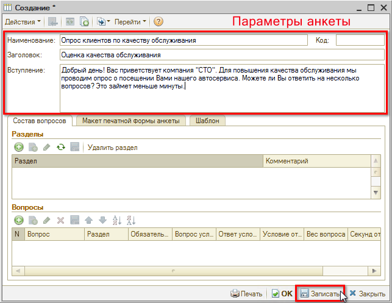
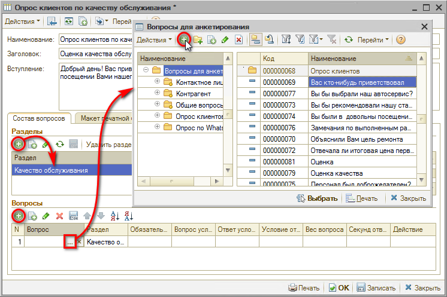
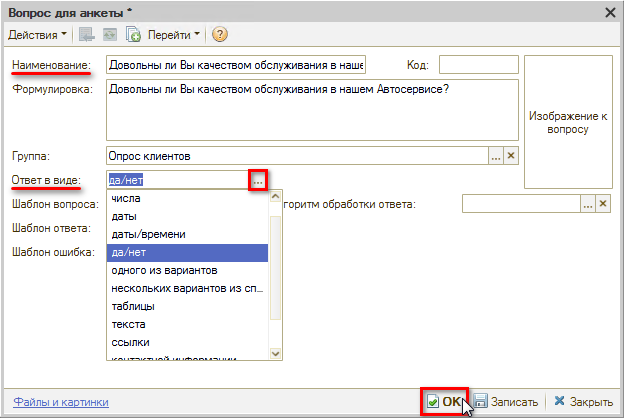
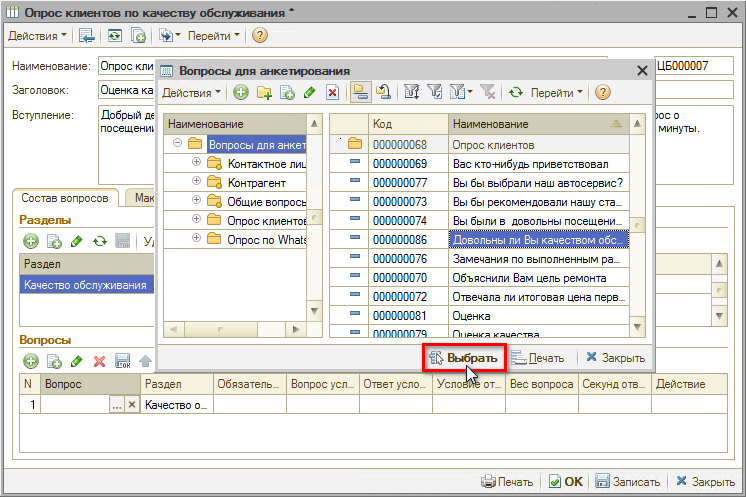
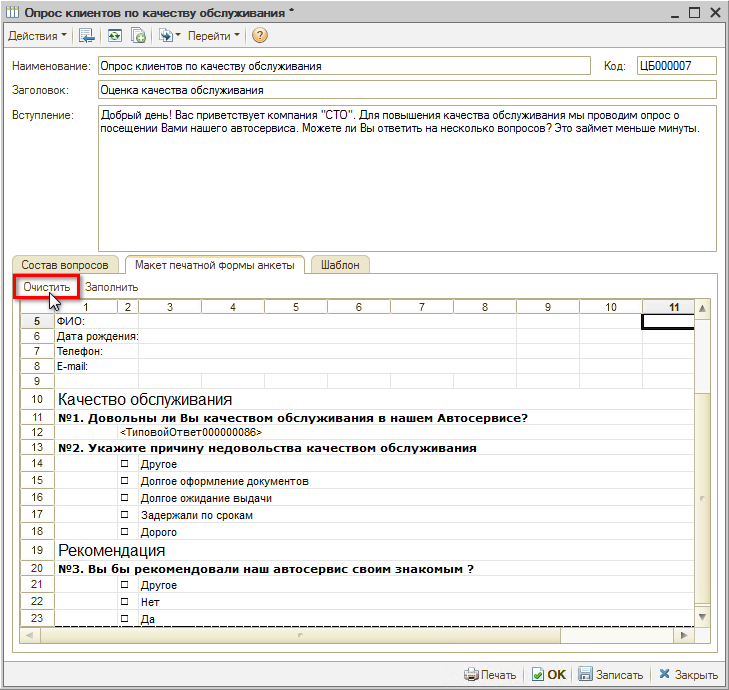

# Как настроить анкету для постсервисного обзвона

<table><tr><td><b>Время чтения:</b> 7 мин.</td><td><b>Обновлено:</b> 11.07.2022</td></tr></table>

## Содержание

1. [Пример создания анкеты](#пример-создания-анкеты)
2. [Виды ответов](#виды-ответов)
3. [Параметры обязательности для вопроса](#параметры-обязательности-для-вопроса)
4. [Правка макета печатной формы](#правка-макета-печатной-формы)

Анкеты для опроса клиентов создаются в справочнике "Типовые анкеты" (в меню интерфейса: *Администрирование* *→ Компания → CRM → Типовые анкеты* / в стандартном меню: *Справочники → Взаимоотношения с клиентами → Типовые анкеты*):

Анкета состоит из *параметров* самой анкеты, *вопросов* и *вариантов ответов* на них, которые создаются в справочнике "Вопросы для анкетирования". Вопросы могут быть разбиты по разделам, а могут просто идти общим списком.

## Пример создания анкеты

Рассмотрим пример создания анкеты, состоящий из двух разделов.

Сначала нужно заполнить параметры самой анкеты:

1. *Наименование* - обязательно для заполнения.
2. *Заголовок* - при заполнении используется в печатной форме анкеты.
3. *Вступление* - при заполнении используется в печатной форме анкеты.

и записать изменения:

Далее создадим раздел "Качество обслуживания" и добавим вопросы для раздела:

На форме создания вопроса требуется заполнить наименование, выбрать вид ответа на вопрос – например, "да/нет" (см. ниже раздел [*"Виды ответов"*](#виды-ответов)) – и нажать кнопку "ОК":

Параметр вопроса "Формулировка" по умолчанию копируется из Наименования. При необходимости можно более расширенно сформулировать вопрос. Формулировка вопроса отображается в режиме "Быстрое заполнение" опроса и печатной форме.

Далее нужно выбрать созданный вопрос для анкеты:

и установить для него обязательность заполнения:

Вторым вопросом раздела создадим вопрос с *видом ответа* "несколько вариантов из списка" и заполним возможные варианты ответов:

При установке галочки *"Требуется развернутый ответ"* появится текстовое поле для ввода пояснения.

Поскольку причину недовольства нужно указать, только если клиент на первый вопрос ответит "нет", то в качестве обязательности выберем следующую настройку:

Все возможные параметры обязательности заполнения см. ниже, в разделе [*"Параметры обязательности для вопроса"*](#параметры-обязательности-для-вопроса).

Далее создадим второй раздел – "Рекомендации". В раздел добавим необязательный для заполнения вопрос с *видом ответа* "одного из вариантов":

Изменения необходимо сохранить, нажав кнопку "Ок".

## Виды ответов

<table><tr><td><b>№ п/п</b></td><td><b>Вид ответа</b></td><td><b>Описание</b></td></tr><tr><td>1</td><td><i>Строка</i></td><td>Ввод ответа строкой.  Можно ограничить количеством символов</td></tr><tr><td>2</td><td><i>Число</i></td><td>Ввод ответа только в виде числа.  Можно ограничить количеством символов</td></tr><tr><td>3</td><td><i>Дата</i></td><td>Ввод ответа только в виде даты</td></tr><tr><td>4</td><td><i>Дата/время</i></td><td>Ввод ответа только в виде даты/времени</td></tr><tr><td>5</td><td><i>Да/нет</i></td><td>Выбор из вариантов ответа "да" или "нет"</td></tr><tr><td>6</td><td><i>Один из вариантов</i></td><td>Выбор одного варианта из предложенного списка с помощью переключателя. Заполняется список вариантов</td></tr><tr><td>7</td><td><i>Несколько вариантов из списка</i></td><td>Выбор нескольких вариантов из предложенного списка с помощью флажков. Заполняется список вариантов</td></tr><tr><td>8</td><td><i>Таблица</i></td><td>Ввод ответа в виде таблицы. Заполняется список колонок таблицы и указывается количество строк таблицы</td></tr><tr><td>9</td><td><i>Текст</i></td><td>Ввод ответа в виде текста</td></tr><tr><td>10</td><td><i>Ссылка</i></td><td>Расширяет возможности ввода ответа. Можно указать собственный тип данных для ввода ответа: число, строка, дата, булево (да/нет), значения из предопределенных справочников: Автомобили, Варианты ответов опросов, Должности, Модели автомобилей и т.д.</td></tr><tr><td>11</td><td><i>Контактная информация</i></td><td>Ввод ответа в виде контактной информации: телефон, адрес, e-mail и т.п. Способ ввода ответа зависит от выбранного вида и типа контактной информации</td></tr></table>

## Параметры обязательности для вопроса

На вопрос можно настроить обязательность его заполнения. Обязательность заполнения проверяется в ходе режима "Быстрого заполнения" анкеты.

***Варианты обязательности:***

<table><tr><td><b>№ п/п</b></td><td><b>Параметр обязательности</b></td><td><b>Описание</b></td></tr><tr><td>1</td><td>Не обязателен к заполнению</td><td>Устанавливается по умолчанию. Ответ на вопрос заполнять не обязательно.</td></tr><tr><td>2</td><td>Обязателен к заполнению</td><td>Нельзя перейти к следующему вопросу или завершить опрос, пока не заполнен ответ на вопрос.</td></tr><tr><td>3</td><td>Условно обязателен к заполнению</td><td>Задается условие при котором обязательно нужно ответить на вопрос. В качестве условия выступает ответ на предыдущий вопрос, в зависимости от которого проверяется или не проверяется обязательность заполнения.</td></tr><tr><td>4</td><td>Условно не заполнять</td><td>Задается условие при котором не отображается вопрос для заполнения в режиме "Быстрое заполнение". В качестве условия выступает ответ на предыдущий вопрос, в зависимости от которого отображается или не отображается данный вопрос.</td></tr></table>

## Правка макета печатной формы

По типовой анкете предусмотрена возможность подкорректировать макет печатной формы. Для этого требуется:

1. Перейти на вкладку "Макет печатной формы" формы редактирования анкеты и нажать кнопку "Заполнить":  
   
2. Подкорректировать макет (например, убрать код раздела) и записать изменения:  
   

Если необходимо вернуться к печатной форме, формируемой программой, нужно нажать кнопку "Очистить":

Затем снова заполнить макет и записать изменения.

---

**Теги:** управление качеством, постсервисный обзвон, анкета, опрос клиента

