# Как настроить бонусную систему

<table><tr><td><b>Время чтения:</b> 12 мин.</td><td><b>Обновлено:</b> 29.07.2026</td></tr></table>

Источник: https://www.5systems.ru/help/kak-nastroit-bonusnuyu-sistemu

## Содержание

1. [Справочник «Бонусные программы»](#справочник-бонусные-программы)
2. [Описание параметров](#описание-параметров)
3. [Мастер настроек бонусных программ](#мастер-настроек-бонусных-программ)
4. [Регламентные задания](#регламентные-задания)
5. [Рассылка об активации бонусов](#рассылка-об-активации-бонусов)
6. [Предупреждение о сгорании бонусов](#предупреждение-о-сгорании-бонусов)
7. [Права и настройки бонусной системы](#права-и-настройки-бонусной-системы)
8. [Фоновые задания](#фоновые-задания)

## Справочник «Бонусные программы»

Для настройки бонусной программы перейдите к карточке справочника "Бонусные программы" (меню программы: Маркетинг → Программа лояльности → Бонусная программа → Бонусные программы):

В карточке следует задать необходимые параметры (см. описание [*ниже*](#описание-параметров)).

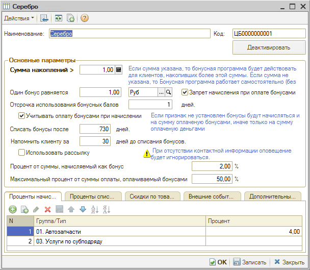

Бонусная программа начинает действовать сразу после ее активации (кнопка "Активировать" в верхней части справочника, повторное нажатие на кнопку остановит действие программы). Дата активации заносится в регистр сведений "Активные бонусные программы", ее можно изменить. Ранее указанной даты бонусы по программе начисляться не будут:

Бонусная программа указывается в дисконтной карте контрагента – таким образом в системе одновременно может действовать несколько бонусных программ, однако к дисконтной карте привязывается только одна:

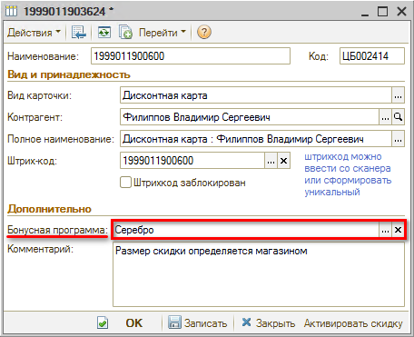

## Описание параметров

<table><tr><td><b>Параметр</b></td><td><b>Описание</b></td></tr><tr><td colspan="2"><b><i>Основные параметры</i></b></td></tr><tr><td>Сумма накоплений &gt;</td><td>Сумма, накопленная за определенный период с совершенных сделок по клиенту. В зависимости от суммы накоплений за период бонусная программа автоматически меняется у дисконтной карты. Если установить значение равное нулю, то сумма накоплений на бонусную программу влиять не будет. Автоматическая смена бонусной программы у дисконтной карты происходит, если настроено регламентное задание "Обновление бонусной программы" (см. <i><a href="#регламентные-задания">Регламентные задания</a>).</i> Период накоплений устанавливается отдельно. Для этого нужно перейти в настройки параметров: Администрирование → Сервис → Начальная настройка → Настройка констант:  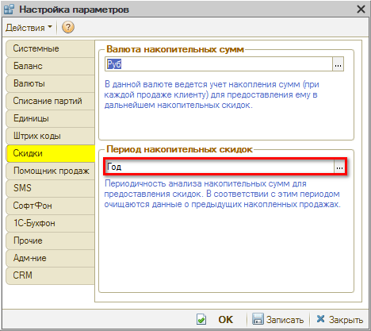 Можно установить значение параметра системы "Период накопленных скидок" как "Не используется" или "Неограниченно", тогда период при расчете суммы накоплений не будет учитываться.</td></tr><tr><td>Один бонус равняется...</td><td>Номинал одного бонуса в определенной валюте</td></tr><tr><td>Запрет начисления при оплате бонусами</td><td>Если флаг не установлен, бонусы будут начисляться в том числе и на сделку, часть которой клиент оплачивает с помощью накопленных ранее бонусов</td></tr><tr><td>Отсрочка использования бонусных баллов</td><td>Минимальное количество дней, которое должно пройти между сделкой и моментом активации бонусов (в приведенном выше примере клиент может воспользоваться накопленными бонусами спустя один день после сделки). Если установлено значение 0, клиент может использовать начисленные бонусы в тот же день для оплаты новой сделки</td></tr><tr><td>Списать бонусы после...</td><td>Срок действия бонусов, отсчитывается от дня закрытия заказ-наряда. По истечении указанных дней бонусы, начисленные за сделку, списываются</td></tr><tr><td>Напомнить клиенту за...</td><td>За сколько дней до списания бонусов клиенту будет отправляться оповещение</td></tr><tr><td>Использовать рассылку</td><td>При установке флага автоматически отправляются оповещения через мессенджеры при активации бонусов и за несколько дней до их списания (должны быть настроены регламентные задания "Активация бонусных баллов" и "Оповещение о бонусных баллах", см. ниже <i><a href="#регламентные-задания">Регламентные задания</a></i>). Сообщения отправляются на мобильный номер из карточки контрагента</td></tr><tr><td>Процент от суммы, начисляемый как бонус...</td><td>Процент от конечной стоимости каждого товара и автоработы, за который будут начисляться бонусы. Если 1 бонус равен 1 руб. и учитывается только 2% от стоимости реализованного товара или работы, то за покупку в 1000 руб. на дисконтную карту будет начислено 20 бонусов. Процент может варьировать в зависимости от товара или типа/группы товаров, автоработы/группы авторабот. Подобные варианты указываются ниже в табличной части "Проценты начислений". В приведенном выше примере карточки бонусной программы бонусы по умолчанию начисляются на 2% от стоимости для всех групп товаров, кроме "Автозапчасти" (4%) и "Услуги по субподряду" (0%)</td></tr><tr><td>Максимальный процент от суммы оплаты, оплачиваемый бонусами</td><td>Максимальный процент от суммы сделки, который клиент может оплатить с помощью бонусов. В приведенном выше примере бонусами нельзя оплатить больше 50% конечной суммы заказ-наряда</td></tr><tr><td colspan="2"><i>Вкладка "Проценты начислений"</i></td></tr><tr><td>Табличная часть "Проценты начислений"</td><td>Указывается товар или тип/группа товаров, авторабота/группа авторабот, процент начислений на который отличается от параметра "Процент от суммы, начисляемый как бонус"</td></tr><tr><td colspan="2"><i>Вкладка "Проценты списания"</i></td></tr><tr><td>Табличная часть "Проценты списания"</td><td>Максимальный процент от суммы строки, который клиент может оплатить с помощью бонусов. В данном примере показано, что автоработы из группы "Автозапчасти", "Автомойка" и "Услуги по субподряду" нельзя оплатить бонусами в заказ-наряде:  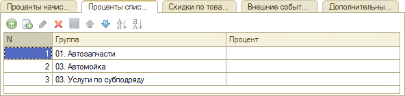</td></tr><tr><td colspan="2"><i>Вкладка "Скидки по товарам/услугам"</i></td></tr><tr><td>Табличная часть "Скидки по товарам/услугам"</td><td>Номенклатура или автоработы, на которые в рамках бонусной программы предоставляется скидка. При установке скидки в 100% товар/работа предоставляется в подарок. Пример настройки предоставления работ в подарок:  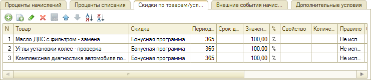 По товару/работе должен быть установлен тип скидки со следующими параметрами:  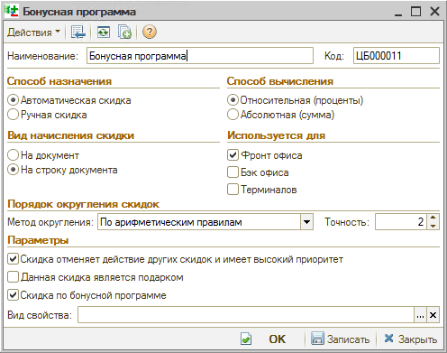</td></tr><tr><td colspan="2"><i>Вкладка "Внешние события начисления"</i></td></tr><tr><td>Табличная часть "Внешние события начисления"</td><td>Внешние события: день рождения клиента, регистрация в мобильном приложении или на сайте, при возникновении которых начисляются бонусные баллы:   Настройка внешних событий происходит через справочник "Автоматические действия". Чтобы настроить внешние события начисления обратитесь в техническую поддержку компании "Пять систем".</td></tr><tr><td colspan="2"><i>Вкладка "Дополнительные условия"</i></td></tr><tr><td>Табличная часть "Дополнительные условия"</td><td>Настройка условий, при которых будет производиться начисление или списание бонусных баллов:  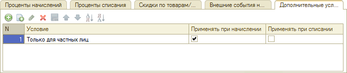 В примере задано условие начисления бонусных баллов только для частных лиц. Можно настроить условия начисления или списания по конкретному подразделению или цеху. Чтобы настроить дополнительные условия обратитесь в техническую поддержку компании "Пять систем".</td></tr></table>

## Мастер настроек бонусных программ

С помощью Мастера настроек системы удобно настраивать регламентные задания по бонусной системе и автоматические действия по рассылке сообщений. Все настройки, относящиеся к бонусной системе, расположены на вкладке "Бонусная программа":

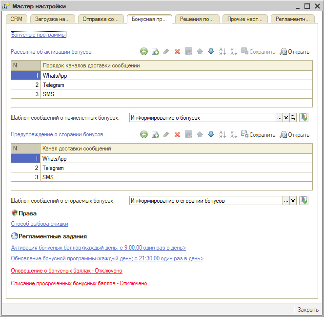

Из Мастера настроек системы можно открыть справочник "Бонусные программы", нажав кнопку-ссылку "Бонусные программы".

## Регламентные задания

Раздел позволяет перейти к подключению/отключению регламентных заданий, влияющих на работу бонусной системы:

1. Активация бонусных баллов - активирует начисленные за сделку бонусы спустя тот период времени, который был указан в параметрах бонусной программы (см. [Настройка бонусной программы](#справочник-бонусные-программы)). Если в параметрах бонусной программы установлен флаг "Использовать рассылку", то отправляется также сообщение клиенту согласно настройкам в блоке Рассылка об активации бонусов.
2. Списание просроченных бонусных баллов - списывает неиспользованные клиентами бонусы через указанное в параметрах (см. [Настройка бонусной программы](#справочник-бонусные-программы)) количество дней после сделки.
3. Оповещение о бонусных баллах - если в параметрах бонусной программы установлен флаг "Использовать рассылку", то отправляется сообщение клиенту согласно настройкам в блоке Предупреждение о сгорании бонусов.
4. Обновление бонусной программы - изменяет бонусную программу по дисконтной карте клиента в зависимости от суммы накоплений, указанной в карточке бонусной программы (см. [Настройка бонусной программы](#справочник-бонусные-программы)). Создает документ "Назначение товарных скидок", если в карточке бонусной программы заданы скидки на товары/работы.

Для активации и списания бонусов используется документ "Корректировка бонусов" (меню программы: Маркетинг → Программа лояльности → Бонусная программа → Корректировка бонусов). При исполнении регламентных заданий Активация бонусных баллов и Списание просроченных бонусных баллов документ "Корректировка бонусов" создается автоматически.

Для перехода к настройке регламентного задания, нажмите ссылку с его наименованием:

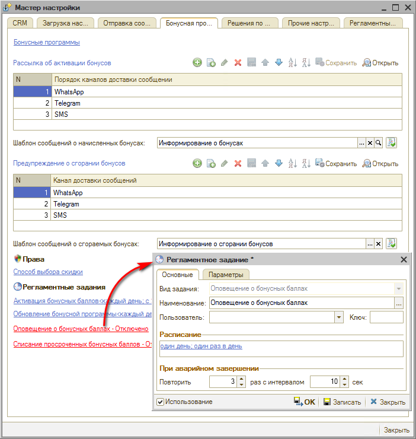

Для активации регламентного задания необходимо, чтобы у него стоял флаг "Использование" и было настроено расписание. Пример см. в [*Мастер настройки системы → Регламентные задания*](../../../articles/5S%20AUTO/Администрирование%20и%20настройка%20системы/Мастер%20настройки%20системы/master-nastroyki-sistemy.md#регламентные-задания).

## Рассылка об активации бонусов

Настройка автоматического действия по отправке сообщения клиенту об активации начисленных ему бонусов. Отправка сообщения осуществляется, если включено регламентное задание "Активация бонусных баллов" (см. *[Регламентные задания](#регламентные-задания))* и в параметрах бонусной программы установлен флаг "Использовать рассылку" (см. *[Настройка бонусной программы](#справочник-бонусные-программы)).*

Для настройки установите каналы доставки сообщения (мессенджеры), куда будет отправляться сообщение клиенту:

**Обратите внимание!** Для отправки сообщений через мессенджеры, необходимо, чтобы была настроена интеграция с ними. Проверить наличие настроенной интеграции можно на вкладке "Отправка сообщений" Мастера настройки сообщений. См. [*Мастер настройки системы → Каналы доставки*](../../../articles/5S%20AUTO/Администрирование%20и%20настройка%20системы/Мастер%20настройки%20системы/master-nastroyki-sistemy.md#каналы-доставки).

Если указано несколько мессенджеров, то логика отправки сообщений следующая:

1. Система пытается отправить сообщение на канал доставки №1. 
   Если сообщение отправлено и клиент прочитал его, то на другие каналы сообщение не отправляется.
2. Если сообщение не отправлено или клиент не прочитал его в течение 10 минут, то Система отправляет сообщение на канал доставки №2. 
   Если сообщение отправлено и клиент прочитал его, то на другие каналы сообщение не отправляется.
3. Если сообщение не отправлено или клиент не прочитал его в течение 10 минут, то Система отправляет сообщение на канал доставки №3.

При необходимости измените текст преднастроенного шаблона сообщения:

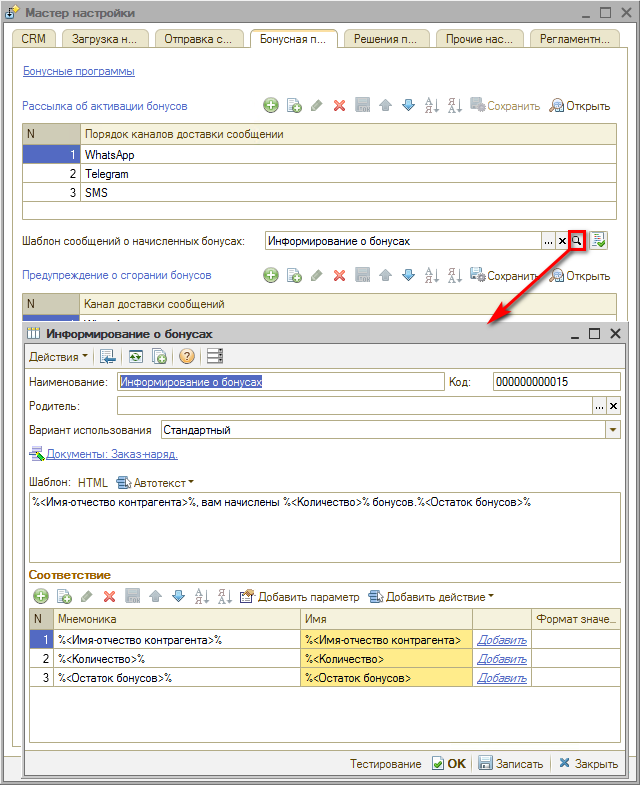

Измененный шаблон можно протестировать, нажав кнопку   "Проверить шаблон сообщения" рядом с параметром "Шаблон сообщений о начисленных бонусах" (см. [*Мастер настройки системы → Проверка шаблона сообщения*](../../../articles/5S%20AUTO/Администрирование%20и%20настройка%20системы/Мастер%20настройки%20системы/master-nastroyki-sistemy.md#проверка-шаблона-сообщения)).

После внесения изменений в настройку блока "Рассылка об активации бонусов" обязательно нажмите кнопку "Сохранить":

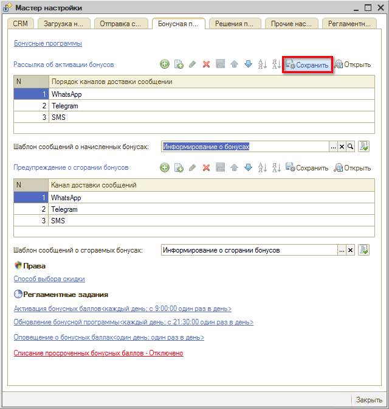

## Предупреждение о сгорании бонусов

Настройка автоматического действия по отправке сообщения клиенту о скором сгорании его бонусов. Отправка сообщения осуществляется, если включено регламентное задание "Оповещение о бонусных баллах" (см. *[Регламентные задания](#регламентные-задания))* и в параметрах бонусной программы установлен флаг "Использовать рассылку" (см. *[Настройка бонусной программы](#справочник-бонусные-программы)).*

Настройка производится по аналогии с настройкой блока *Рассылка об активации бонусов*.

## Права и настройки бонусной системы

Для работы бонусной системы предусмотрены права и настройки (меню программы: Администрирование → Сервис → Пользователи и права → Установка прав и настроек):

1. Автоматически создавать дисконтную карточку клиенту - если установлено значение "Да", то при начислении бонусов, но отсутствии у контрагента дисконтной/бонусной карты в программе, дисконтная/бонусная карта будет создаваться автоматически: 
   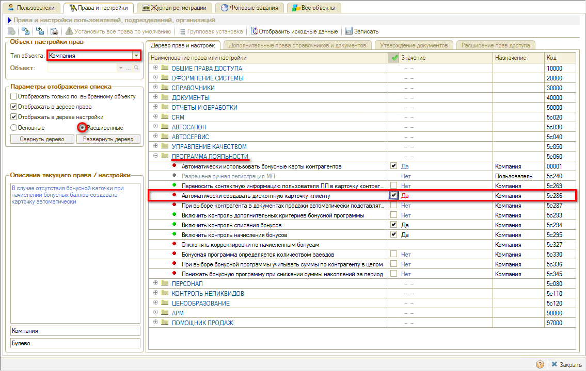
2. Автоматически использовать бонусные карты контрагентов - если установлено значение "Да", то в документы "Заказ-наряд" и "Реализация товаров" будет автоматически подставляться дисконтная/бонусная карта контрагента, если она у него есть: 
   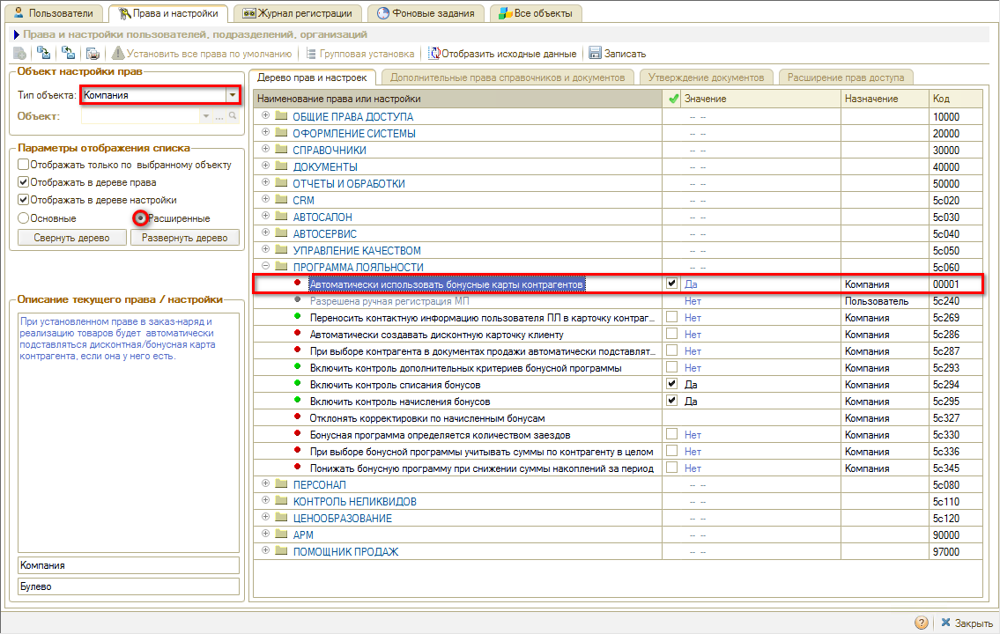

## Фоновые задания

В системе существуют фоновые задания, непосредственно связанные с бонусной системой - перечислены в разделе Регламентные задания. Запуск фоновых заданий происходит в Установках прав и настроек на вкладке "Фоновые задания".

Настроить и активировать регламентные задания можно через редактирование регламентного задания на вкладке "Фоновые задания" (альтернативный способ настройки через [*Мастера настройки системы*](../../../articles/5S%20AUTO/Администрирование%20и%20настройка%20системы/Мастер%20настройки%20системы/master-nastroyki-sistemy.md)). Если фонового задания по умолчанию нет в списке регламентных заданий, его необходимо создать по кнопке "Добавить".

---

**Теги:** скидки и бонусы, бонусная система, настройка, правила начисления

