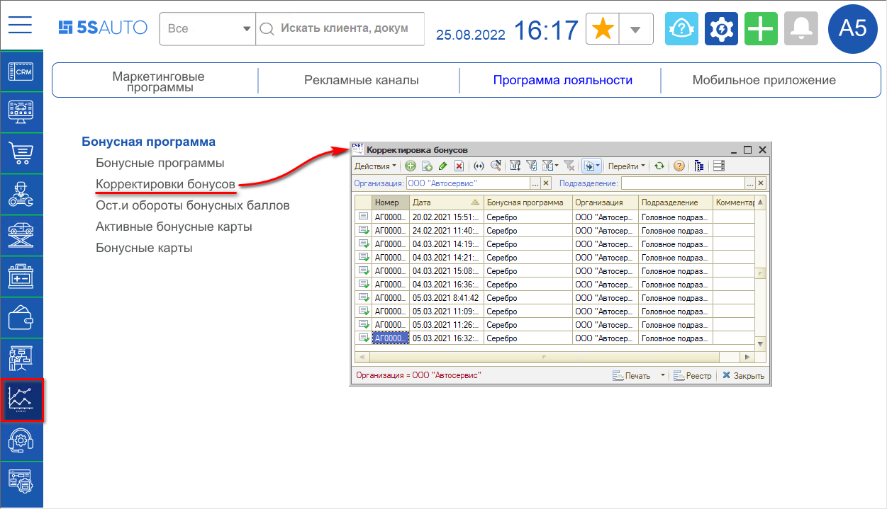
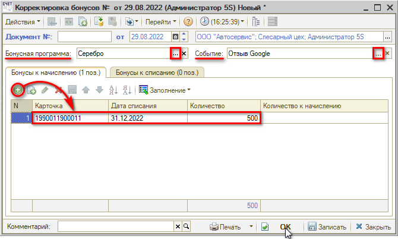

# Как начислить бонусы клиенту

<table><tr><td><b>Время чтения:</b> 2 мин.</td><td><b>Обновлено:</b> 06.06.2025</td></tr></table>

Источник: https://www.5systems.ru/help/kak-nachislit-bonusy-klientu

Для того, чтобы активировать бонусы *вручную*, используется документ “Корректировка бонусов” – *Маркетинг → Программа лояльности → Бонусная программа → Корректировки бонусов:*

Рекомендуется настроить регламентные задания "Активация бонусных баллов" и "Списание просроченных бонусных баллов", которые будут создавать и проводить документы в фоновом режиме (см. урок [Как настроить бонусную систему → Регламентные задания](../Как%20настроить%20бонусную%20систему/kak-nastroit-bonusnuyu-sistemu.md)). Однако иногда требуется начислить клиенту бонусы вручную.

Для этого следует создать новый документ "Корректировка бонусов" заполнить поля “Бонусная программа” и “Событие”, на вкладке "Бонусы к начислению" добавить и заполнить строки – *выбрать номер карты,* указать количество бонусов и дату списания (срок действия):

Списание просроченных бонусов также делается документом "Корректировка бонусов", в этом случае необходимо перейти на вкладку "Бонусы к списанию" и нажать на кнопку *Заполнение → Заполнить просроченными бонусами* или заполнить вручную. Одновременно одним и тем же документом и активировать новые бонусы, и списывать просроченные не рекомендуется.

---

**Теги:** скидки и бонусы, бонусы, начисление, бонусный счет

