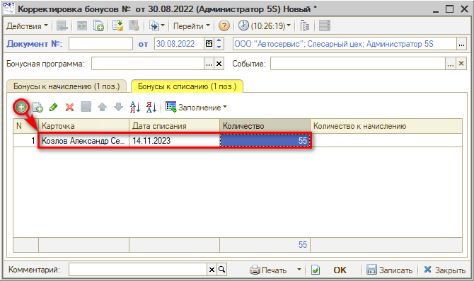
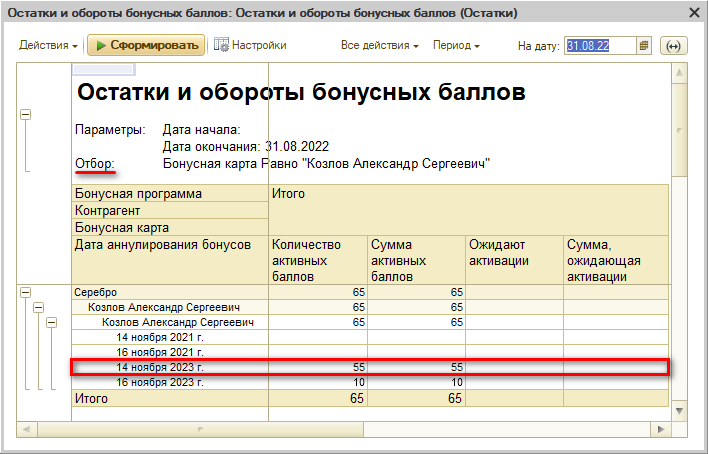
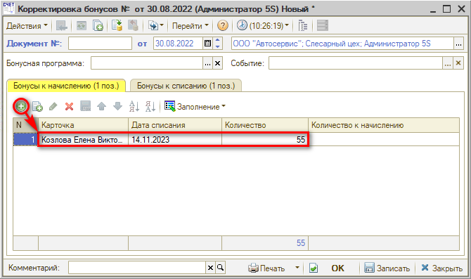
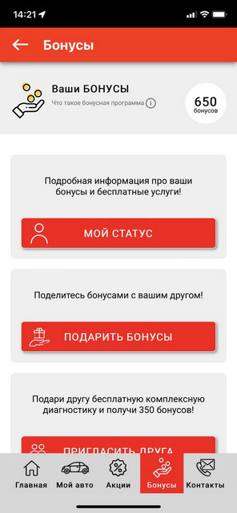
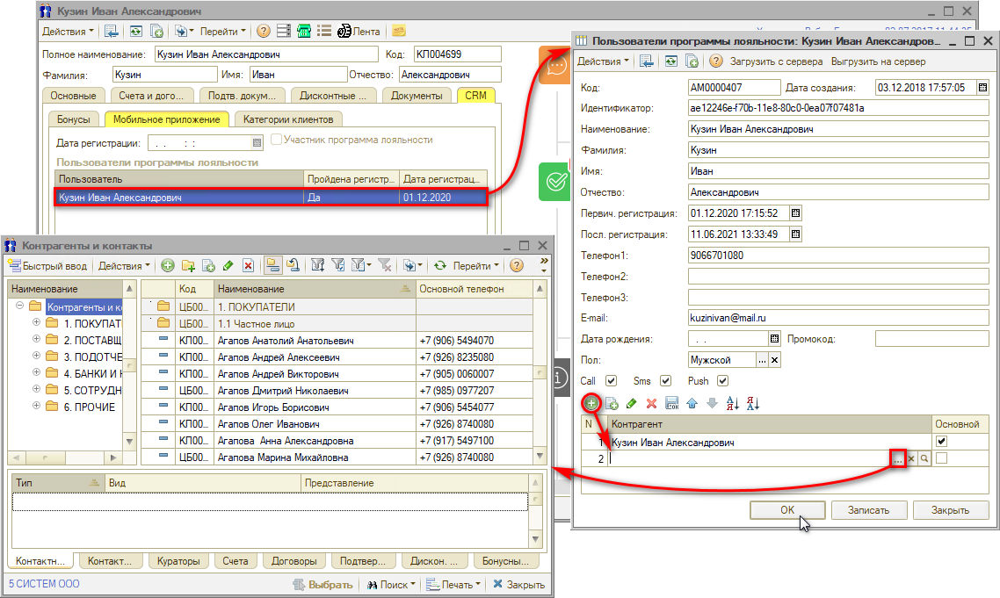
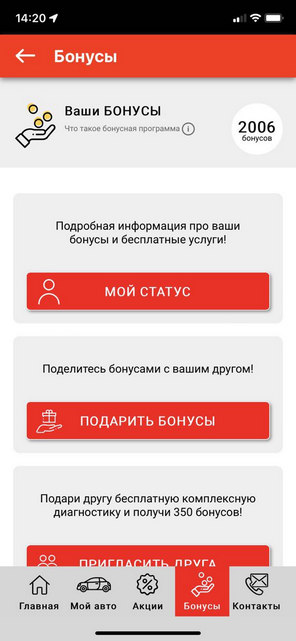

# Как объединить бонусные счета клиентов

<table><tr><td><b>Время чтения:</b> 3 мин.</td><td><b>Обновлено:</b> 14.09.2026</td></tr></table>

Источник: https://www.5systems.ru/help/kak-obedinit-bonusnye-scheta-klientov

## Содержание

1. [Способ 1. При помощи документа "Корректировка бонусов"](#способ-1-при-помощи-документа-корректировка-бонусов)
2. [Способ 2. Настройка карточки пользователя программы лояльности](#способ-2-настройка-карточки-пользователя-программы-лояльности)

## Способ 1. При помощи документа "Корректировка бонусов"

Для того, чтобы бонусы одного клиента начислить другому (например, бонусы мужа – жене), может использоваться документ "Корректировка бонусов". Для этого следует создать новый документ (см. урок [Как начислить бонусы клиенту](../Как%20начислить%20бонусы%20клиенту/kak-nachislit-bonusy-klientu.md)), на вкладке "Бонусы к списанию" добавить новую строку и заполнить карточку клиента (номер или ФИО), с которого требуется списать бонусы, *обязательно* дату списания[\*](#snoska) (т.е. срок действия) этих бонусов (см. пояснение далее) и их количество:

\*Дата списания бонусов появляется в программе при их начислении (ручном или автоматическом). Найти дату списываемых бонусов для заполнения "Корректировки бонусов" можно в отчете "Остатки и обороты бонусных баллов", открытом с отбором по бонусной карте:

После этого необходимо перейти на вкладку "Бонусы к начислению", добавить новую строку и заполнить ее по клиенту, которому требуется начислить эти бонусы – карточку, дату списания (здесь может быть произвольная) и количество:

Затем "Корректировку бонусов" следует записать и провести нажатием на кнопку "ОК".

## Способ 2. Настройка карточки пользователя программы лояльности

Если требуется объединить бонусные счета клиентов, которые являются пользователями мобильного приложения, то это можно сделать через функционал мобильного приложения в программе.

Например, у одного клиента есть 650 бонусов:

В карточке клиента на вкладке "CRM → Мобильное приложение" следует двойным кликом открыть карточку пользователя программы лояльности, в ней добавить в таблице второго пользователя и сохранить:

Сразу же после этого у клиента в мобильном приложении изменяется количество бонусов – к ним добавляются бонусы второго пользователя:

---

**Теги:** скидки и бонусы, бонусные счета, объединение, клиенты

