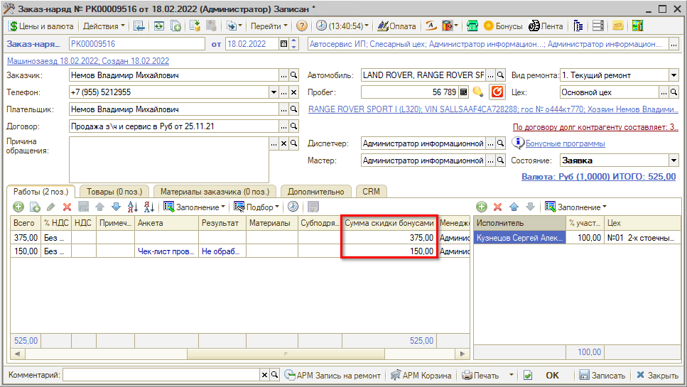

# Как оплатить бонусами

<table><tr><td><b>Время чтения:</b> 2 мин.</td><td><b>Обновлено:</b> 14.09.2026</td></tr></table>

Источник: https://www.5systems.ru/help/kak-oplatit-bonusami

Клиент может использовать бонусы для оплаты любой последующей сделки при условии, что эти бонусы активированы и не просрочены. Для этого в документе "Заказ-наряд" необходимо нажать кнопку “Бонусы” или ссылку "Бонусные программы", ввести количество используемых бонусов и нажать "Ок":

Бонусы будут переведены в указанный ранее номинал в настройках, получившаяся сумма будет распределена по суммам товаров и работ; итог будет отображаться в колонке "Сумма скидки бонусами":

## Как применить скидку по бонусной программе

Если в рамках бонусной программы настроены скидки на товары/работы (см. [вкладку "Скидки по товарам/услугам" в уроке по настройке бонусной системы](../Как%20настроить%20бонусную%20систему/kak-nastroit-bonusnuyu-sistemu.md)), то в окне "Информация о бонусных баллах" они отобразятся для выбора в документ:

Для выбора доступны те товары/работы со скидкой, которые клиент еще не использовал.

Выбранные товары или работы отобразятся на соответствующей вкладке в Заказ-наряде с примененной скидкой.

---

**Теги:** скидки и бонусы, бонусы, оплата бонусами, заказ-наряд

