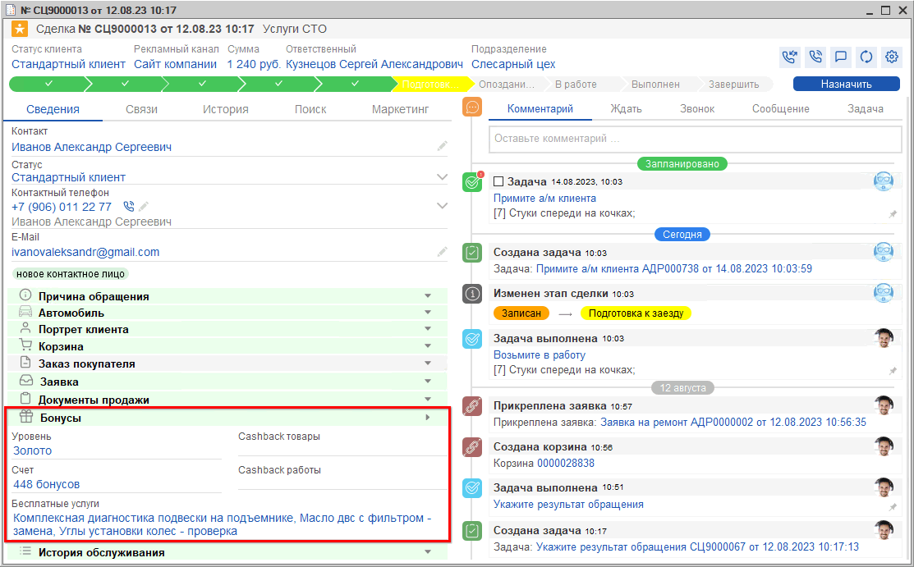
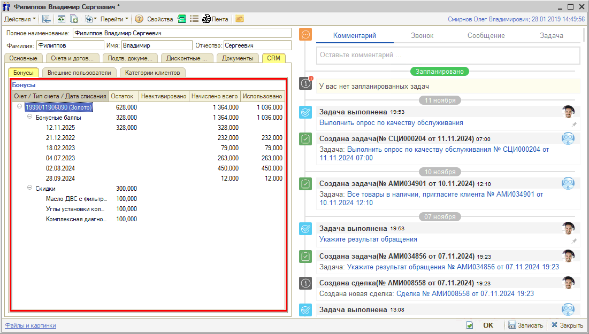
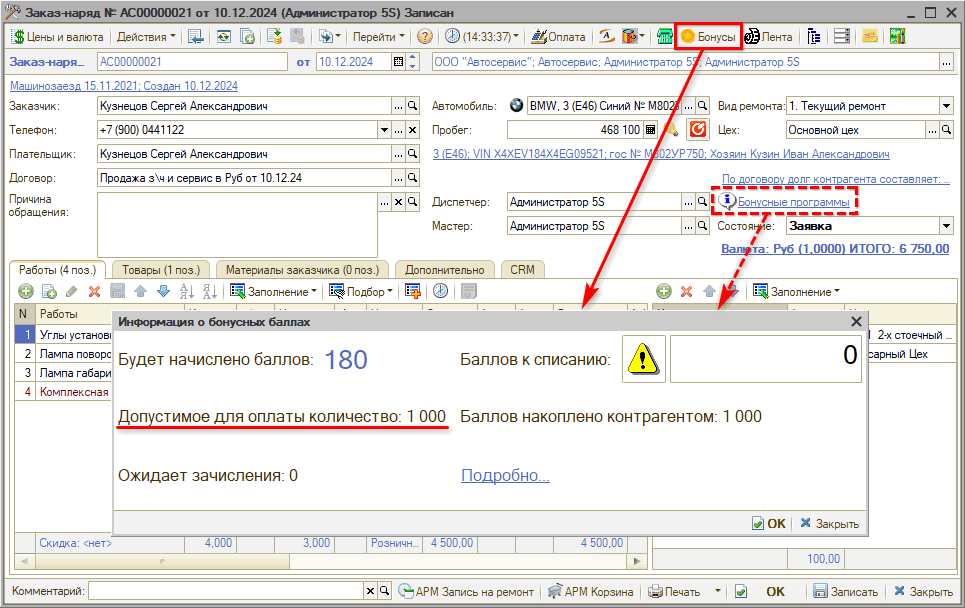

# Как посмотреть бонусы клиента

<table><tr><td><b>Время чтения:</b> 3 мин.</td><td><b>Обновлено:</b> 06.06.2025</td></tr></table>

Источник: https://www.5systems.ru/help/kak-posmotret-bonusy-klienta

Увидеть информацию о бонусных баллах клиента можно в следующих местах программы:

## 1. В Сделке

Бонусы отображаются в сведениях Сделки в информационном блоке *Бонусы*: представлена информация по бонусной системе – уровень, счёт, бесплатные услуги и т.д.

## 2. В карточке клиента

Также информацию по бонусам можно увидеть в карточке клиента на вкладке *CRM → Бонусы –* отображаются бонусные баллы и скидки, которые были начислены, использованы и остаток:

## 3. В Заказ-наряде

Также бонусы можно увидеть непосредственно в Заказ-наряде: для просмотра количества бонусов следует нажать кнопку "Бонусы" на верхней панели (кнопка активна, если у клиента есть дисконтная карта) или ссылку "Бонусные программы" над полем состояния Заказ-наряда (ссылка отображается при наличии дисконтной карты):

На открывшейся форме "Информация о бонусных баллах" отображаются данные:

- *Будет начислено баллов…* – сколько баллов будет начислено на дисконтную карту клиента после закрытия заказ-наряда.
- *Допустимое для оплаты количество…* – максимальное количество бонусов, которое можно потратить на данную сделку.
- *Ожидает зачисления…* – согласно настройкам, клиент не может использовать начисленные ему баллы сразу после заключения сделки.
- *Баллов к списанию…* – заполняется вручную, когда клиент хочет использовать накопленные им баллы (см. урок [Как оплатить бонусами](../Как%20оплатить%20бонусами/kak-oplatit-bonusami.md)).
- *Баллов накоплено контрагентом…* – количество активных баллов на дисконтной карте клиента.
- По ссылке *"Подробно…"* в отдельном окне открывается отчет "Остатки и обороты бонусных баллов".

---

**Теги:** скидки и бонусы, бонусы, бонусный счет, клиент

