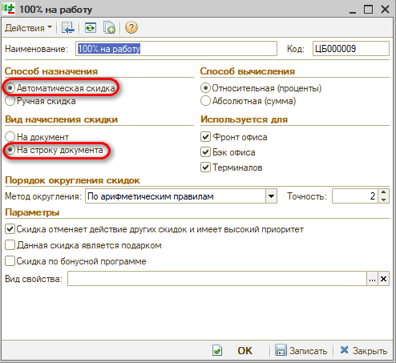
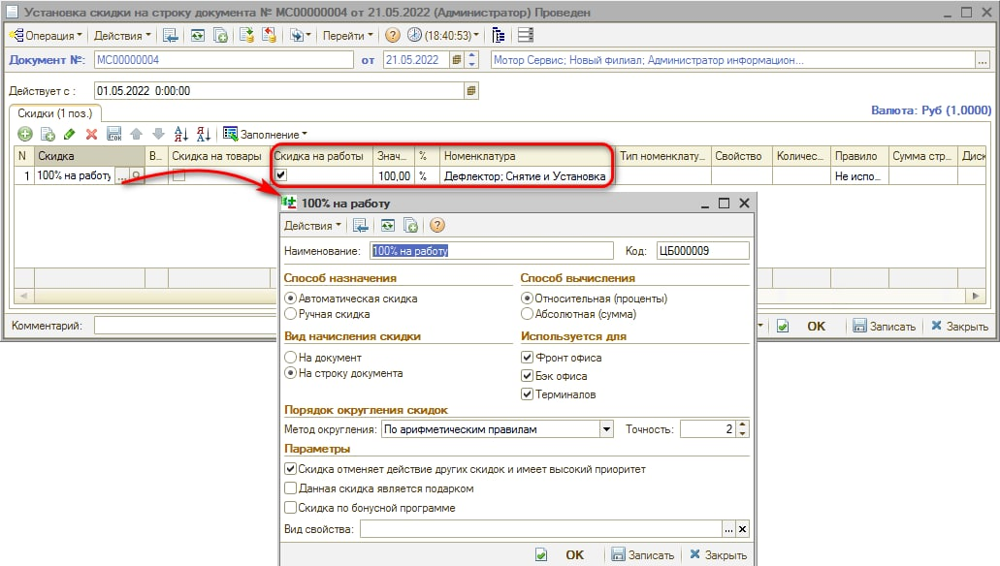
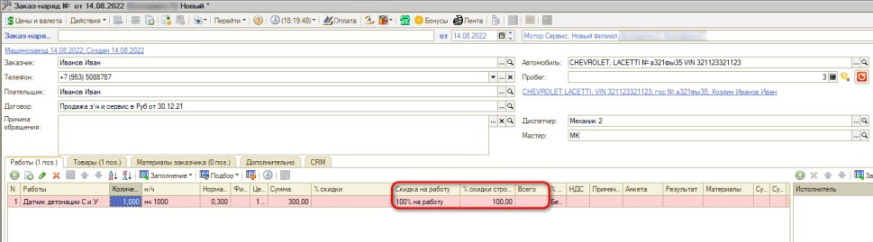

# Как создать бесплатную автоработу

<table><tr><td><b>Время чтения:</b> 7 мин.</td><td><b>Обновлено:</b> 10.02.2025</td></tr></table>

См. видео в статье *"[Настройка скидок → Создание автоматической скидки](../../../articles/5S%20AUTO/Ценообразование/Настройка%20скидок/nastroyka-skidok.md#создание-автоматической-скидки)".*

**Создание скидки на работу**

Для создания бесплатной автоработы, за которую начисляется выработка сотруднику, необходимо создать автоматическую скидку на строку, установив ее на необходимую автоработу.

Для создания скидки нужно перейти в справочник через меню *Администрирование → Компания → Типы скидок и наценок*. В данном справочнике создать скидку, выбрав способ назначения “Автоматическая скидка” и вид начисления скидки “На строку документа”.

Пример созданной скидки:

**Создание бесплатной автоработы**

После создания скидки необходимо создать документ “Установка скидки на строку документа” и закрепить за ней процент. Перейти к реестру документов можно через меню *Администрирование → Компания → Назначение скидок на строки.*

*Как создать скидку на строку – смотрите урок: [Как создать скидку на строку](../Как%20создать%20скидку%20на%20строку/kak-sozdat-skidku-na-stroku.md).*

В табличной части документа "Установка скидки на строку документа" необходимо выбрать ранее созданную скидку. В столбце "Скидка на работы" отметить, что данная скидка распространяется на работы. Значение указать "100". В столбце “Номенклатура” выбрать вариант *Авторабота,* затем выбрать из справочника автоработу, на которую будет распространяться скидка 100%:

После этого во всех документах, созданных позже даты, указанной в поле “Действует с”, будет работать эта скидка.

**Использование скидки**

Скидка подставится автоматически при выборе автоработы в Заказ-наряде:

Если скидка не проставилась автоматически при выборе бесплатной автоработы, необходимо проверить право “Способ выбора скидки” (Код 43013), у которого должно быть установлено значение “Автоматические и ручные скидки”.

Данное право устанавливается на шаблон прав, тип объекта – Пользователь. *Подробнее об установке прав см. статью: [Установка прав и настроек пользователя](../../../articles/5S%20AUTO/Пользователи%20и%20права/Установка%20прав%20и%20настроек%20пользователя/ustanovka-prav-i-nastroek-polzovatelya.md).*

---

**Теги:** скидки и бонусы, бесплатная авторабота, скидка 100%, автоработы

