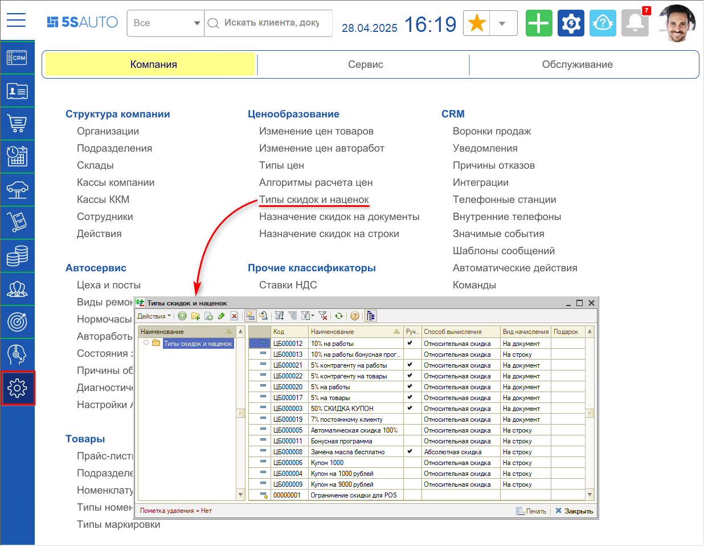
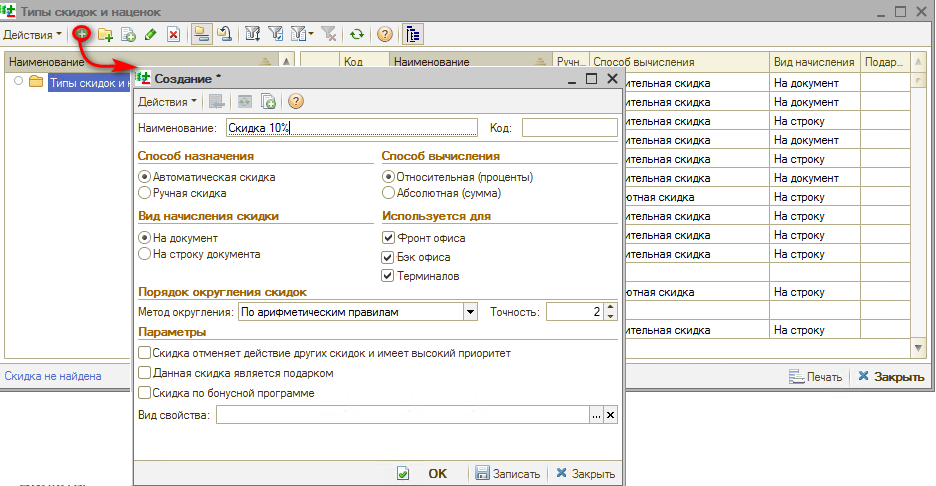
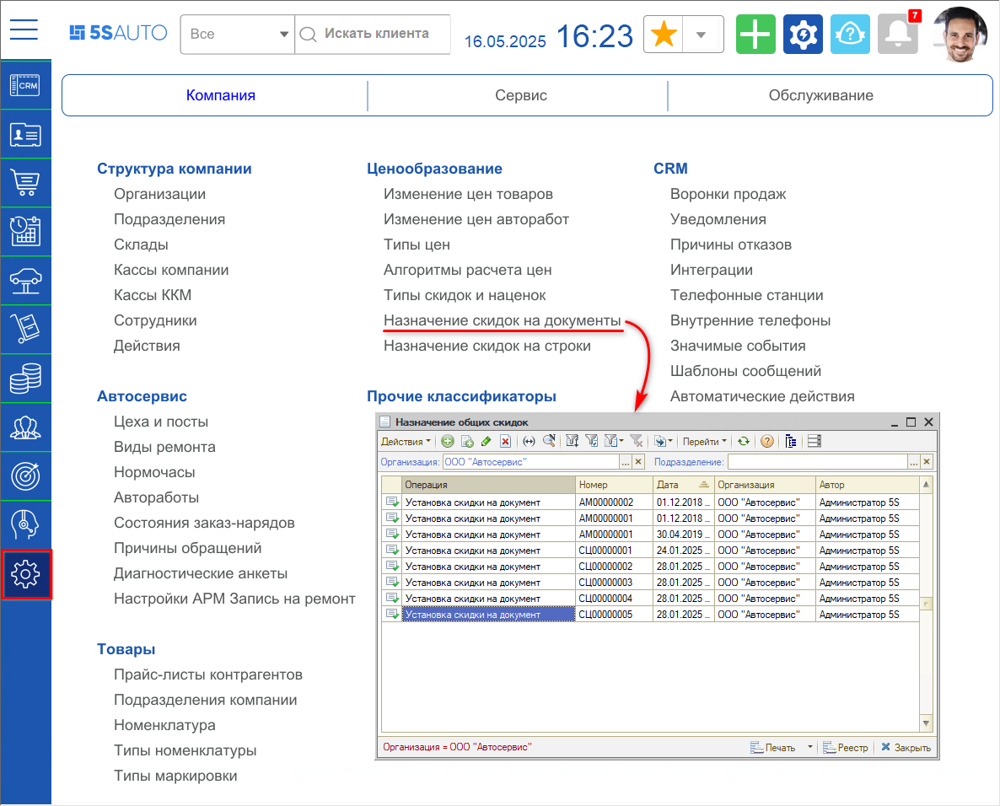
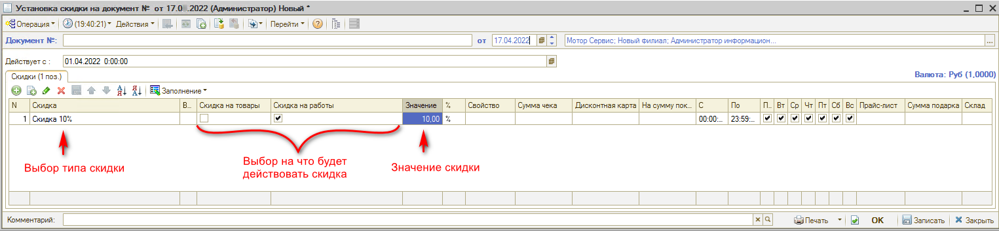
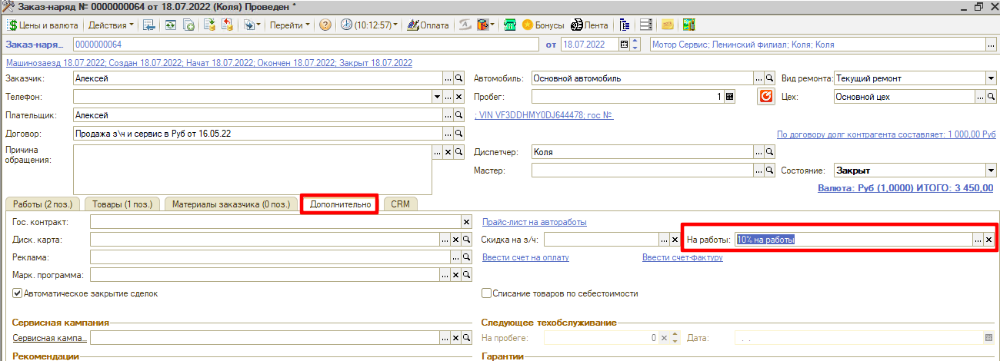
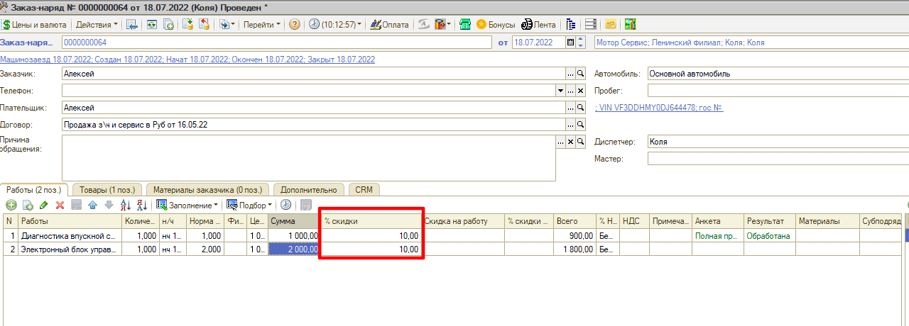

# Как создать скидку на документ

<table><tr><td><b>Время чтения:</b> 7 мин.</td><td><b>Обновлено:</b> 31.10.2025</td></tr></table>

Источник: https://www.5systems.ru/help/kak-sozdat-skidku-na-dokument

## Содержание

1. [Как создать тип скидки для назначения на документ](#как-создать-тип-скидки-для-назначения-на-документ)
2. [Как установить назначение скидки на документ](#как-установить-назначение-скидки-на-документ)

См. видео в статье "[Настройка скидок](../../../articles/5S%20AUTO/Ценообразование/Настройка%20скидок/nastroyka-skidok.md)":

- *"Создание скидки на документ"* в раздел *"[Настройка и применение скидок на документ](../../../articles/5S%20AUTO/Ценообразование/Настройка%20скидок/nastroyka-skidok.md#настройка-и-применение-скидок-на-документ)";*
- *"Использование ручных скидок в документах продажи"* в разделе *"[Ручная установка скидки на строку в документе](../../../articles/5S%20AUTO/Ценообразование/Настройка%20скидок/nastroyka-skidok.md#ручная-установка-скидки-на-строку-в-документе)"* (с 0:45).

## Как создать тип скидки для назначения на документ

***Скидки на документ*** создаются для того, чтобы в дальнейшем в документах продажи была возможность добавить бонус в виде скидки, например, постоянному клиенту.

Процесс создания скидки можно поделить на два этапа:

1. Создание типа скидки, в котором указывается назначение, способ вычисления и вид скидки.
2. Привязка определенного процента скидки за созданным типом, указание правил использования скидки.

Создать новый тип скидок можно в справочнике “Типы скидок и наценок”. Для этого необходимо зайти в справочник через меню *Администрирование → Компания → Ценообразование → Типы скидок и наценок:*

***Важно:*** *Ни в коем случае не меняйте скидку "Скидка не найдена". Она автоматически используется в случаях ручного изменения цены "Всего" в табличной части документов.*

В данном справочнике следует добавить новый тип скидки, через кнопку “Добавить”:

Далее следует заполнить значения:

1. ***Наименование*** – обязательное поле для заполнения.
2. ***Способ назначения:*** необходимо выбрать, скидка будет проставляться автоматически или выбираться вручную.
3. ***Способ вычисления:*** требуется выбрать, какой будет скидка – в процентах или фиксированная.
4. ***Вид начисления скидки:*** для настройки скидки на документ указываем “На документ”.
5. ***Используется для:*** рекомендуется выбирать все.
6. ***Порядок округления скидки:*** требуется выбрать метод округления (по арифметическим правилам или всегда в большую сторону), а также указать точность. 
   *Точность формирования скидки:* 
   2 - Округление до 1 копейки; 
   1 - Округление до 10 копеек; 
   0 - Округление до рубля; 
   -1 - Округление до 10 рублей; 
   -2 - Округление до 100 рублей.
7. ***Параметры*** выбираются в зависимости от того, какая скидка будет настраиваться в дальнейшем. Обычно не выбирается ничего либо выбирается, что она вытесняющая.

## Как установить назначение скидки на документ

После создания типа скидки необходимо создать документ *"Назначение общих скидок"*.

Без создания документа за созданной скидкой в справочнике “Типы скидок и наценок” не будет прикреплен процент скидки.

Для перехода к реестру документов перейти через меню *Администрирование → Компания → Ценообразование → Назначение скидок на документы:*

При создании нового документа установки скидки указывается дата, с которой будет действовать скидка в поле *"Действует с"*. Рекомендуется указать начало месяца или ранее. В табличную часть следует добавить строку с типом скидки, выбрать вид использования "товары" и/или "работы" и указать значение скидки.

В указанном выше примере была настроена автоматическая скидка 10% на работы, которая будет устанавливаться в документы продажи по умолчанию.

При добавлении, например, в заказ-наряд этой скидки, во всех строках работ документа будет добавлен процент скидки, закрепленный за ней. Скидка указывается на вкладке “Дополнительно”:

После выбора скидки, она отобразится у всех работ в Заказ-наряде.

Если установить тип скидки "Ручная скидка", то скидка автоматически устанавливаться не будет и ее можно будет устанавливать вручную.

Если сотруднику недоступна установка скидки, то необходимо проверить право “Способ выбора скидки”, которое может иметь следующие варианты установки:

1. Назначение всех скидок запрещено;
2. Выбор скидок запрещен, скидки устанавливаются автоматически;
3. Возможен выбор только ручных скидок;
4. Выбор ручных скидок разрешен, в противном случае скидки устанавливаются автоматически;
5. Возможен выбор ручных скидок и назначение производной скидки по отдельным товарным позициям.

---

**Теги:** скидки и бонусы, скидка, документ, заказ-наряд

