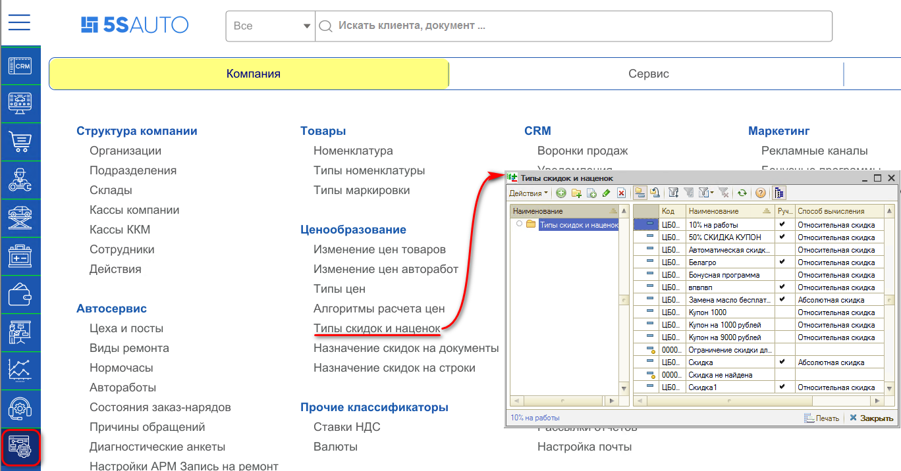
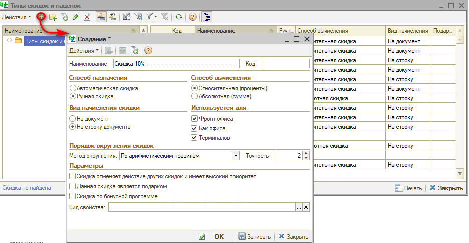
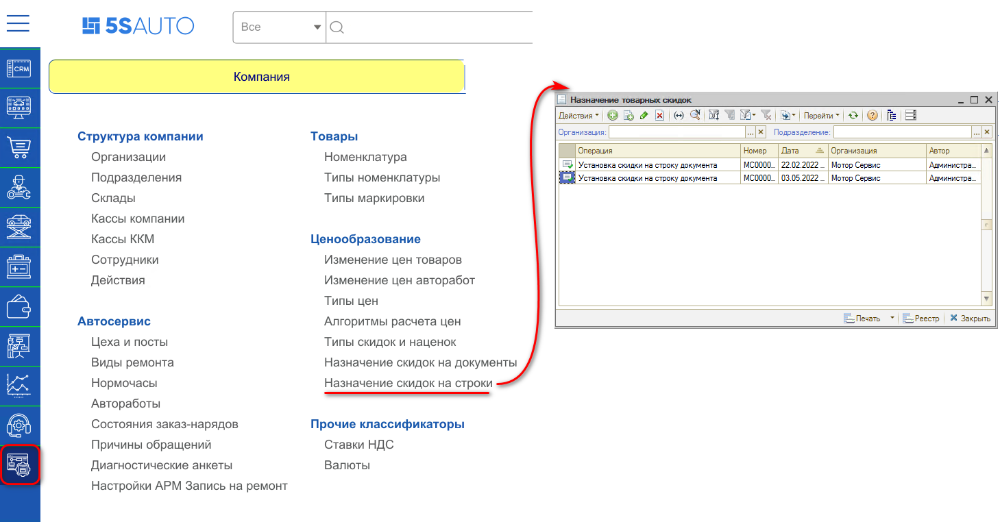
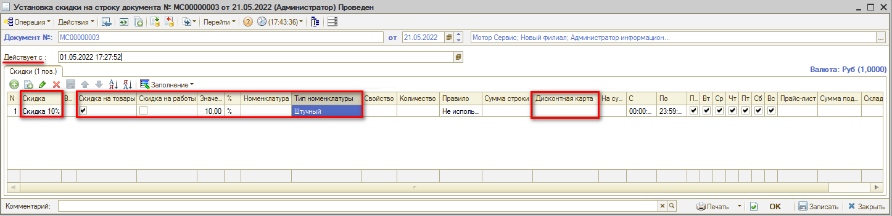
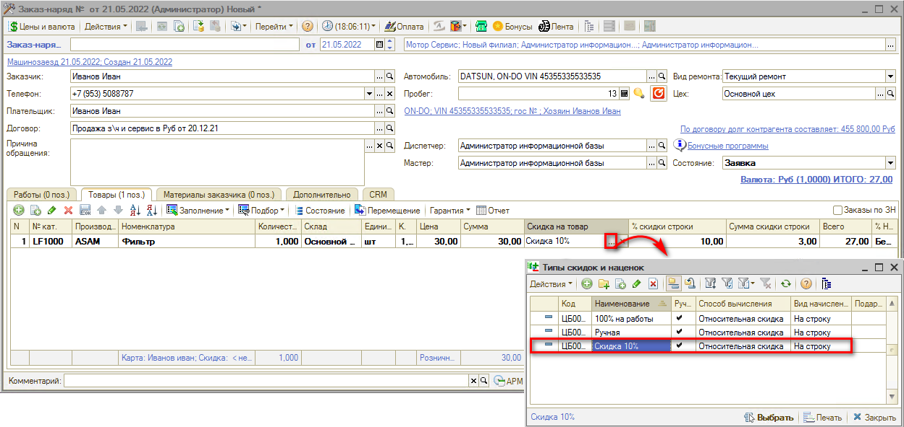
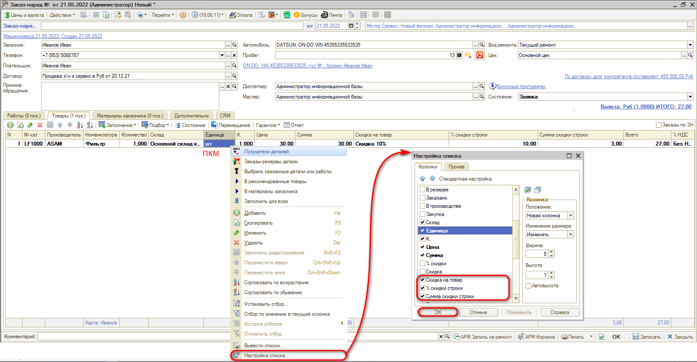

# Как создать скидку на строку

<table><tr><td><b>Время чтения:</b> 5 мин.</td><td><b>Обновлено:</b> 14.09.2026</td></tr></table>

Источник: https://www.5systems.ru/help/kak-sozdat-skidku-na-stroku

## Содержание

1. [Как создать тип скидки для назначения на строку](#как-создать-тип-скидки-для-назначения-на-строку)
2. [Как установить назначение скидки на строку](#как-установить-назначение-скидки-на-строку)

См. видео в статье "[Настройка скидок](../../../articles/5S%20AUTO/Ценообразование/Настройка%20скидок/nastroyka-skidok.md)":

- *"Создание скидки на строку"* в разделе *"[Настройка скидок на строку](../../../articles/5S%20AUTO/Ценообразование/Настройка%20скидок/nastroyka-skidok.md#настройка-скидок-на-строку)";*
- *"Использование ручных скидок в документах продажи"* в разделе *"[Ручная установка скидки на строку в документе](../../../articles/5S%20AUTO/Ценообразование/Настройка%20скидок/nastroyka-skidok.md#ручная-установка-скидки-на-строку-в-документе)".*

## Как создать тип скидки для назначения на строку

Создать новый тип скидок можно в справочнике “Типы скидок и наценок”. Для этого необходимо перейти в справочник через меню *Администрирование → Компания → Типы скидок и наценок*.

Процесс создания скидки делится на два этапа:

1. Создание типа скидки, в котором указывается назначение, способ вычисления и вид скидки.
2. Привязка определенного процента скидки за созданным типом, указание правил использования скидки.

*Ни в коем случае не менять скидку "Скидка не найдена":* она автоматически используется в случаях ручного изменения цены "Всего" в табличной части документов.

Добавить новый тип скидки можно нажатием кнопки “Добавить”.

Затем следует заполнить значения:

1. ***Наименование*** – обязательное поле для заполнения.
2. ***Способ назначения:*** необходимо выбрать, скидка будет проставляться автоматически или выбираться вручную.
3. ***Способ вычисления:*** следует выбрать, какой будет скидка – в процентах или фиксированная.
4. ***Вид начисления скидки:*** для настройки скидки на строку выбираем “На строку документа”.
5. ***Используется для:*** рекомендуется выбрать все.
6. ***Порядок округления скидки:*** следует выбрать метод округления (по арифметическим правилам или всегда в большую сторону), а также указать точность. 
   *Точность формирования скидки:* 
   2 - Округление до 1 копейки; 
   1 - Округление до 10 копеек; 
   0 - Округление до рубля; 
   -1 - Округление до 10 рублей; 
   -2 - Округление до 100 рублей.
7. ***Параметры*** выбираются в зависимости от того, какая скидка будет настраиваться в дальнейшем. Обычно не выбирается ничего либо выбирается, что она вытесняющая.

## Как установить назначение скидки на строку

После создания типа скидки необходимо создать документ *"Назначение общих скидок"*. Без создания документа за созданной скидкой в справочнике “Типы скидок и наценок” не будет прикреплен процент скидки.

Перейти к реестру документов можно через меню *Администрирование → Компания → Назначение скидок на строки*:

В документе установки скидки на строку необходимо выбрать скидку, на что будет действовать данная скидка, указать ее значение в процентах/рублях. Далее можно выбрать к чему будет использоваться скидка: к конкретной автоработе/номенклатуре, группе или типу номенклатуры, если необходимо.

Обязательно должен быть заполнен один из столбцов – “Номенклатура” или “Тип номенклатуры”, иначе будет выходить ошибка.

Отличием скидки на строку от скидки на документ является возможность привязать скидку на конкретную номенклатуру или группу/папку, а также на тип номенклатуры. Скидку также можно привязать к дисконтной карте или папке с дисконтными картами.

На примере ниже показана ручная скидка на строку 10%, которая будет доступна только на товары с типом номенклатуры "Штучный".

После этого во всех документах, созданных позже указанной даты в поле “Действует с” будет работать эта скидка.

Так как данная скидка ручная, то ее необходимо будет выбирать вручную на нужные позиции. Если скидка автоматическая, то она будет подставляться в зависимости от введенных в документе установки условий.

Обратите внимание: скидка на строку в документе указывается в колонках ***“Скидка на работу”*** и ***“Скидка на товары”.***

Если колонок не видно – значит, они скрыты и их необходимо добавить. Для добавления колонки следует зайти в документ продажи, нажать правой кнопкой мыши на свободном поле табличной части и выбрать "Настройка списка".

Рекомендуем добавить три колонки, которые отображают информацию о скидках на строку:

- *Скидка на товар/работу* - поле, в котором выбирается/изменяется скидка на строку;
- *% скидки строки* - поле, отображающее информацию о проценте скидки в зависимости от суммы товара;
- *Сумма скидки строки* - поле, отображающее размер скидки по товару в валюте документа.

---

**Теги:** скидки и бонусы, скидка, строка документа

