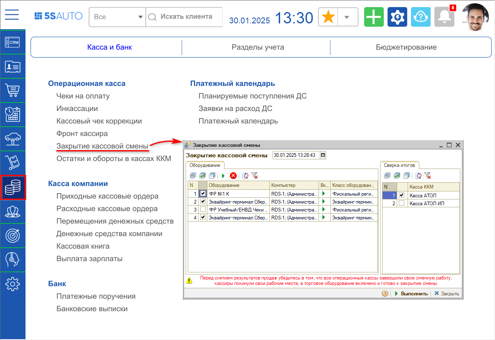
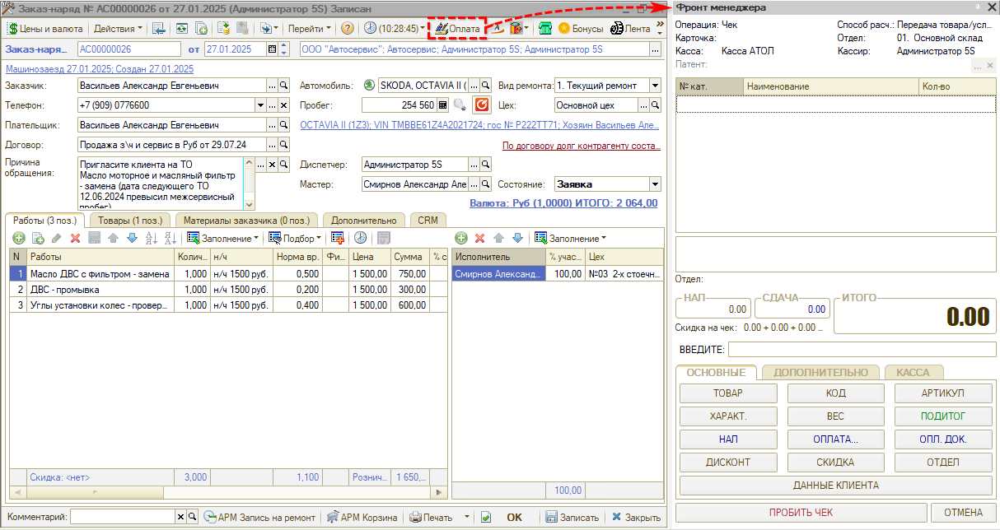
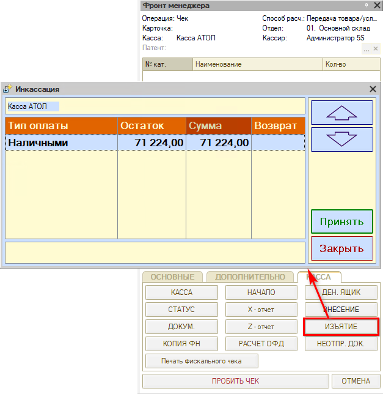
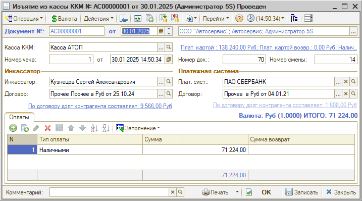
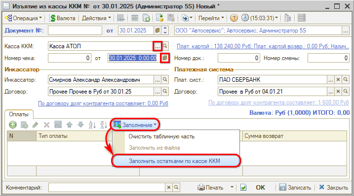

# Как закрыть смену

<table><tr><td><b>Время чтения:</b> 8 мин.</td><td><b>Обновлено:</b> 30.01.2025</td></tr></table>

Существуют два способа закрытия кассовой смены.

## Способ 1. Обработка “Закрытие кассовой смены”

Для закрытия кассовой смены требуется перейти в соответствующую обработку – *Финансы → Касса и банк → Операционная касса → Закрытие кассовой смены:*

На форме *"Закрытие кассовой смены"* на вкладке *"Оборудование"* следует выбрать *Активное оборудование* (убедиться, что данный кассовый аппарат *включен: если выключен, нажать кнопку “Play”),* на вкладке "Сверка итогов" выбрать кассу и нажать кнопку *"Выполнить".*

При закрытии кассовой смены будет сформирован документ *Инкассация* и *Приходный кассовый ордер* на ее основании – для этого должно быть настроено автоматическое формирование *ПКО*. Если не настроено автоматическое создание ПКО, нужно заходить в *Инкассацию* и на ее основании создавать документ.

Подробнее см. в статье *[Обработка Закрытие кассовой смены](../../../articles/5S%20AUTO/Касса/Обработка%20Закрытие%20кассовой%20смены/obrabotka-zakrytie-kassovoy-smeny.md) (есть видео)*.

## Способ 2. Обработка "Фронт менеджера"

*Фронт менеджера* вызывается нажатием кнопки "Оплата" в документах:

**Снятие Z-отчета**

Для закрытия кассовой смены нужно перейти на вкладку "Касса" и снять Z-отчет:

**Инкассация**

Инкассация *наличных* денег требуется, если нужно сдать в банк наличные деньги из кассы. Инкассацию *безналичных* средств (плат. картой и зачет аванса) нужно делать *каждый день*, чтобы в отчетах по кассам отражались корректные данные.

Инкассация вручную может производиться как вместе с закрытием смены, так и отдельно. 
Для этого требуется во *Фронте менеджера* на вкладке *Касса* нажать *“Изъятие”:*

При этом инкассируются только *наличные денежные средства*, т.е. автоматически создается документ *Изъятие из кассы ККМ*, в который попадают только изъятые наличные:

Чтобы типы *оплата картой* и *зачет аванса* не попали в отчет, нужно создавать вручную документ “Изъятие из кассы” – *Финансы → Касса и банк → Операционная касса → Инкассации:*

Требуется выбрать кассу, установить дату и произвести заполнение остатками по кассе:

Документ заполняется суммами по всем типам оплаты. Если наличных в кассе нет, можно удалить строку “Наличными”. После заполнения следует нажать “ОК”:

Деньги снимаются с баланса предприятия: инкассированные денежные средства по типу *“Плат. картой”* вводятся впоследствии посредством *Банковской выписки;* значения по типу оплаты *“Зачет аванса”[\*](#snoska)* при инкассации просто стираются. 
\**Примечание:* "*Зачет аванса"* – это сумма, которая была принята ранее по предоплате: при пробитии итогового чека она зачитывается, но уже не влияет на увеличение выручки.

См. также статью [*Порядок работы с кассами ККМ*](../../../articles/5S%20AUTO/Касса/Порядок%20работы%20с%20кассами%20ККМ/poryadok-raboty-s-kassami-kkm.md).

***Обратите внимание!*** Если кассир забыл *закрыть смену* в онлайн-кассе, продолжительность которой уже *свыше 24 часов*, то, чтобы фискальный накопитель не был заблокирован, и чтобы не получить наказание от налоговой инспекции, *не отбивайте чеки,* пока не закроете текущую смену.

---

**Теги:** касса ККМ, закрытие смены, кассовая смена, Z-отчет

