# Как принять оплату

<table><tr><td><b>Время чтения:</b> 7 мин.</td><td><b>Обновлено:</b> 15.07.2025</td></tr></table>

## Содержание

1. [Оплата наличными](#оплата-наличными)
2. [Оплата по терминалу](#оплата-по-терминалу)
3. [Комбинированная оплата](#комбинированная-оплата)
4. [Предоплата](#предоплата)
5. [Зачет аванса](#зачет-аванса)

*См. видеоурок в разделе "Работа с Заказ-нарядами": [Как принять оплату по Заказ-наряду](../../Урок%2010.%20Работа%20с%20Заказ-нарядами/Как%20принять%20оплату%20по%20Заказ-наряду/kak-prinyat-oplatu-po-zakaz-naryadu.md)*.

## Оплата наличными

Для приема оплаты наличными необходимо в документе *Заказ-наряд* или *Реализация товаров* нажать кнопку *“Оплата”*.

Если требуется принять полную итоговую оплату, то в открывшемся окне нужно указать *способ расчета* *“Пробитие чека передачи предмета платежа”* (стоит по умолчанию) и нажать кнопку *“Принять”:*

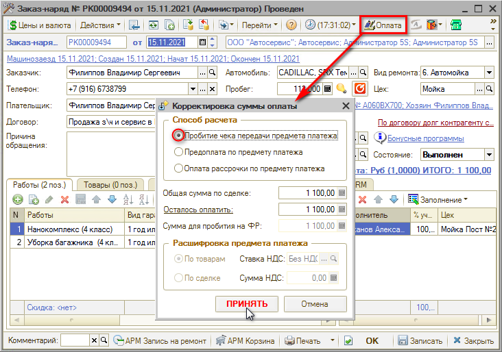

При этом откроется форма *Фронт менеджера* с данными оплачиваемого документа.

Если требуется принять оплату *наличными деньгами*, то следует нажать на кнопку *“НАЛ”,* а затем *“Пробить чек”*:

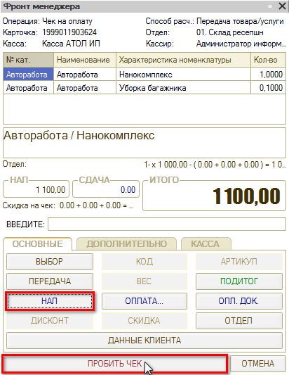

## Оплата по терминалу

Для принятия оплаты безналичным способом аналогично требуется нажать в документе *Заказ-наряд* или *Реализация товаров* кнопку *“Оплата”*  .

На открывшейся форме *Фронт менеджера* следует нажать кнопку *“Оплата”:*

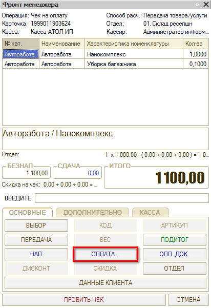

На форме приема оплаты требуется выделить строку с типом оплаты *“Плат. картой”* и нажать кнопку *“Заполнить остатком”*, либо ввести нужную сумму:

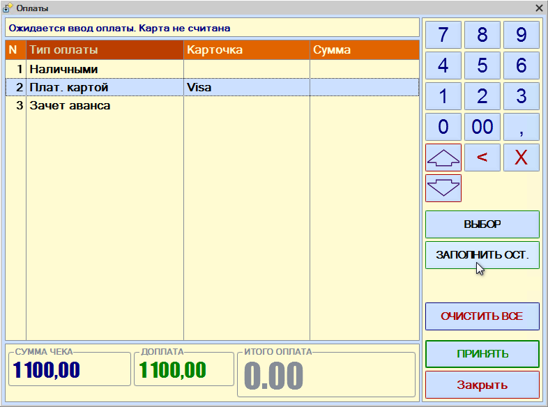

Затем нажать кнопку *“Принять”*:

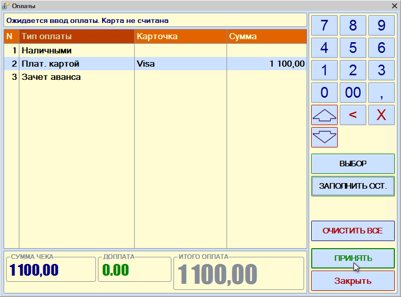

Далее на форме *Фронт менеджера* требуется нажать кнопку *“ПРОБИТЬ ЧЕК”*: при этом будет напечатан чек на ФР и сформируется документ *“Чек на оплату”*.

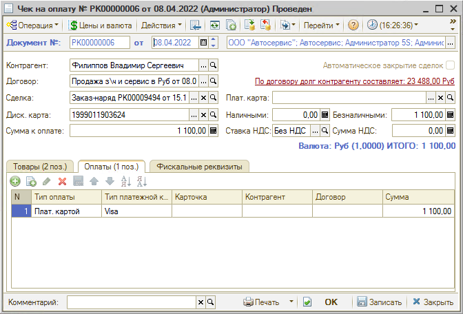

В данном документе будут подробно отображены типы оплаты и суммы по ним.

Перейти в *Чек на оплату* можно через *Дерево подчиненности документа*, по которому принимается оплата:

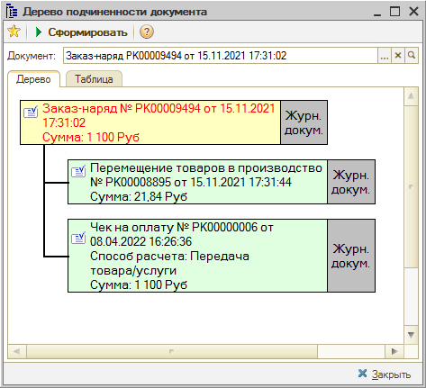

## Комбинированная оплата

Прием оплаты *комбинированным способом* производится по аналогии с приемом оплаты по терминалу.

При заполнении суммы по типам оплаты требуется ввести значения наличными и по карте (можно ввести сумму по одному типу, а при заполнении суммы по второму типу воспользоваться кнопкой "Заполнить остатком"):

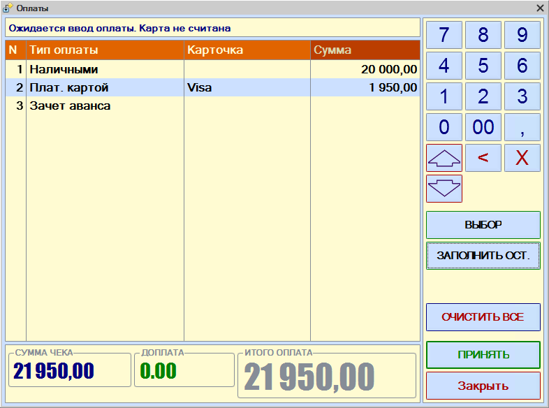

В *Чеке на оплату* будут отражены выбранные способы оплаты:

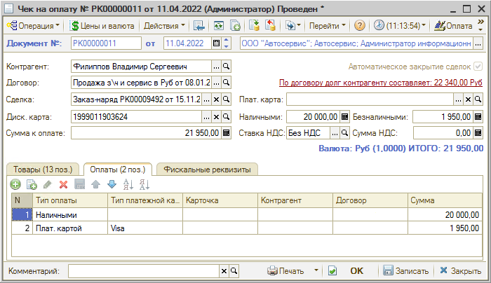

## Предоплата

Если клиент вносит предоплату по *Заказ-наряду* или *Заказу покупателя*, нужно также нажать в документе кнопку *“Оплата”,* а в открывшемся окне в поле *“Способ расчета”* выбрать *“Предоплата по предмету платежа”*, и указать сумму. После нажать *“Принять”:*

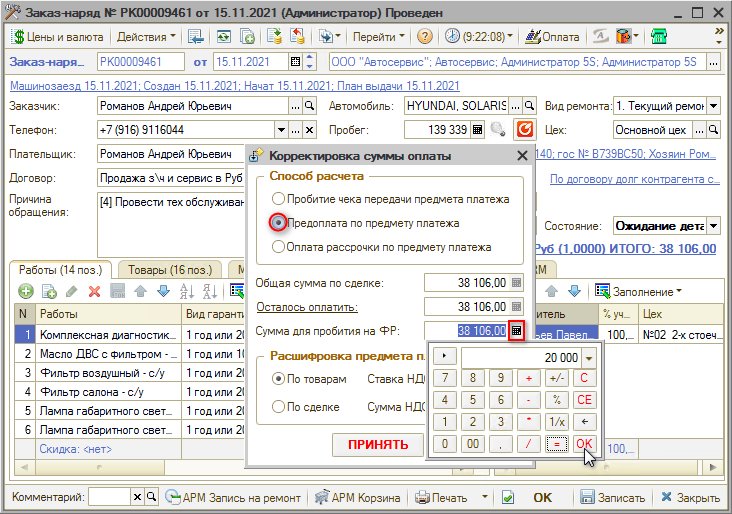

В открывшемся *Фронте менеджера* следует действовать согласно инструкции *выше* в зависимости от типа принимаемой оплаты.

В документе *“Чек на оплату”* на вкладке *“Фискальные реквизиты”* будет указан способ расчета *Предоплата по товару/услуге*:

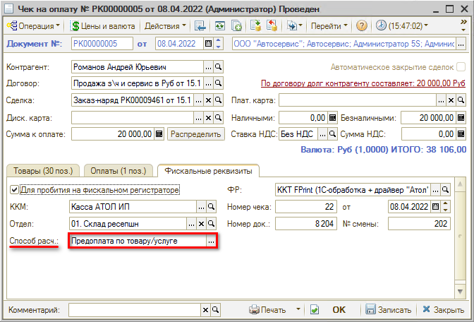

## Зачет аванса

Если по документу была внесена предоплата, ее нужно зачесть при окончательном расчете.

Для этого требуется нажать кнопку *“Оплата”* из *Заказ-наряда* (или другого документа), и в открывшемся окне выбрать *“Пробитие чека передачи предмета платежа”*. В поле *“Осталось оплатить”* нужно указать сумму требуемой доплаты и нажать кнопку “Принять”:

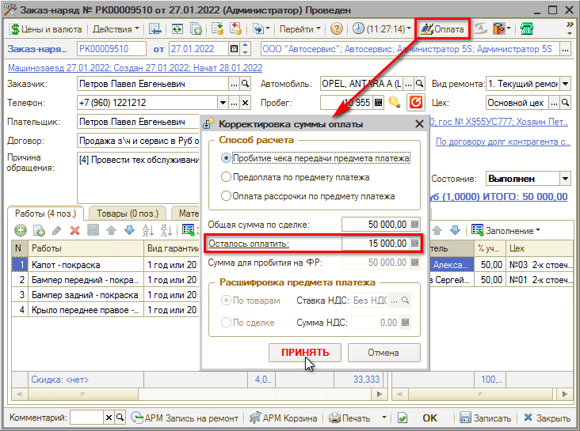

Если ранее была внесена предоплата, то появится вопрос для зачета аванса - требуется нажать “Да”.

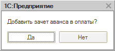

На *Фронте менеджера* требуется нажать кнопку "*ОПЛАТА*":

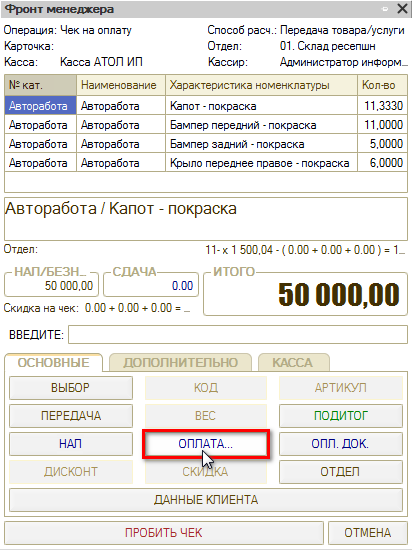

В открывшейся форме, в строке с типом оплаты *“Зачет аванса”* отобразится сумма ранее внесенной предоплаты:

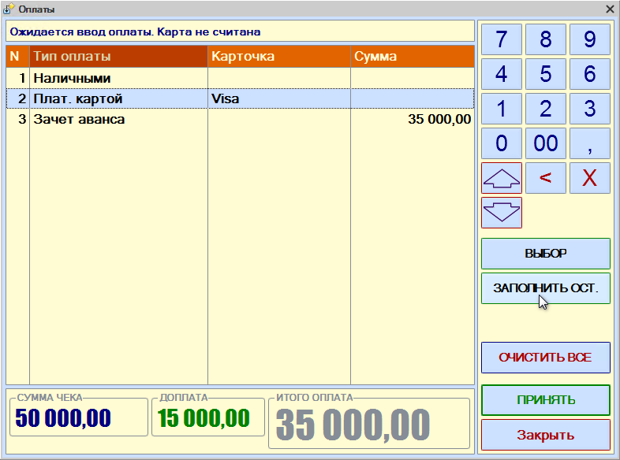

Оставшуюся сумму требуется *заполнить остатком* в соответствии с типом оплаты (наличными или картой) и нажать *“Принять”:*

Далее на *Фронте менеджера* нажать кнопку *“Пробить чек”*: при этом будет пробит второй чек с отражением *итоговой суммы* по документу, а также сформируется еще один документ *“Чек на оплату”.*

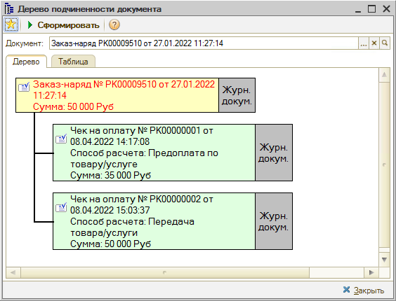

В нем будут отражены все типы принятой оплаты:

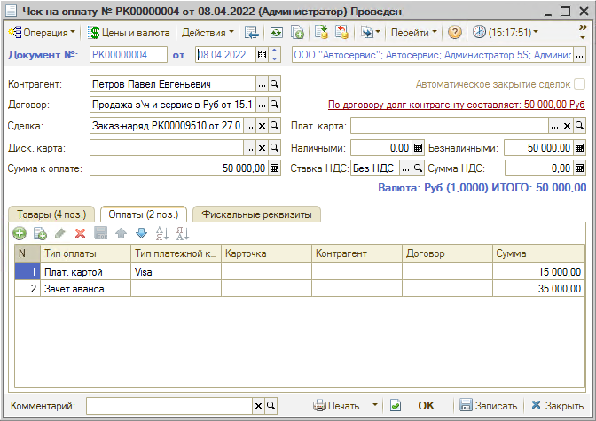

Также см. статьи *[Порядок работы с кассами ККМ](../../../articles/5S%20AUTO/Касса/Порядок%20работы%20с%20кассами%20ККМ/poryadok-raboty-s-kassami-kkm.md) и [Упрощенный Фронт кассира](../../../articles/5S%20AUTO/Касса/Упрощенный%20Фронт%20кассира/uproschennyy-front-kassira.md).*

---

**Теги:** касса ККМ, прием оплаты, чек, фронт кассира

