# Как сделать возврат по кассе

<table><tr><td><b>Время чтения:</b> 8 мин.</td><td><b>Обновлено:</b> 30.01.2025</td></tr></table>

## Содержание

- [1. Возврат предоплаты](#1-возврат-предоплаты)
- [2. Чек возврата товаров покупателю](#2-чек-возврата-товаров-покупателю)
- [3. Чек возврата работ](#3-чек-возврата-работ)
  - [1. Полный возврат](#1-полный-возврат)
  - [2. Частичный возврат](#2-частичный-возврат)
  - [Пробитие чека по РКО](#пробитие-чека-по-рко)

## 1. Возврат предоплаты

Для возврата предоплаты необходимо открыть документ *"Чек на оплату"*, сформированный при ее принятии. Это проще всего сделать через *Дерево документов:*

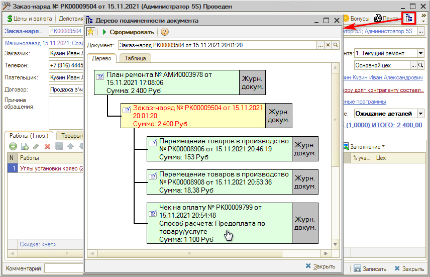

Если предоплата вносилась наличными или банковской картой, то для возврата будет правильно использовать тот же способ оплаты. Для этого на форме документа *Чек на оплату* нужно нажать кнопку *"Оплата"*. При этом откроется *"Фронт менеджера"* с заполненными по документу возврата полями:

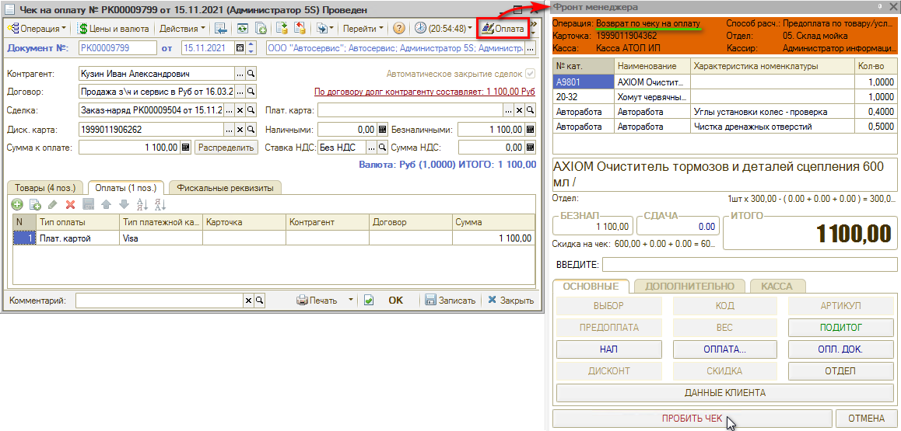

Требуется нажать кнопку *"ПРОБИТЬ ЧЕК"* – при этом будет выведен чек на ФР, а также на основании документа "Чек на оплату" сформируется документ *"Возврат по чеку на оплату":*

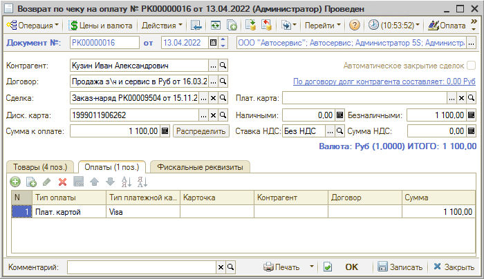

## 2. Чек возврата товаров покупателю

Если клиент возвращает товар, ранее проданный в Заказ-наряде или в Реализации товаров, то в программе необходимо оформить документы возврата (подробнее см. урок [*Как оформить возврат товаров от покупателя*](../../Урок%205.%20Складской%20учет/Как%20оформить%20возврат%20товаров%20от%20покупателя/kak-oformit-vozvrat-tovarov-ot-pokupatelya.md)).

В *Заказ-наряде* (он должен быть в состоянии “Закрыт”) требуется нажать кнопку *“Ввести на основании”* и выбрать в выпадающем списке документ *"Возврат от покупателя":*

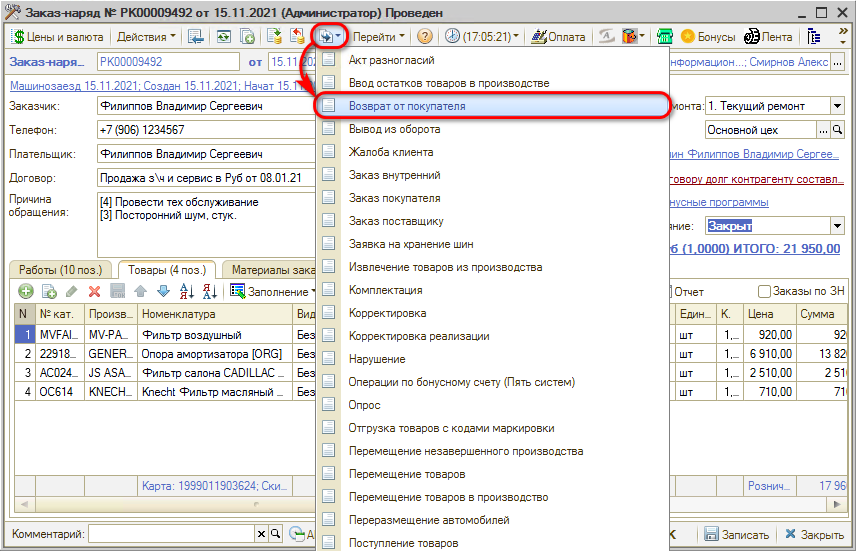

В форму подгрузятся детали из *Заказ-наряда:* нужно удалить лишние товары и оставить только те, по которым требуется сделать возврат. При необходимости можно выбрать причину возврата. Далее документ *“Возврат товаров от покупателя”* нужно *Записать* и затем *провести*.

После этого следует нажать кнопку *“Оплата”*, чтобы произвести возврат денежных средств, выбрать способ расчета *“Пробитие чека передачи предмета платежа”* (должен стоять по умолчанию) и нажать кнопку *“Принять”:*

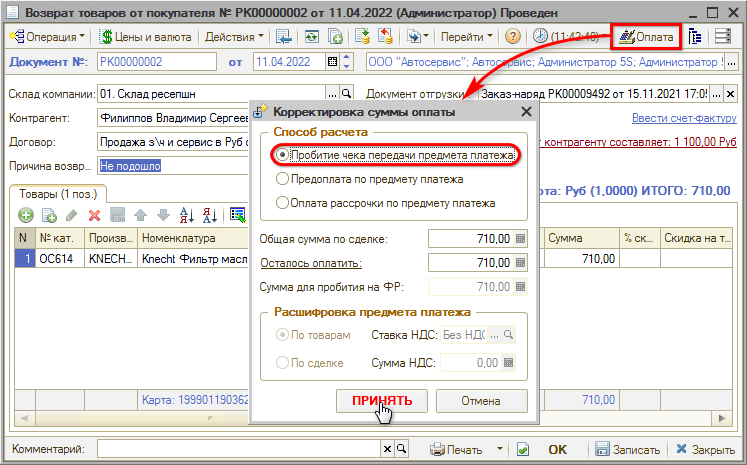

В открывшемся *Фронте менеджера* будет высвечена *Операция “Возврат по чеку на оплату”:*

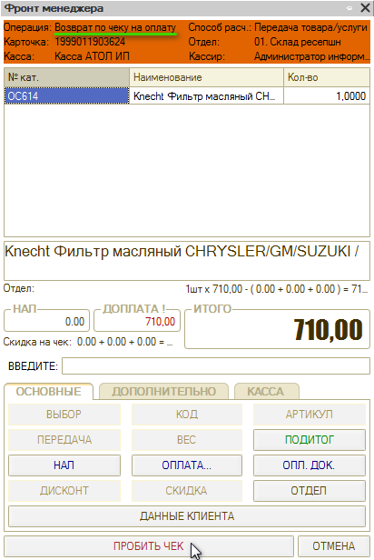

Следует нажать кнопку *“Пробить чек”*. По *дереву документов* можно отследить и проконтролировать весь ход операций.

## 3. Чек возврата работ

### 1. Полный возврат

Если в *Заказ-наряде* есть только работы и нет товаров, и возврат нужно сделать только по работам, то *Возврат от покупателя* делать не требуется.

Нужно зайти в *Чек на оплату* (через *Дерево документов* Заказ-наряда) и нажать *“Оплата”*. Во *Фронте менеджера* пробить чек возврата.

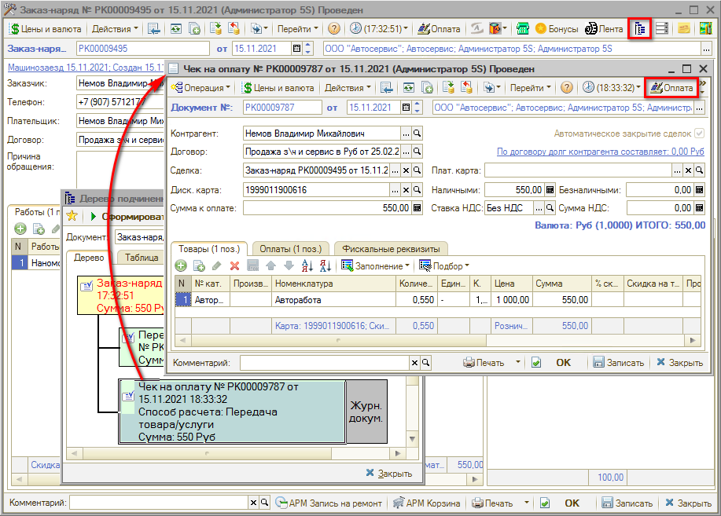

### 2. Частичный возврат

Через *Чек на оплату* частичный возврат сделать невозможно. Можно сделать *полный* возврат работ/товаров по чеку, а затем пробить новый чек на правильную сумму. Либо возможны следующие варианты действий:

**1. Через Акт разногласий**

Если требуется сделать возврат оплаты по работам по закрытому *Заказ-наряду*, нужно ввести на его основании *Акт разногласий:*

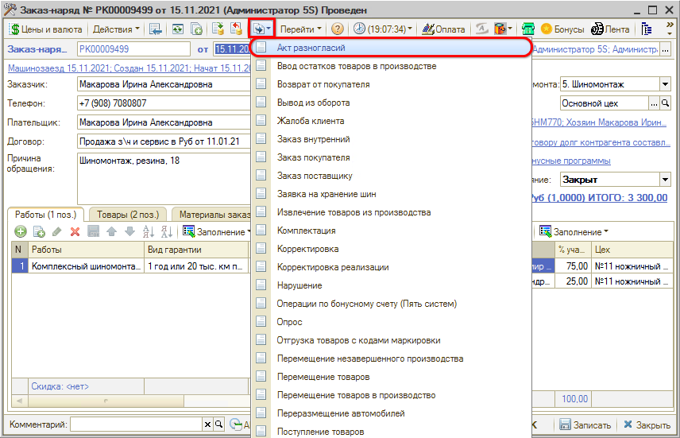

Документ заполняется выполненными работами и использованными при этом деталями. Актом разногласий можно скорректировать цены товаров/работ, их количество, а также убрать товар/работу из Заказ-наряда.

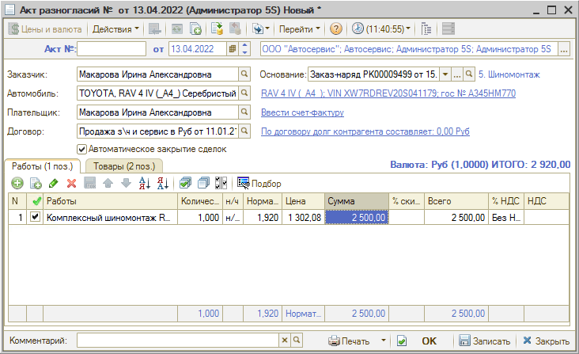

При проведении документа по контрагенту (плательщик) возникает корректировка взаиморасчетов на разницу между суммой заказ-наряда и суммой по акту разногласий.

Таким образом, если требуется *корректировка стоимости* работ, *Акт разногласий* нужно делать обязательно.

**2. Корректировка закрытого Заказ-наряда**

Данный способ может использоваться, если бизнес-процесс в компании построен таким образом, что внесение изменений в закрытый Заказ-наряд допускается.

При этом требуется учитывать, сколько времени прошло от закрытия Заказ-наряда, и не повлияет ли его корректировка на уже рассчитанную и выданную заработную плату.

Производится удаление из Заказ-наряда работ, затем создается *Расходный кассовый ордер*, и по нему пробивается чек (см. *далее).*

### Пробитие чека по РКО

После проведения *Акта разногласий* (или корректировки закрытого заказ-наряда) необходимо создать *Расходный кассовый ордер* на клиента:

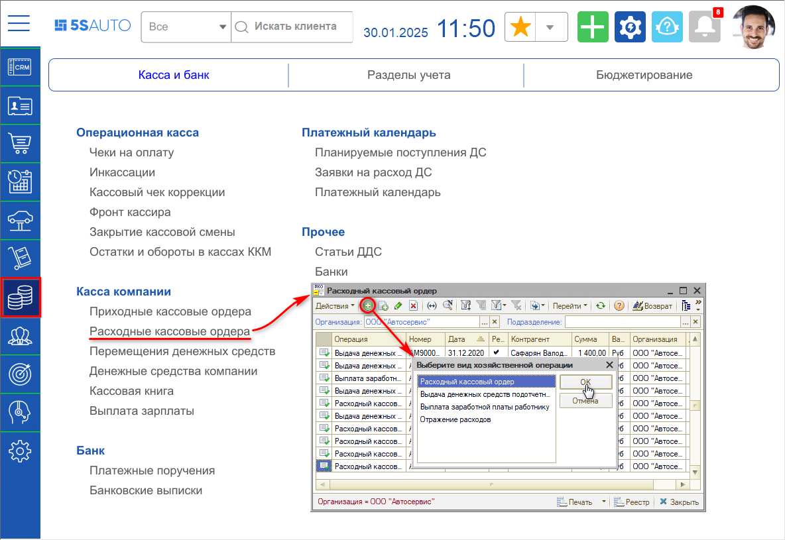

В создаваемом *РКО* нужно заполнить клиента, сумму, поставить галочку "Для пробития на фискальном регистраторе", выбрать кассу, заполнить способ и тип расчета, сохранить документ и нажать кнопку *"Возврат":*

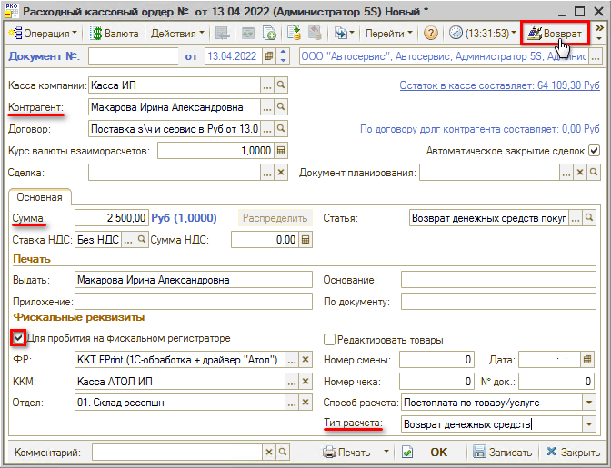

В открывшемся *Фронте кассира* пробить чек:

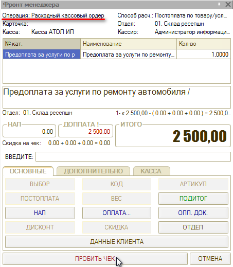

См. также статьи *[Порядок работы с кассами ККМ](../../../articles/5S%20AUTO/Касса/Порядок%20работы%20с%20кассами%20ККМ/poryadok-raboty-s-kassami-kkm.md) и [Упрощенный Фронт кассира](../../../articles/5S%20AUTO/Касса/Упрощенный%20Фронт%20кассира/uproschennyy-front-kassira.md).*

---

**Теги:** касса ККМ, возврат, возвратный чек, чек возврата

