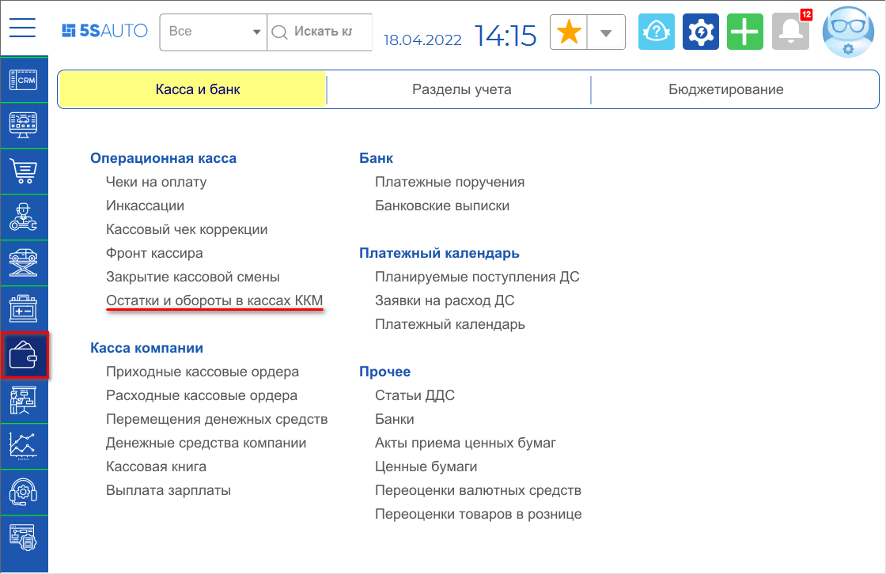
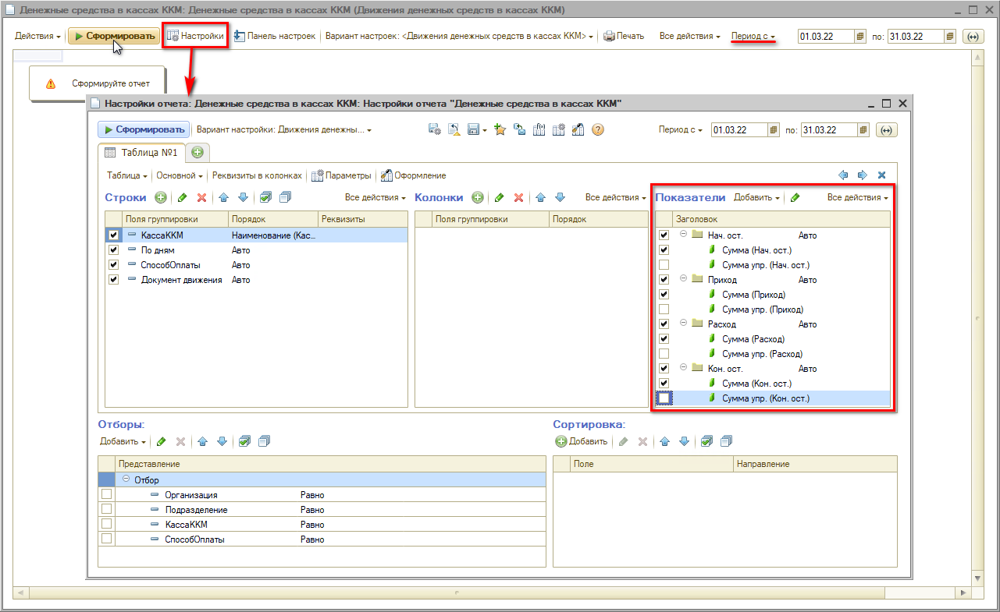
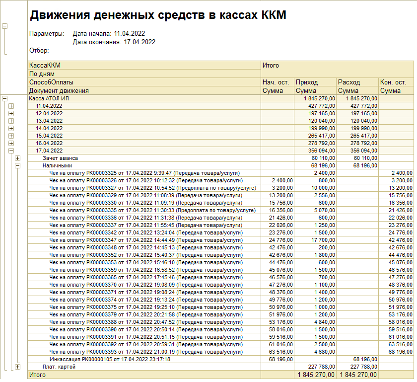

# Как сформировать обороты по кассе

<table><tr><td><b>Время чтения:</b> 3 мин.</td><td><b>Обновлено:</b> 11.07.2022</td></tr></table>

Источник: https://www.5systems.ru/help/kak-sformirovat-oboroty-po-kasse

Для того, чтобы произвести анализ остатков и движений денежных средств в кассах ККМ, необходимо сформировать **отчет “Остатки и обороты в кассах ККМ”**. Способ перехода из меню программы: Финансы → Касса и банк → Операционная касса → Остатки и обороты в кассах ККМ

## Стандартные варианты отчета

- *Остатки денежных средств в кассах ККМ* – позволяет сформировать отчет, в который будет выведена информация о наличии денежных средств только на указанную дату в кассах ККМ.
- *Остатки и обороты денежных средств в кассах ККМ* – позволяет сформировать отчет, в который будет выведена информация о наличии и оборотах денежных средств в кассах ККМ в указанный период.
- *Движения денежных средств в кассах ККМ* – позволяет сформировать отчет, в который будет выведена подробная информация о движении денежных средств в кассах ККМ за период.

## Настройки отчета

По кнопке *Настройки* можно произвести настройки отчета: задать группировку строк и колонок, показателей, дополнительных полей и др.

Поле *Показатели* содержит флажки:

- ***Нач. ост.*** – группа показателей *Начальный остаток*: остаток денежных средств в кассах ККМ на начало периода.
- ***Приход*** – группа показателей *поступления* денежных средств.
- ***Расход*** – группа показателей *выбытия* денежных средств.
- ***Кон. ост.*** – группа показателей *Конечный остаток*: остаток денежных средств в кассах ККМ на конец периода.
- ***Сумма*** – сумма денежных средств в кассах ККМ в валюте регламентированного учета.
- ***Сумма упр.*** – сумма денежных средств в кассах ККМ в валюте управленческого учета.

Помимо настроек отчета следует установить *период* – выбрать день/неделю/месяц или задать произвольный промежуток – и сформировать отчет нажатием на кнопку *“Сформировать”*:

## Пример сформированного отчета

Далее работа с отчетом ведется посредством использования уровней группировок строк: можно посмотреть данные на определенную дату по типам оплаты.

---

**Теги:** касса ККМ, обороты по кассе, отчет, кассовая выручка

