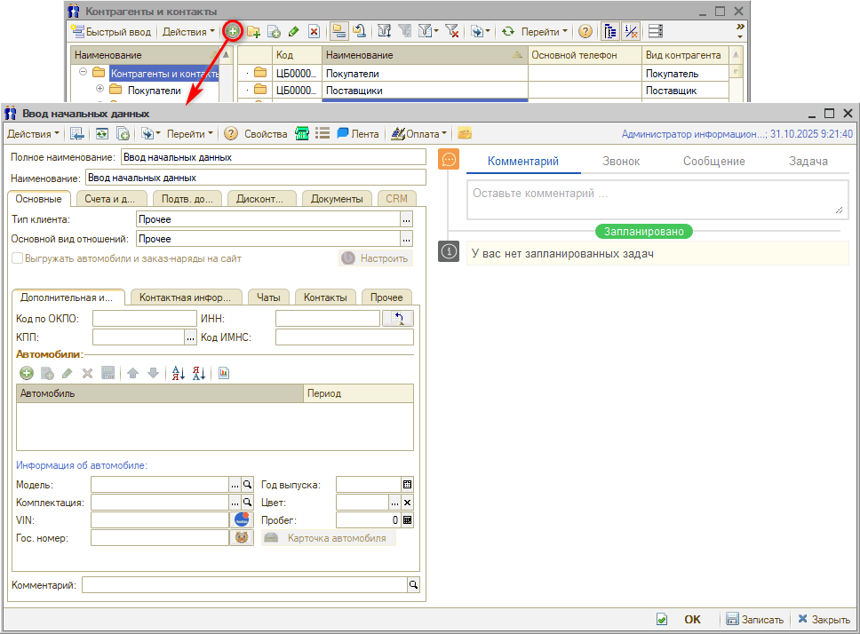
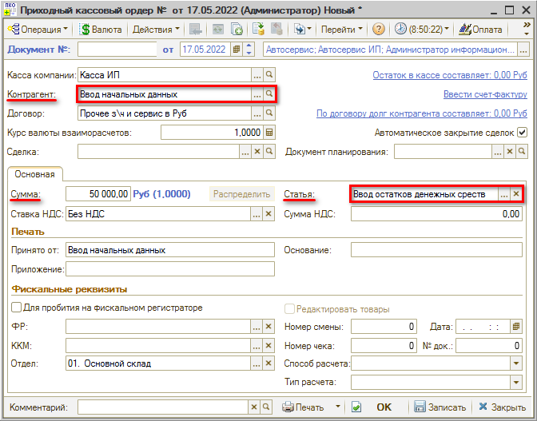
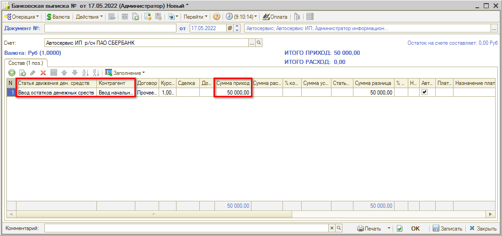

# Как ввести начальные остатки по кассе и банку

<table><tr><td><b>Время чтения:</b> 4 мин.</td><td><b>Обновлено:</b> 31.10.2025</td></tr></table>

При начале работы с программой требуется ввести в базу начальные остатки денежных средств. Для этого требуется:

1. Создать контрагента с именем *“Ввод начальных остатков”* (см. урок *“[Как создать контрагента](../../Урок%203.%20Клиенты%20и%20автомобили/Как%20создать%20контрагента%20по%20ИНН/kak-sozdat-kontragenta-po-inn.md)”):* 
   
2. Для отражения внесения *наличных денежных средств* в кассу следует создать *Приходный кассовый ордер* от этого контрагента и указать в нем статью движения денежных средств *“Ввод остатков денежных средств”*: 
   
3. Для отражения внесения *безналичных денежных средств* в кассу необходимо создать *банковскую выписку* от этого же контрагента и указать в ней статью ДДС “Ввод остатков денежных средств”: 
   

---

**Теги:** учет денежных средств, начальные остатки, касса, банк

