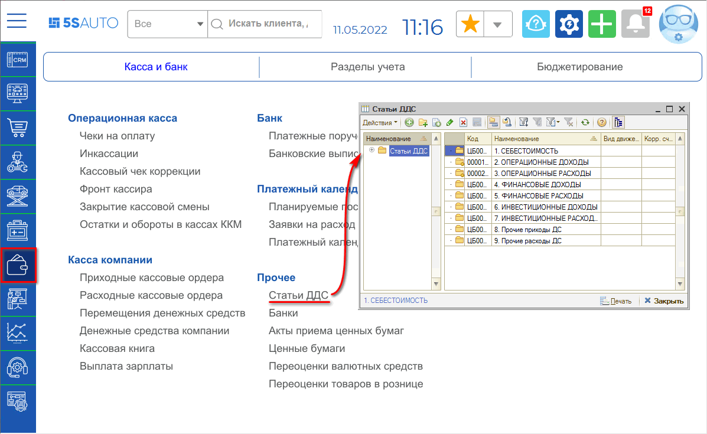
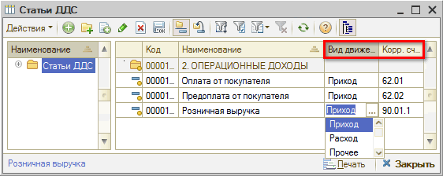
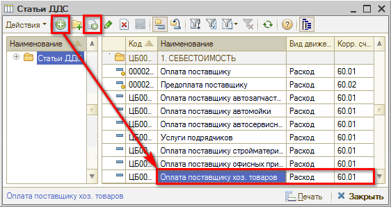

# Как добавить статью ДДС

<table><tr><td><b>Время чтения:</b> 4 мин.</td><td><b>Обновлено:</b> 11.07.2022</td></tr></table>

Источник: https://www.5systems.ru/help/kak-dobavit-statyu-dds

## Справочник "Статьи ДДС"

Справочник **“Статьи ДДС”** служит для разделения операций *движения денежных средств* по статьям. Это позволяет анализировать поступившие денежные средства и понесенные расходы.

Открыть справочник “Статьи ДДС” можно из меню программы: *Финансы → Касса и банк → Прочее → Статьи ДДС*.

## Реквизиты справочника

- *Вид движения ден. средств* – задает направление движения, значение выбирается из списка: *приход*, *расход* или *прочее*.
- *Корр. счет* – корреспондирующий счет бухгалтерского учета для документов, проходящих по этой статье. Выбирается из плана счетов.

## Предопределенные статьи ДДС

В справочник занесено несколько предопределенных статей движения денежных средств (они обозначаются значком с желтым шариком). Такие предопределенные статьи ДДС используются автоматически при проведении той или иной торговой операции.

Предопределенные статьи можно переименовать, чтобы их названия отражали особенности учетной политики компании.

**Список предопределенных статей ДДС:**

- *Возврат из под отчета* – статья подставляется при возврате денежных средств из под отчета.
- *Возврат от поставщика* – подставляется при возврате денежных средств поставщиком (например за бракованный товар).
- *Оплата от покупателя* – подставляется при оплате от покупателя.
- *Предоплата от покупателя* – подставляется при предоплате покупателя за товар.
- *Розничная выручка* – подставляется при поступления оплат через розничную торговую сеть.
- *Возврат покупателю* – подставляется при возврате денежных средств покупателю (например за бракованный товар).
- *Выдача заработной платы* – подставляется при выдаче денежных средств на оплату труда.
- *Выдача под отчет* – подставляется при выдаче денежных средств под отчет.
- *Оплата налогов и сборов* – подставляется при оплате налогов.
- *Оплата поставщику* – подставляется при оплате поставщику.
- *Предоплата поставщику* – подставляется при предоплате поставщику.
- *Ввод остатков ДС* – подставляется при переносе остатков взаиморасчетов из других систем.
- *Курсовые разницы* – предназначена для отражения курсовых разниц.
- *Перемещение ДС между кассами компании* – подставляется при перемещении денежных средств между кассами компании.

## Добавление статей ДДС

Пользователь может добавить свои статьи денежных средств по поступлению и расходу денежных средств, например "Получение ссуды", "Получение кредита", "Покупка канцелярских принадлежностей" и т.д.

Для этого требуется в нужной группе справочника добавить новую строку при помощи кнопок “Добавить” или “Добавить копированием”, ввести наименование и выбрать *Вид движения ден. средств* и *Корр. счет* в соответствующих графах:

В дальнейшем добавленные статьи движения денежных средств будут заполняться в платежных документах

---

**Теги:** учет денежных средств, статьи ДДС, движение денежных средств, справочник

