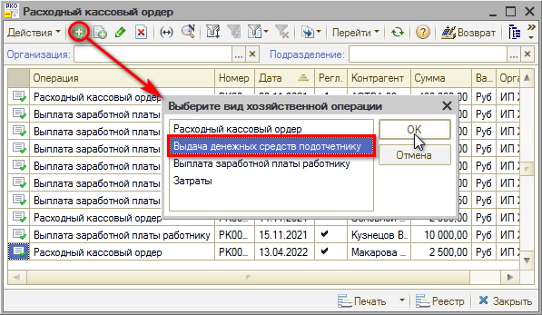
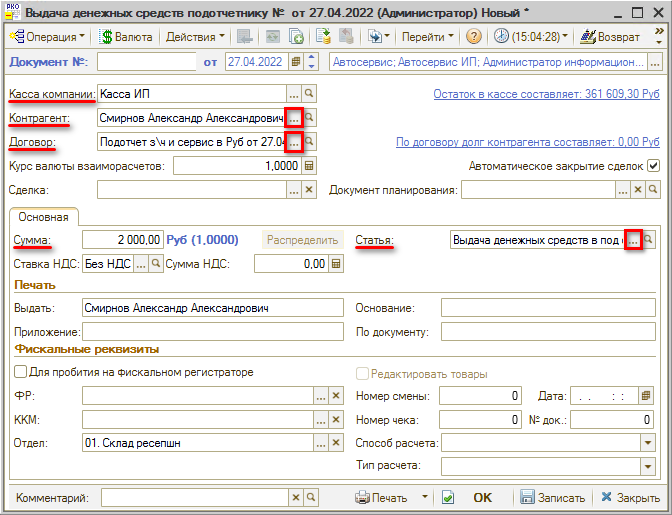
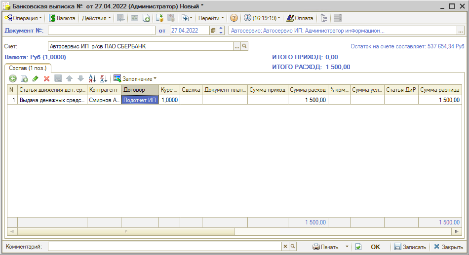

# Как отразить выдачу денег в подотчет сотруднику

<table><tr><td><b>Время чтения:</b> 3 мин.</td><td><b>Обновлено:</b> 11.07.2022</td></tr></table>

Источник: https://www.5systems.ru/help/kak-otrazit-vydachu-deneg-v-podotchet-sotrudniku

## Содержание

1. [Выдача наличных денег из кассы](#выдача-наличных-денег-из-кассы)
2. [Перевод с банковского счета на карту сотруднику](#перевод-с-банковского-счета-на-карту-сотруднику)

## Выдача наличных денег из кассы

Для того, чтобы отразить в программе выдачу наличных денежных средств из кассы подотчет сотруднику, требуется создать документ *Расходный кассовый ордер (РКО)*.

Расположение реестра в программе: *Финансы → Касса и банк → Касса компании → Расходные кассовые ордера* (или в стандартном меню: Документы → Движения денежных средств → Расходный кассовый ордер)

РКО имеют разные виды хозяйственных операций: требуется установить вид хозяйственной операции “Выдача денежных средств подотчетнику”.

В создаваемом документе нужно указать *Кассу*, *Контрагента*, *Договор[\*](#snoska)*, *Сумму* и выбрать *Статью движения денежных средств.* 
\**Примечание:* У сотрудника должен быть оформлен договор вида *Подотчет*.

Затем заполненный документ следует записать и провести.

Чтобы вывести *Расходный кассовый ордер* на печать, предварительно нужно заполнить текстовые поля в области “Печать” на форме документа.

## Перевод с банковского счета на карту сотруднику

Если денежные средства под отчет перечисляются с банковского счета на карточку сотрудника, требуется отразить это в программе при помощи документа *“Банковская выписка”*. Расположение реестра банковских выписок в программе: *Финансы → Касса и банк → Банк → Банковские выписки*

В создаваемом документе требуется заполнить *Статью движения ден. средств, Контрагента, Договор, Сумму расхода:*

Созданную банковскую выписку необходимо записать и провести.

---

**Теги:** учет денежных средств, подотчет, сотрудник, расходный кассовый ордер

