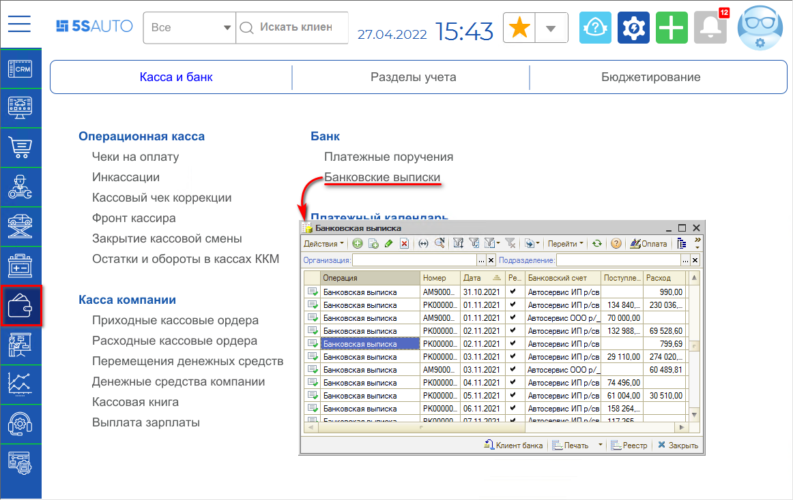
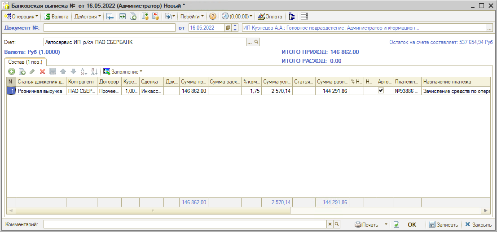
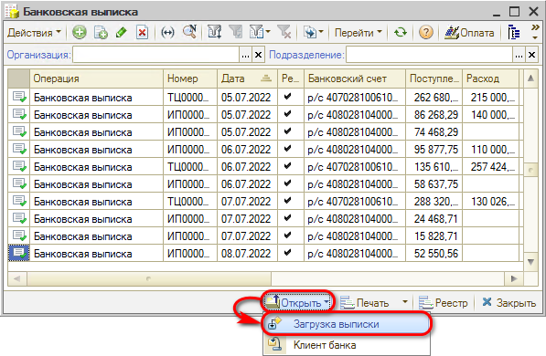
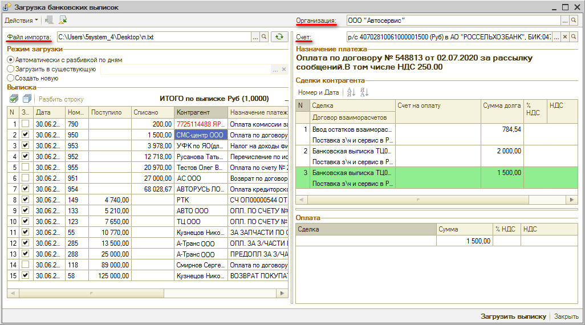
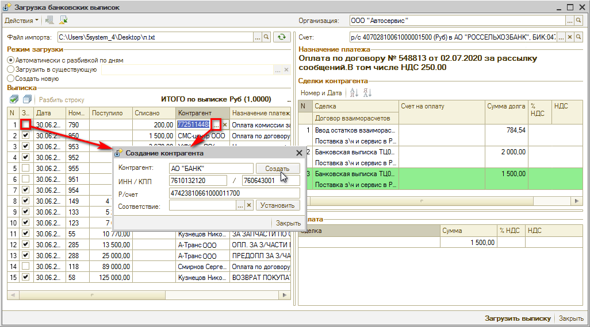

# Как отразить операции по банковскому счету

<table><tr><td><b>Время чтения:</b> 5 мин.</td><td><b>Обновлено:</b> 14.09.2026</td></tr></table>

Источник: https://www.5systems.ru/help/kak-otrazit-operacii-po-bankovskomu-schetu

## Содержание

1. [Интерфейс документа Банковская выписка](#интерфейс-документа-банковская-выписка)
2. [Как загрузить банковскую выписку](#как-загрузить-банковскую-выписку)

Для учета в программе движения безналичных денежных средств по расчетным счетам компании служит документ ***“Банковская выписка”***.

## Интерфейс документа Банковская выписка

Реестр банковских выписок расположен в меню программы *Финансы → Касса и банк → Банк → Банковские выписки* (или в стандартном меню: Документы → Движения денежных средств → Банковская выписка):

Банковская выписка вводится в соответствии с выпиской, получаемой из банка.

В поле *Счет* указывается расчетный счет компании, по которому производится движение денежных средств. При загрузке выписки из банка данные подгружаются автоматически.

В таблице документа должны быть заполнены значения:

- *Статья движения ден. средств*, по которой производится платеж.
- *Контрагент* – плательщик или получатель денежных средств.
- *Договор*, согласно которому ведутся взаиморасчеты с контрагентом.
- *Сделка* – документ, по которому были уплачены (получены) денежные средства.
- *Сумма приход* – сумма поступления денежных средств на банковский счет компании. Поле доступно, если выбрана приходная статья движения денежных средств.
- *Сумма расход* – сумма расхода денежных средств с банковского счета компании. Поле доступно, если выбрана расходная статья движения денежных средств.

Таблица вкладки *Состав* может быть автоматически заполнена при помощи кнопки *Заполнение*: *По платежным поручениям*, *По планам поступления ДС* или *По заявкам на расход ДС*.

Созданную банковскую выписку необходимо записать и провести.

Меню кнопки *Печать* позволяет сформировать печатную форму *Банковская выписка*.

## Как загрузить банковскую выписку

В программе используется специальный функционал *загрузки банковской выписки* из файла, предварительно полученного из банка. Для того, чтобы загрузить банковскую выписку, следует в реестре банковских выписок нажать на кнопку “Открыть” и выбрать обработку “Загрузка выписки”:

В открывшемся окне обработки требуется выбрать *организацию*, *расчетный счет* и загрузить *файл импорта[\*](#snoska)*. Выписка заполняется платежами по выбранным организации и счету:

*\*Примечание:* При работе с программой через удаленный рабочий стол, т.е. при подключении через RDP, *файл* выписки необходимо скопировать в своих документах и вставить на рабочий стол удаленного компьютера – например, в окно, которое откроется при загрузке файла импорта.

При выделении в выписке строки с определенным платежом – в поле “Сделки контрагента” отображаются все документы по данному контрагенту, по которым есть долг, и выводится сумма долга. Подсвечивается документ, который может выступать в качестве сделки по строке платежа.

Красным шрифтом выделяются контрагенты, которые не найдены в базе: для загрузки платежей по ним *необходимо* сначала *создать для них карточки контрагентов,* либо *произвести сопоставление с существующими в базе контрагентами*:

В открывшемся окне в поле “Соответствие” следует найти контрагента, с которым требуется произвести сопоставление, либо, если такого в базе нет, нажать кнопку “Создать”: карточка нового контрагента будет создана в базе и автоматически подтянется в обработку.

Далее в колонке “Загружать” необходимо отметить флажками те платежи, которые требуется разнести. Затем следует выбрать один из 3-х режимов загрузки:

1. *Автоматически с разбивкой по дням* (по умолчанию): при выборе данного режима производится *разбивка выписок по датам*, если файл выгрузки из банка содержит данные за несколько дней.
2. *Загрузить в существующую:* при выборе этого режима данные загружаются в существующую банковскую выписку.
3. *Создать новую:* при выборе данного режима будет создана одна банковская выписка по всем отмеченным платежам (без разбивки по датам).

После заполнения всех параметров следует нажать кнопку “Загрузить выписку”. *В зависимости от выбранного режима* будут созданы и проведены банковские выписки, либо обновлена существующая банковская выписка.

Подробнее см. статью *[Обработка для загрузки банковских выписок](../../../articles/5S%20AUTO/Банки%20и%20платежные%20системы/Банковские%20выписки/Обработка%20для%20загрузки%20банковских%20выписок/obrabotka-dlya-zagruzki-bankovskikh-vypisok.md).*

---

**Теги:** учет денежных средств, банковский счет, платежное поручение, выписка

