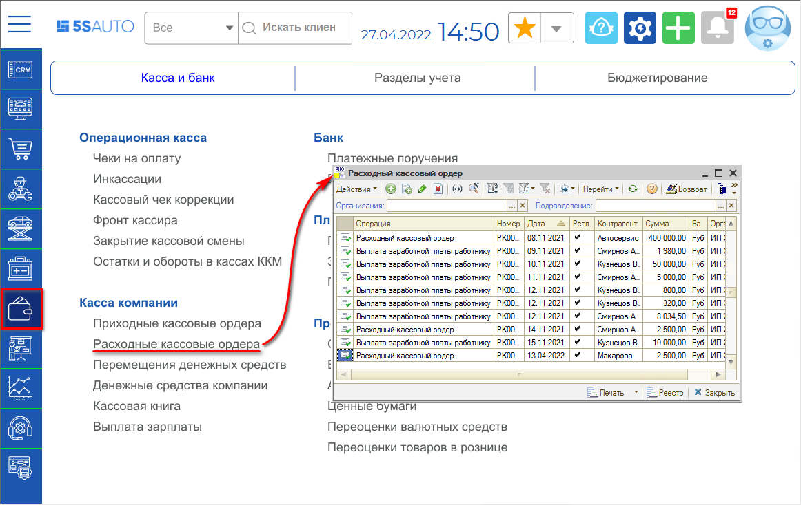
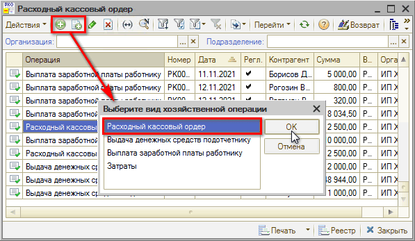
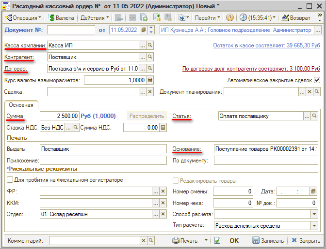

# Как отразить оплату поставщику из кассы

<table><tr><td><b>Время чтения:</b> 2 мин.</td><td><b>Обновлено:</b> 14.09.2026</td></tr></table>

Источник: https://www.5systems.ru/help/kak-otrazit-oplatu-postavschiku-iz-kassy

Для того, чтобы отразить в программе выдачу наличных денежных средств из кассы для оплаты поставщику, требуется создать документ *Расходный кассовый ордер (РКО)*. Расположение реестра РКО в программе: *Финансы → Касса и банк → Касса компании → Расходные кассовые ордера* (или в стандартном меню: Документы → Движения денежных средств → Расходный кассовый ордер)

РКО имеют разные виды хозяйственных операций: требуется установить вид хозяйственной операции “Расходный кассовый ордер”.

Документ “Расходный кассовый ордер” может быть введен на основании Заказа поставщику, Поступления товаров, Инкассации, Заявки на расход ДС, Приходного кассового ордера, Счета от поставщика и других документов.

В создаваемом документе нужно указать:

- *Кассу*, из которой изымаются денежные средства;
- *Контрагента*, которому выплачиваются денежные средства;
- *Договор*, согласно которому ведутся взаиморасчеты с контрагентом;
- *Сумму* расходования денежных средств;
- выбрать *Статью движения денежных средств*.

Гиперссылка *По договору долг контрагенту составляет* отражает текущее состояние расчетов с контрагентом по договору.

Заполненный документ следует записать и провести.

Расходный кассовый ордер можно вывести на печать – предварительно нужно заполнить текстовые поля в области “Печать” на форме документа.

---

**Теги:** учет денежных средств, оплата поставщику, касса, расходный кассовый ордер

