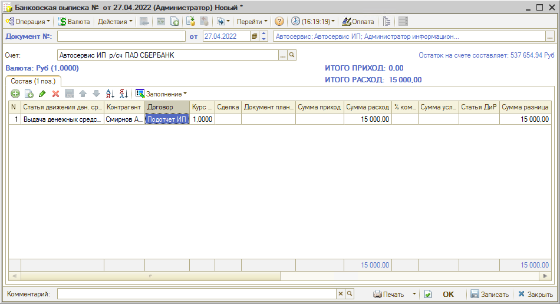
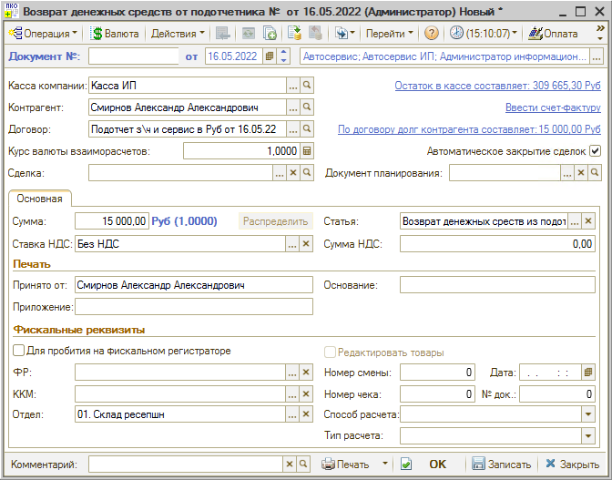

# Как отразить перевод денег с расчетного счета в кассу

<table><tr><td><b>Время чтения:</b> 1 мин.</td><td><b>Обновлено:</b> 11.07.2022</td></tr></table>

В рамках данного урока рассматривается один из способов, как можно отразить в программе перевод денег с расчетного счета в кассу компании.

Для начала следует сделать перевод на банковскую карту подотчетному лицу:

Затем нужно сделать возврат из подотчета – внесение в кассу компании с помощью ПКО:

---

**Теги:** учет денежных средств, расчетный счет, касса, перевод, приходный кассовый ордер

