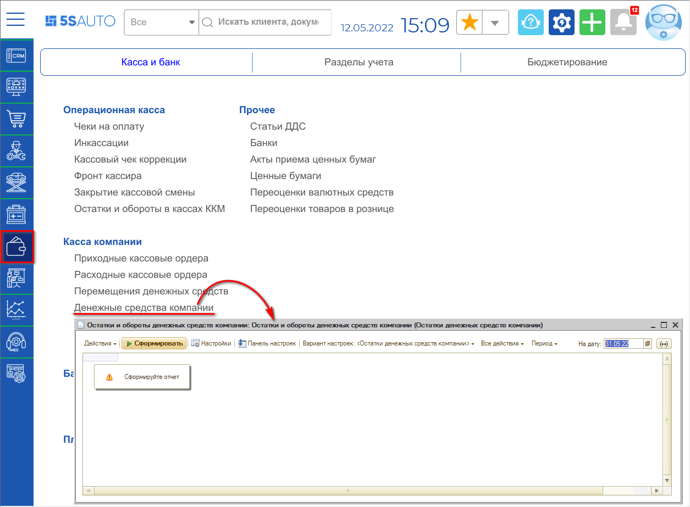
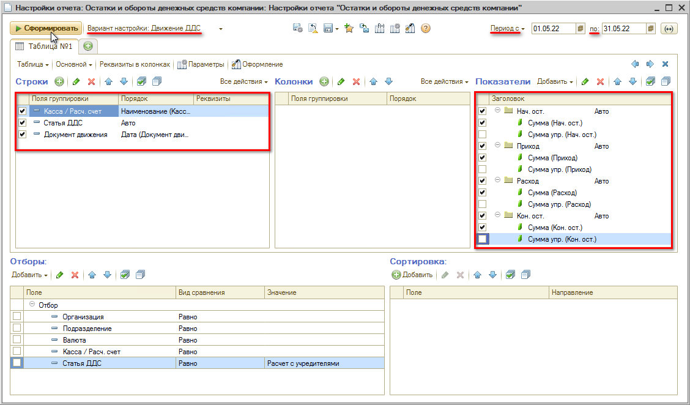
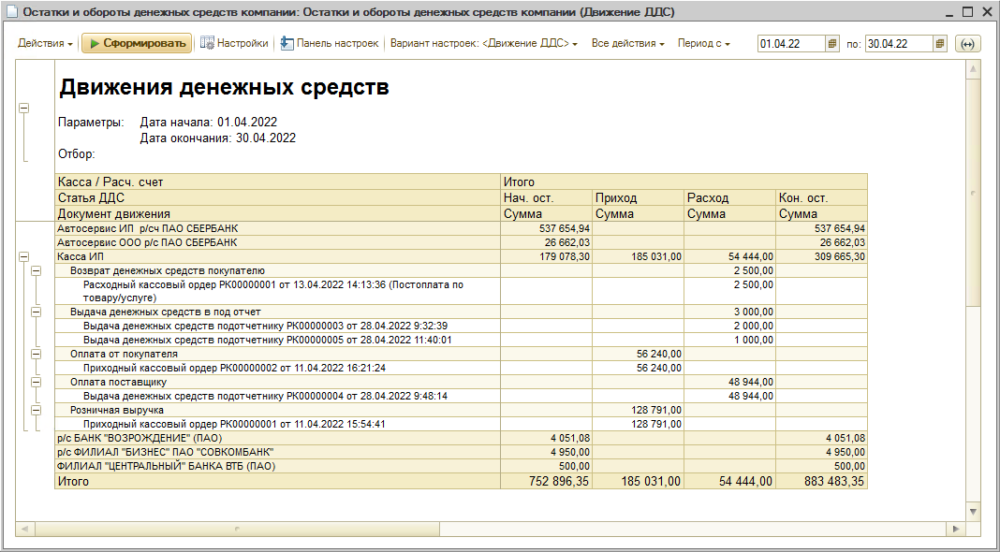

# Как сформировать отчет по движению денег компании

<table><tr><td><b>Время чтения:</b> 2 мин.</td><td><b>Обновлено:</b> 11.07.2022</td></tr></table>

Отчет "**Остатки и обороты денежных средств компании"** служит для анализа остатков и движений денежных средств в кассах компании, банковских счетах и кассах ККМ.

Расположение отчета в меню программы: *Финансы → Касса и банк → Касса компании → Денежные средства компании* (или в стандартном меню: Отчеты → Финансовые →  Остатки и обороты денежных средств компании)

Следует выбрать вариант отчета *“Движение ДДС”*, установить период и нажать кнопку “Настройки”. В открывшемся окне настроек задать нужные показатели, группировку строк и колонок, дополнительных полей и др.:

**Возможные Показатели:**

- *Нач. ост.* – группа показателей “Начальный остаток”: остаток денежных средств в кассах, на банковских счетах или средств, вложенных в ценные бумаги, на начало периода.
- *Приход* – группа показателей поступления денежных средств.
- *Расход* – группа показателей выбытия денежных средств.
- *Кон. ост.* – группа показателей “Конечный остаток”: остаток денежных средств в кассах, на банковских счетах или средств, вложенных в ценные бумаги, на конец периода.
- *Сумма* – сумма денежных средств в кассах, на расчетных счетах и ценных бумагах в соответствующей валюте.
- *Сумма упр.* – сумма денежных средств в кассах, на расчетных счетах и ценных бумагах в управленческой валюте.

После установки настроек следует нажать кнопку *“Сформировать”*.

**Пример сформированного отчета:**

---

**Теги:** учет денежных средств, отчет, движение денежных средств, ДДС

