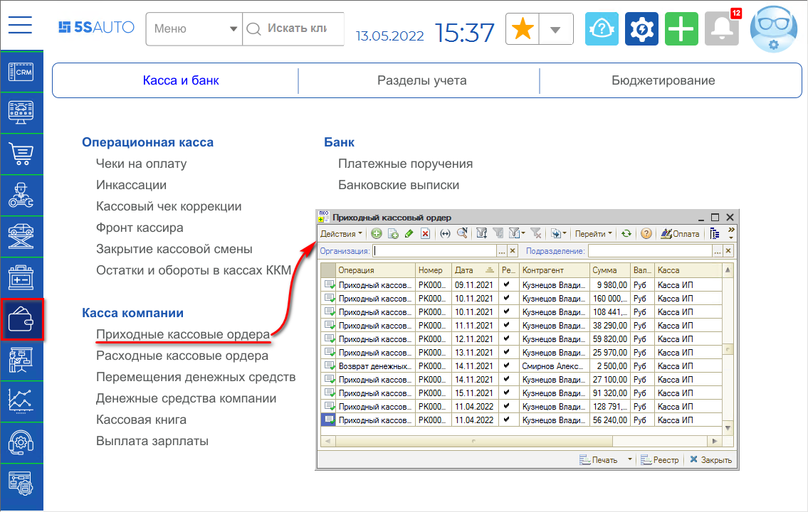
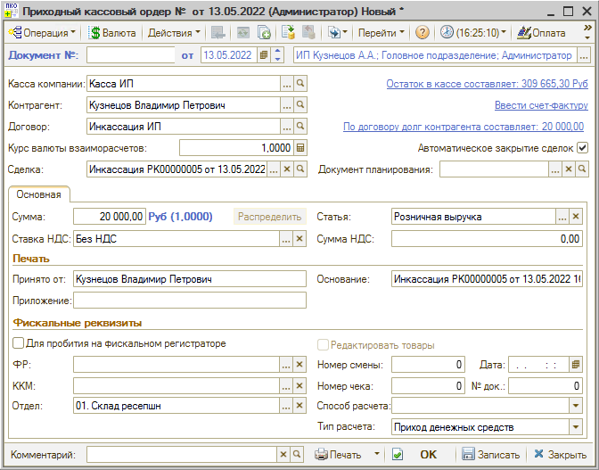
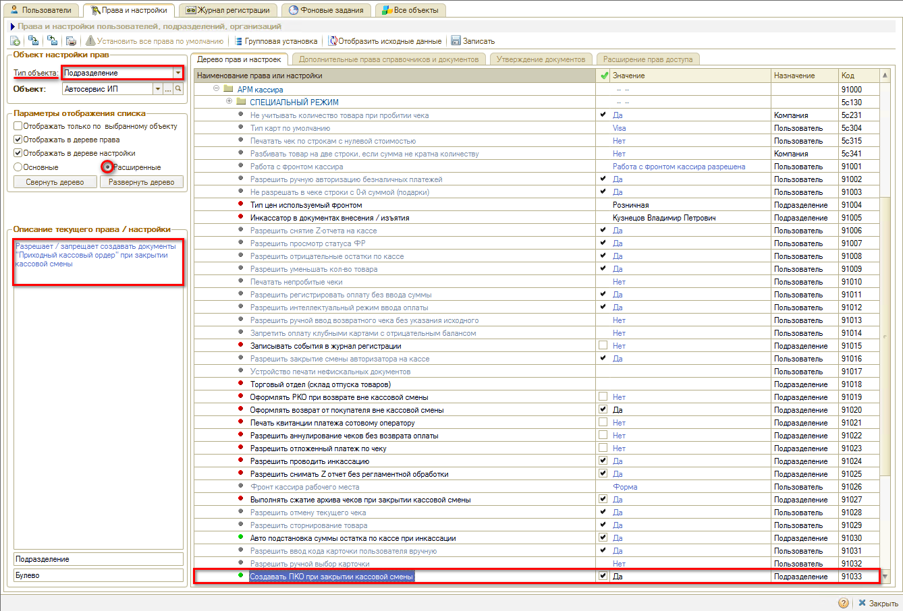
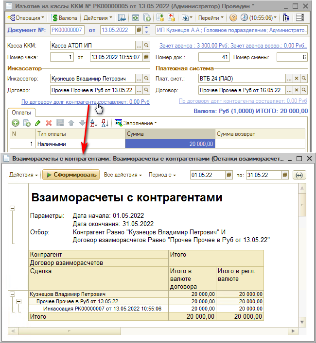
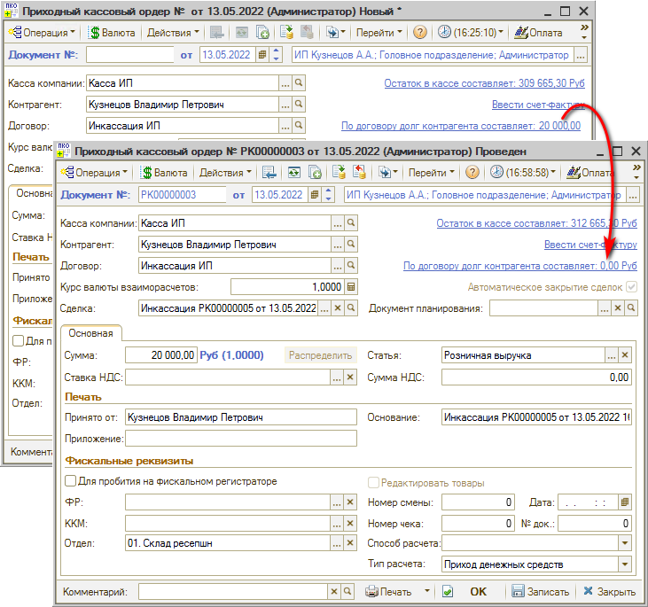

# Учет кассовой выручки

<table><tr><td><b>Время чтения:</b> 5 мин.</td><td><b>Обновлено:</b> 11.07.2022</td></tr></table>

## Содержание

1. [Как отразить учет наличных денежных средств](#как-отразить-учет-наличных-денежных-средств)
2. [Как отразить учет безналичных денежных средств](#как-отразить-учет-безналичных-денежных-средств)
3. [Как отразить списание задолженности с контрагента](#как-отразить-списание-задолженности-с-контрагента)

После закрытия кассовой смены и проведения инкассации (см. урок [*Как закрыть смену*](../../Урок%2015.%20Работа%20с%20кассой%20ККМ/Как%20закрыть%20смену/kak-zakryt-smenu.md)) требуется отразить в программе поступление кассовой выручки.

Для учета наличных денежных средств используется документ ***Приходный кассовый ордер** (ПКО)*, а для учета безналичных денег – ***Банковская выписка***.

## Как отразить учет наличных денежных средств

Чтобы отразить поступление наличных денежных средств в кассу компании, необходимо создать документ Приходный кассовый ордер (ПКО). Расположение реестра ПКО в меню программы: *Финансы → Касса и банк → Касса компании → Приходные кассовые ордера*

Документ *Приходный кассовый ордер* может вводиться на основании следующих документов: Инкассация, Авансовый отчет, Возврат поставщику, Заказ покупателя, Заказ-наряд, Реализация товаров, Расходный кассовый ордер, и других.

Документ имеет два вида хозяйственных операций: “Приходный кассовый” ордер и “Возврат денежных средств от подотчетника”.

**Поля документа *Приходный кассовый ордер*:**

- *Касса компании* – касса, в которую принимаются денежные средства. Справа от этого поля располагается гиперссылка, показывающая остаток денежных средств в кассе.
- *Контрагент* – плательщик (инкассатор), вносящий в кассу денежные средства.
- *Договор* – договор, согласно которому ведутся взаиморасчеты с контрагентом.
- *Сделка* – документ, по которому были получены денежные средства.
- *По договору долг контрагенту составляет* – гиперссылка отражает текущее состояние расчетов с контрагентом по договору. Нажатием на ссылку открывается отчет “Взаиморасчеты с контрагентами”, сформированный для указанного контрагента.

Область *ПКО*

- *Сумма* – сумма поступления денежных средств.
- *Статья* – статья движения денежных средств (вид операции), по которой поступают денежные средства. Один из самых важных реквизитов: отражает суть производимой операции, в дальнейшем используется для анализа движения денежных средств.

Область *Печать* – текстовые поля, используемые при выводе документа на печать.

### Автоматическое создание ПКО

Чтобы приходные кассовые ордера создавались автоматически каждый раз при закрытии кассовой смены, необходимо включить настройку *“Создавать ПКО при закрытии кассовой смены”*:

## Как отразить учет безналичных денежных средств

Поступление безналичных денежных средств должно оформляться на расчетный счет организации. Для этого следует создать документ *Банковская выписка*.

Расположение реестра банковских выписок в программе: *Финансы → Касса и банк → Банк → Банковские выписки*

Поле *“Счет”* – это расчетный счет компании, по которому производится движение денежных средств.

В таблице должны быть заполнены значения:

- *Статья движения ден. средств*, по которой производится платеж;
- *Контрагент* – получатель денежных средств (банк);
- *Договор*, согласно которому ведутся взаиморасчеты с контрагентом;
- *Сделка* – документ, по которому были уплачены денежные средства;
- *Сумма приход* – сумма поступления денежных средств на банковский счет компании;
- *Назначение платежа* – в приведенном примере: “Зачисление средств по операциям эквайринга”.

Таблица может быть автоматически заполнена при помощи кнопки *Заполнение → По платежным поручениям*. Созданную банковскую выписку необходимо записать и провести.

## Как отразить списание задолженности с контрагента

При проведении *Инкассации* формируется задолженность контрагента (инкассатора или платежной системы) перед компанией:

*Примечание: На приведенном скриншоте в ссылке “По договору долг контрагенту составляет:” стоит значение “0,00 руб.”, т.к. отображается долг на момент создания документа Инкассация.*

Документы *Приходный кассовый ордер* и *Банковская выписка* позволяют зафиксировать списание этой задолженности с контрагента:

---

**Теги:** учет денежных средств, кассовая выручка, инкассация, касса ККМ

