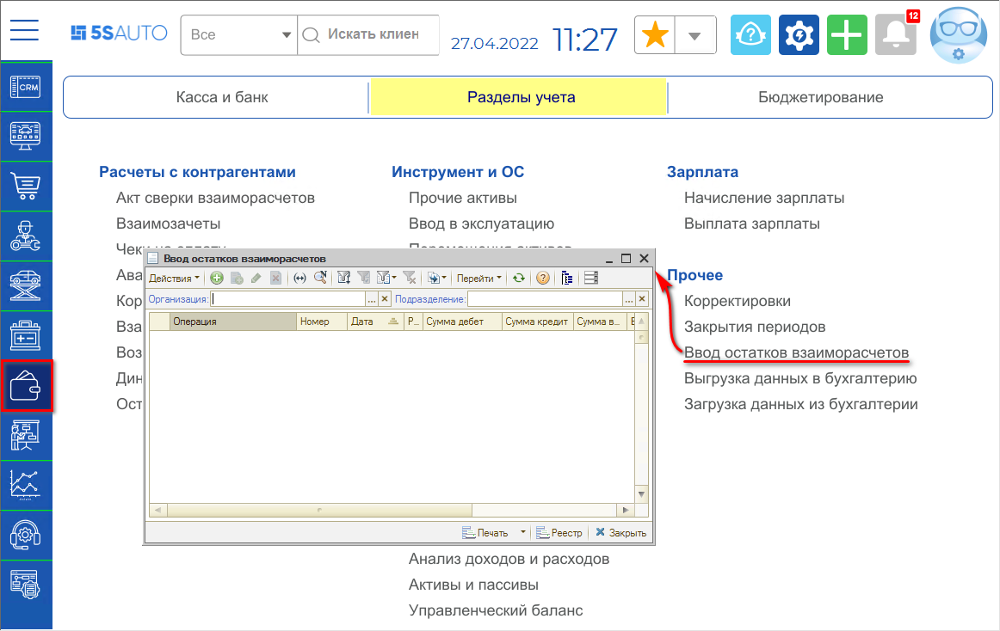
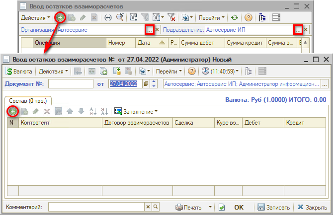
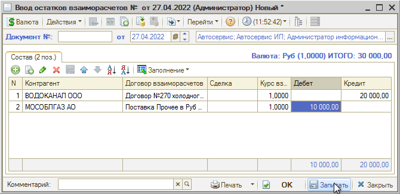

# Как ввести начальные остатки взаиморасчетов

<table><tr><td><b>Время чтения:</b> 2 мин.</td><td><b>Обновлено:</b> 11.07.2022</td></tr></table>

Источник: https://www.5systems.ru/help/kak-vvesti-nachalnye-ostatki-vzaimoraschetov

Документ **"Ввод остатков взаиморасчетов"** служит для ввода начальных остатков по взаиморасчетам с контрагентами, имеющими дебиторскую или кредиторскую задолженность по различным договорам взаиморасчетов. Как правило, данный документ требуется создать один раз – при начале работы с базой.

Документ создается в реестре путем добавления нового элемента: *Финансы → Разделы учета → Прочее → Ввод остатков взаиморасчетов* (или в стандартном меню: Документы → Взаиморасчеты → Ввод остатков взаиморасчетов)

Требуется указать организацию и подразделение и нажать кнопку “Добавить”:

В создаваемом документе необходимо выбрать или ввести следующие данные:

- *Контрагента*, для которого вводятся остатки по взаиморасчетам;
- *Договор взаиморасчетов* с контрагентом;
- *Сделку* (если требуется разнести показатели по документам);
- *Дебет* – сумма задолженности контрагента перед Вашей компанией по данному договору;
- *Кредит* – сумма задолженности Вашей компании перед контрагентом по данному договору.

Затем заполненный документ требуется сохранить нажатием на кнопку “Записать” или “ОК”:

Рекомендуется создавать *Ввод остатков взаиморасчетов* по каждому подразделению, добавляя всех контрагентов в один документ.

---

**Теги:** взаиморасчеты, начальные остатки, долг, контрагент

