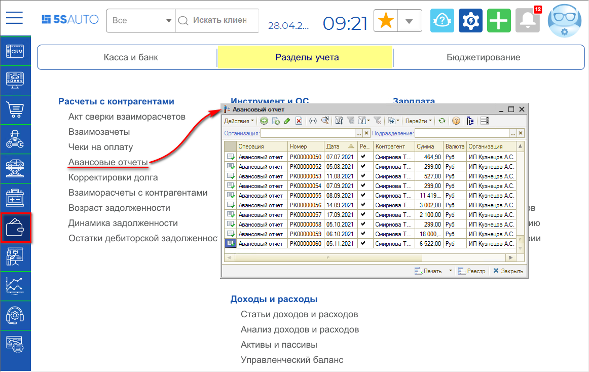
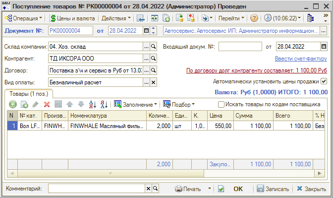
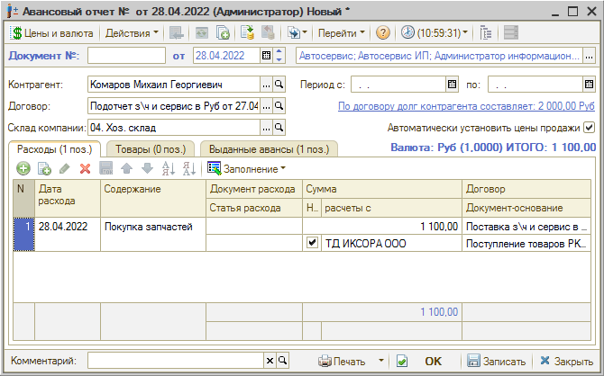
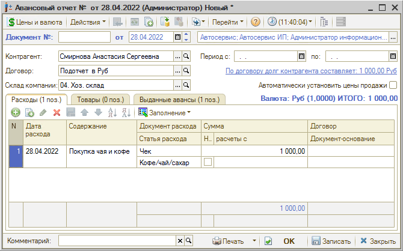

# Как отразить авансовый отчет сотрудника

<table><tr><td><b>Время чтения:</b> 4 мин.</td><td><b>Обновлено:</b> 11.07.2022</td></tr></table>

Источник: https://www.5systems.ru/help/kak-otrazit-avansovyy-otchet-sotrudnika

## Содержание

[Варианты оформления Авансового отчета](#варианты-оформления-авансового-отчета)

- [1. Через Поступление товаров](#1-через-поступление-товаров)
- [2. Списание без оформления Поступления товаров](#2-списание-без-оформления-поступления-товаров)

Документ **"Авансовый отчет"** служит для списания сумм задолженностей с подотчетного лица с отнесением их на выбранную статью расходов. То есть, это отчет по денежным средствам, выданным ранее [сотруднику под отчет](../../Урок%2016.%20Учет%20денежных%20средств/Как%20отразить%20выдачу%20денег%20в%20подотчет%20сотруднику/kak-otrazit-vydachu-deneg-v-podotchet-sotrudniku.md).

Реестр *авансовых отчетов* находится в разделе меню: *Финансы → Разделы учета → Расчеты с контрагентами → Авансовые отчеты* (или в стандартном меню: Документы → Взаиморасчеты → Авансовый отчет)

## Варианты оформления Авансового отчета

### 1. Через Поступление товаров

Если требуется учесть в программе взаиморасчеты с поставщиком – например, если денежные средства сотруднику выдавались для закупки запчастей – то в документе *Авансовый отчет* необходимо отразить поступление товаров на склад.

Для этого сначала следует на основании РКО создать документ *Поступление товаров* и отразить в нем поступление на склад товаров от поставщика, которые были куплены подотчетником.

*Авансовый отчет* рекомендуется также создавать на основании *Расходного кассового ордера*. В нем нужно заполнить *Контрагента* (подотчетное лицо), *Договор*, *Склад* и таблицу *Расходы:*

Значение в столбце *“Содержание”* заполняется вручную произвольно.

Далее необходимо поставить галочку *“На расчеты с”* и выбрать контрагента – поставщика товаров. Если этот флажок установлен, то указанный расход будет отнесен на взаиморасчеты с этим контрагентом. Если флажок снят – то на расходы по указанной статье (см. *далее*).

В качестве документа-основания[\*](#snoska) важно отразить *Поступление товаров*. 
\**Примечание:* Только в случае, если установлен флажок отнесения расхода на расчеты с контрагентом *На расчеты с*.

На вкладке *Товары* можно отразить купленные подотчетником детали, а в таблицу на вкладке *Выданные авансы* подтягивается документ “Выдача денежных средств подотчетнику” (РКО).

*Пояснение:* Когда сотруднику выдаются деньги под отчет и оформляется РКО, у него появляется долг перед компанией на выданную сумму. При оформлении документа *Поступление товаров* у компании формируется долг перед поставщиком на сумму поступления (т.е. на стоимость купленных товаров). Авансовый отчет позволяет оформить списание долга с сотрудника и оплату поставщику за купленные товары. Остаток денежных средств сотрудник сдает в кассу компании, оформляется ПКО, который списывает остаток долга.

### 2. Списание без оформления Поступления товаров

Посредством *Авансового отчета* можно оформить расходы компании сразу, без учета отношений с поставщиком, т.е. без оформления *Поступления товаров*. Например, в случае приобретения чая/кофе или канцтоваров.

Для этого необходимо на основании РКО создать *Авансовый отчет*, в нем заполнить *Контрагента*, *Договор* (подотчет) и таблицу *Расходы* – в ней важно правильно выбрать *статью расхода*. Значения *“Содержание”* заполняется произвольно, в качестве документа расхода можно указать “*Чек”*.

---

**Теги:** взаиморасчеты, авансовый отчет, подотчет, сотрудник

