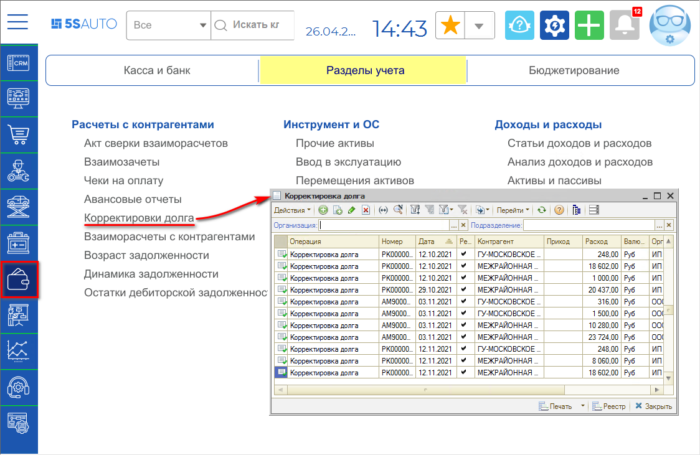
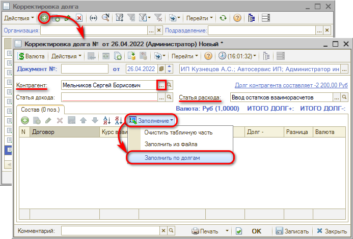
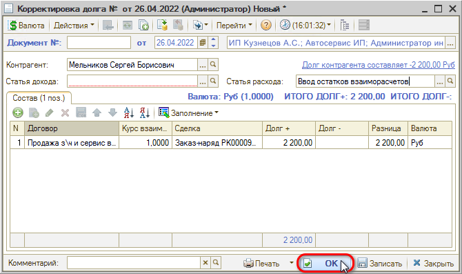

# Как списать долг с контрагента

<table><tr><td><b>Время чтения:</b> 2 мин.</td><td><b>Обновлено:</b> 11.07.2022</td></tr></table>

Источник: https://www.5systems.ru/help/kak-spisat-dolg-s-kontragenta

Документ **"Корректировка долга"** служит для ручной корректировки долга контрагента.

Для того чтобы сформировать документ *“Корректировка долга”*, необходимо создать новый элемент в соответствующем реестре: расположение в меню программы – *Финансы → Разделы учета → Расчеты с контрагентами → Корректировки долга*

В создаваемом документе требуется указать контрагента, заполнить статью расхода и с помощью кнопки автозаполнения *Заполнить по долгам:*

После заполнения документ необходимо *Записать с проведением* нажатием на кнопку “ОК”:

---

**Теги:** взаиморасчеты, списание долга, корректировка долга, контрагент

