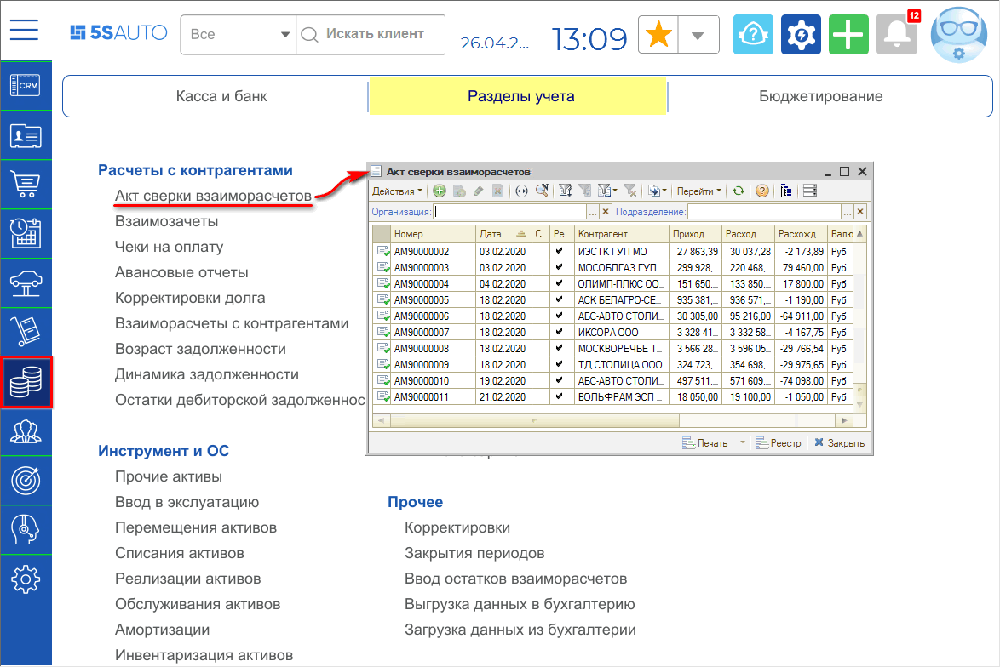
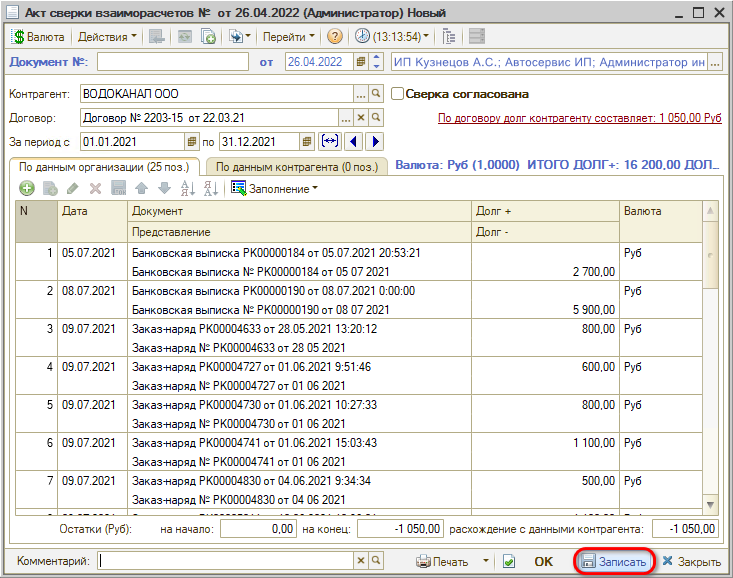
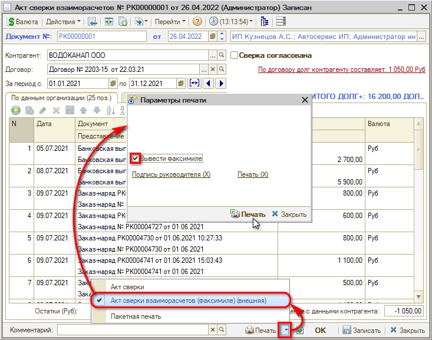

# Как сформировать акт сверки взаиморасчетов

<table><tr><td><b>Время чтения:</b> 2 мин.</td><td><b>Обновлено:</b> 29.07.2026</td></tr></table>

Источник: https://www.5systems.ru/help/kak-sformirovat-akt-sverki-vzaimoraschetov

Документ **"Акт сверки взаиморасчетов"** предназначен для согласования сумм задолженности по документам взаиморасчетов. В том случае, если возникло расхождение данных о задолженности между контрагентом и вашей организацией, данный документ позволяет осуществить сверку данных.

Для того чтобы сформировать *Акт сверки взаиморасчетов*, необходимо создать новый документ в соответствующем реестре: расположение в меню программы – *Финансы → Разделы учета → Расчеты с контрагентами → Акт сверки взаиморасчетов*

Новый элемент создается нажатием на кнопку “Добавить”, в нем нужно выбрать контрагента и заполнить период, за который требуется произвести сверку. Затем акт необходимо *заполнить по взаиморасчетам*, используя кнопку автозаполнения. При нажатии на кнопку открывается окно выбора режима загрузки – *"Все документы*" или *"Регламентированный учет"* (в зависимости от учетной политики компании):

После выбора режима загрузки акт заполняется документами – требуется его *Записать*:

Документ *Акт сверки взаиморасчетов* не выполняет никаких движений. Он может быть распечатан и передан контрагенту для согласования.

Чтобы вывести печатную форму акта сверки, нужно нажать стрелку рядом с кнопкой *Печать* и выбрать *Акт сверки взаиморасчетов (факсимиле)*, в открывшемся окне отметить галочку *“Вывести факсимиле”* и нажать “Печать”:

Открывается печатная форма *Акта сверки взаиморасчетов*:

---

**Теги:** взаиморасчеты, акт сверки, контрагент, отчет

