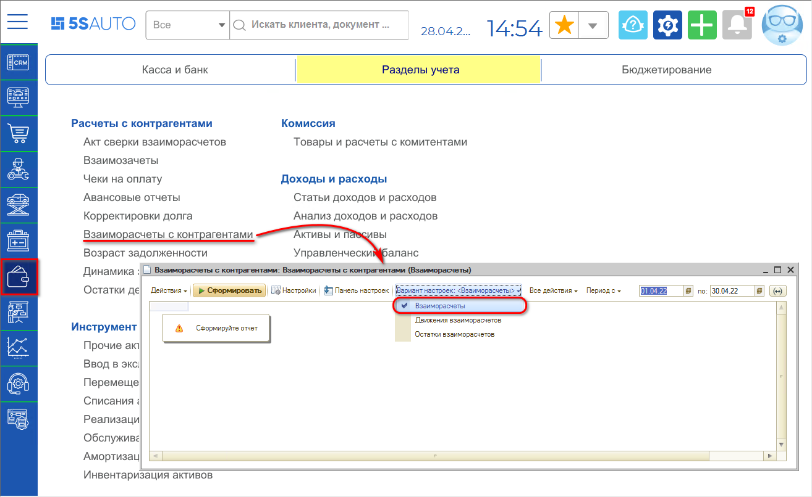
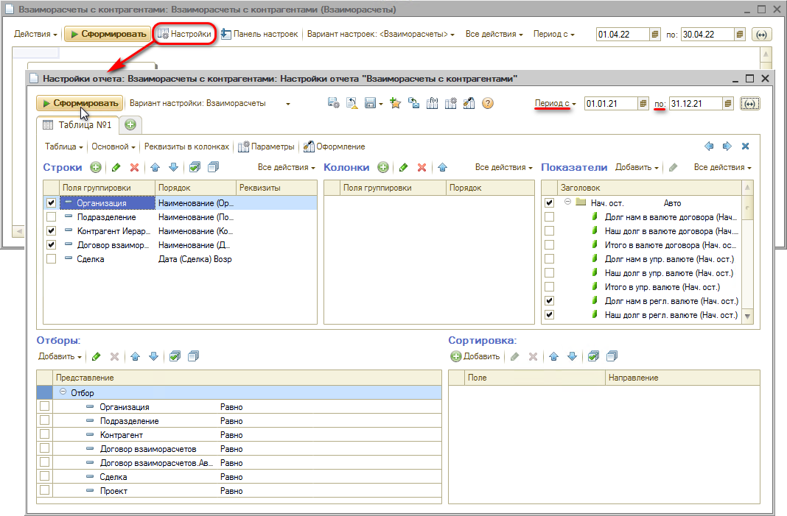

# Как сформировать ведомость по взаиморасчетам

<table><tr><td><b>Время чтения:</b> 4 мин.</td><td><b>Обновлено:</b> 31.10.2025</td></tr></table>

Источник: https://www.5systems.ru/help/kak-sformirovat-vedomost-po-vzaimoraschetam

## Содержание

1. [Показатели отчета](#показатели-отчета)
2. [Пример сформированного отчета](#пример-сформированного-отчета)

Для анализа состояния взаиморасчетов с контрагентами используется отчет **“Взаиморасчеты с контрагентами”**: *Финансы → Разделы учета → Расчеты с контрагентами → Взаиморасчеты с контрагентами*, вариант настроек – *Взаиморасчеты.*

Требуется установить нужный период, задать настройки отчета и нажать кнопку “Сформировать”:

## Показатели отчета

**1. Группы показателей:**

- *Нач. ост.* – начальный остаток, состояние взаиморасчетов с контрагентом на начало периода. Если остаток отрицателен, то Ваша компания должна контрагенту. Если остаток положителен, то контрагент должен Вашей компании.
- *Приход* – показатели увеличения долга контрагента перед Вашей компанией.
- *Расход* – показатели уменьшения долга контрагента перед Вашей компанией.
- *Кон. ост.* – конечный остаток, состояние взаиморасчетов с контрагентом на конец периода. Если остаток отрицателен, то Ваша компания должна контрагенту. Если остаток положителен, то контрагент должен Вашей компании.

**2. Долг:**

- *Долг нам* – долг контрагента перед компанией.
- *Долг наш* – долг компании перед контрагентом.
- *Итого* – состояние взаиморасчетов с контрагентом.

**3. Валюта учета:**

- Валюта *договора* взаиморасчетов.
- Валюта *управленческого учета*.
- Валюта *регламентированного учета*.

Можно использовать *фильтры и отборы*: вывести в отчет только показатели по определенному подразделению, по контрагентам, по подотчетным лицам и др.

## Пример сформированного отчета

В примере в отчете заданы настройки: показатели *в регл. валюте*, *долг нам* и *наш долг* по группам *Нач. ост., Приход, Расход* и *Кон. ост.*

Для дальнейшего анализа используется изменение уровней группировки отчета.

---

**Теги:** взаиморасчеты, ведомость по взаиморасчетам, отчет, задолженность

