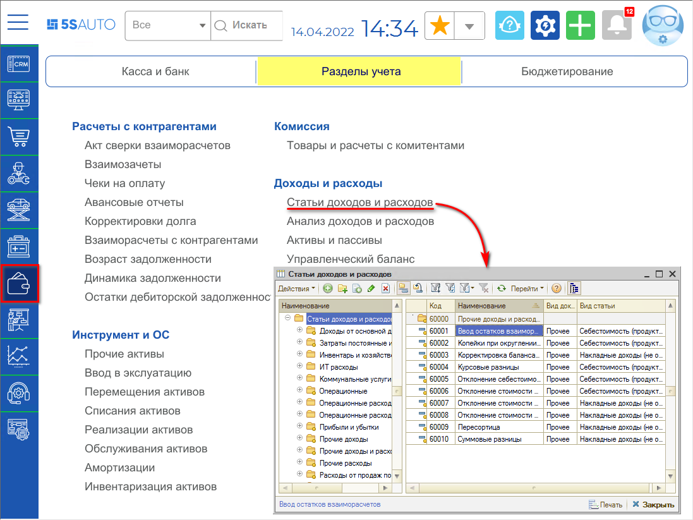
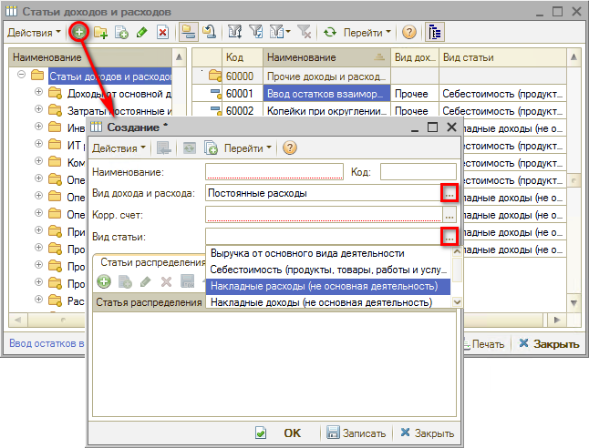
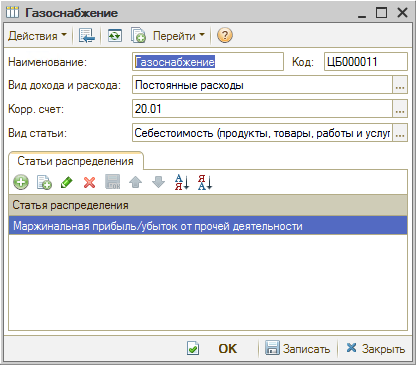

# Как добавить статью дохода/расхода

<table><tr><td><b>Время чтения:</b> 2 мин.</td><td><b>Обновлено:</b> 20.12.2023</td></tr></table>

Источник: https://www.5systems.ru/help/kak-dobavit-statyu-dokhodaraskhoda

В справочнике **"Статьи доходов и расходов"** содержится список статей операционных доходов и расходов и конечных (распределенных) статей прибылей и убытков компании. Статьи используются для заполнения в [карточках ус](../Как%20создать%20карточку%20услуги/kak-sozdat-kartochku-uslugi.md)[л](../Как%20создать%20карточку%20услуги/kak-sozdat-kartochku-uslugi.md)[уг](https://support.5systems.ru/hc/ru/articles/5455555263889), а также в документах при проведении той или иной операции.

Расположение справочника в меню: Финансы → Разделы учета → Доходы и расходы → *Статьи доходов и расходов*

Для добавления новой статьи доходов/расходов требуется создать новый элемент справочника:

Требуется заполнить поля карточки:

- *Наименование* статьи;
- *Вид дохода и расхода:* выбрать вид – основные/дополнительные, постоянные/переменные, прочие и т.д.;
- *Вид статьи* – требуется выбрать вид статей доходов и расходов:
  - *Выручка от основного вида деятельности* выбирается для доходов;
  - *Себестоимость (продукты, товары, работы и услуги) –* для расходов;
  - *Накладные доходы/расходы –* для не основной деятельности автосервиса (субаренда и т.д.).

*Пример* заполнения карточки статьи расходов:

---

**Теги:** доходы и расходы, статьи доходов и расходов, справочник

