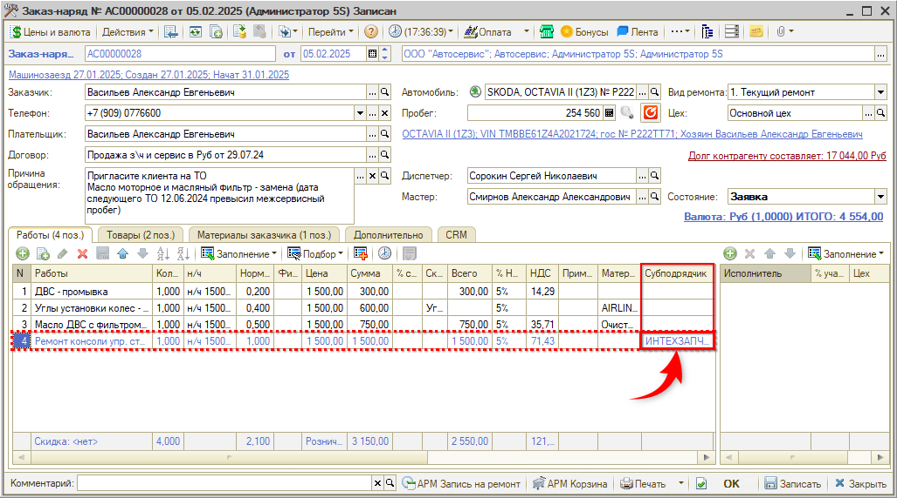
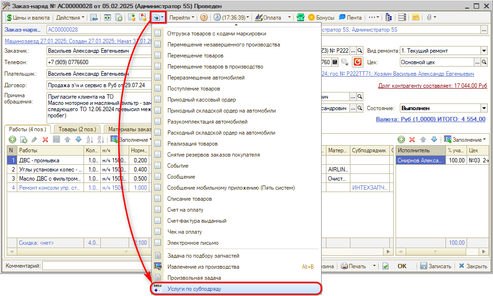
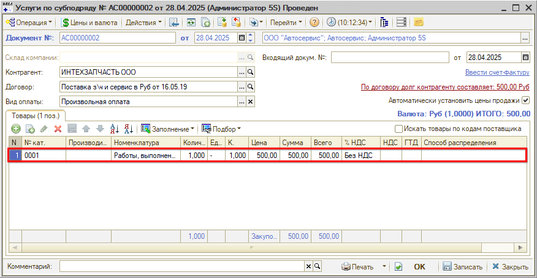
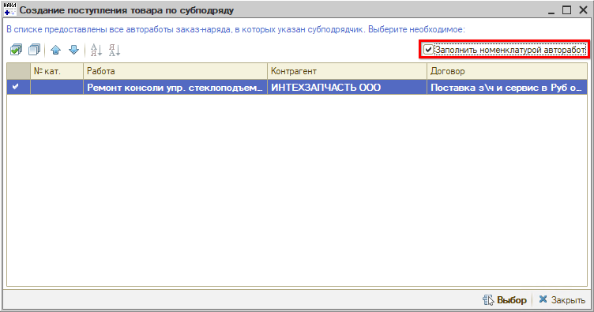

# Как отразить оказание услуг субподряда

<table><tr><td><b>Время чтения:</b> 6 мин.</td><td><b>Обновлено:</b> 31.10.2025</td></tr></table>

Некоторые работы в автосервисе могут выполняться сторонними организациями (**субподрядом**). Учет таких работ в программе производится следующим образом:

1. Заполнение субподрядчика по работе в Заказ-наряде.
2. Оприходование выполненных субподрядчиком работ путем создания и проведения документа "Услуги по субподряду".

## Пример учета работ по субподряду

Создадим Заказ-наряд, где по одной из работ укажем *Субподрядчика* – контрагента, который будет выполнять работу:

Работа по субподряду выделяется серым цветом. Если по работе указывается *Субподрядчик*, то исполнителей заполнять не нужно. Сохраним *Заказ-наряд* и переведем его в состояние *Выполнен*:

Далее создадим на основании *Заказ-наряда* документ *"Услуги по субподряду"*:

Выберем работу, которая будет учтена в документе:

В созданном документе отразим услуги, которые будут учтены по субподрядчику, и проведем документ:

В качестве товаров в документе "Услуги по субподряду" отражается [номенклатура вида *"Услуга"*](../Как%20создать%20карточку%20услуги/kak-sozdat-kartochku-uslugi.md), у которой способ распределения – "На доходы и расходы":

В статье расходов удобно отражать "Услуги сторонних организаций" или "Услуги по субподряду" для учета затрат на сторонние организации.

Для учета работ по субподряду можно создать одну общую услугу, как в примере, а можно на каждую работу создать отдельную услугу и сопоставить их по артикулу: артикул работы = № по каталогу в номенклатуре. Тогда при выборе работ для создания документа "Услуги по ремонту" можно установить флажок "Заполнить номенклатурой (найти по артикулу автоработы)", чтобы номенклатура в документе заполнилась автоматически:

Если необходимо оприходовать услуги по субподряду по нескольким Заказ-нарядам, то удобнее создать документ "Поступление товаров" (Запчасти и склад → Снабжение → Закупка → Поступления товаров / Документы → Поступление ТМЦ → Поступление товаров) с видом операции "Услуги по субподряду". В документе:

1. Указать контрагента-субподрядчика,
2. Добавить услуги по Заказ-нарядам, которые необходимо оприходовать:

Подробнее см. [*статью*](../../../articles/5S%20AUTO/Автосервис/Работа%20с%20субподрядами/rabota-s-subpodryadami.md).

---

**Теги:** доходы и расходы, субподряд, услуги, поступление услуг, заказ-наряд

