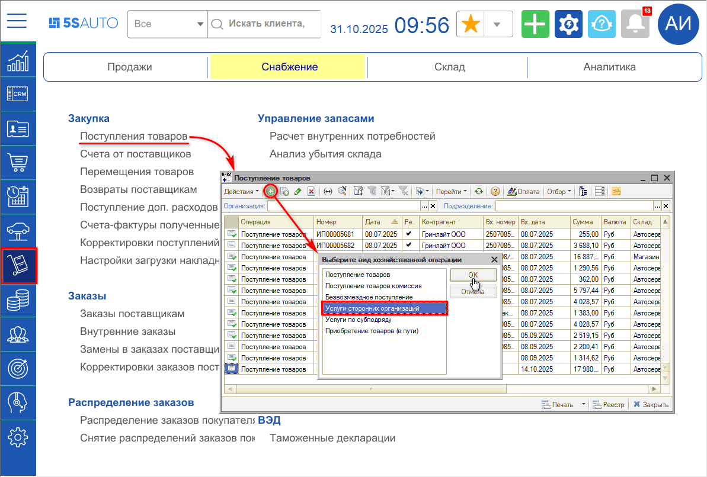
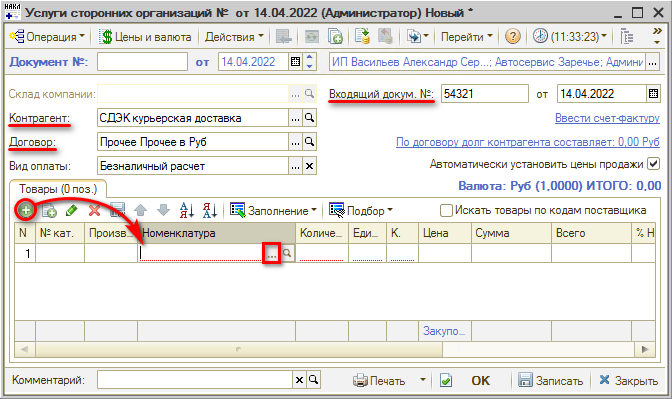
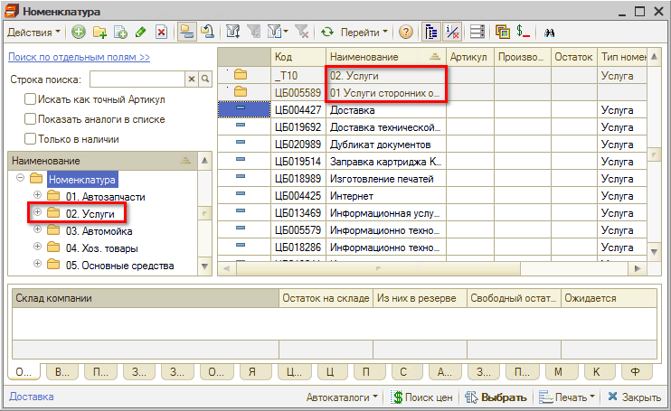
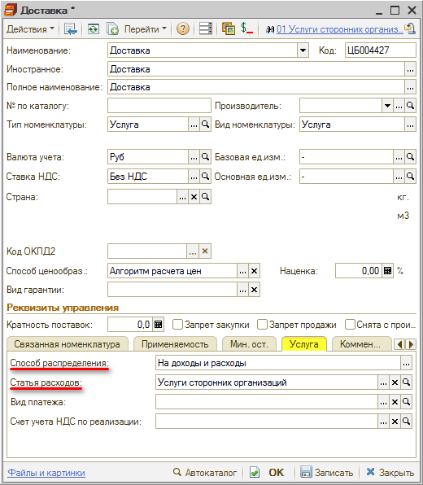
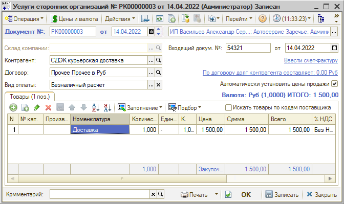

# Как отразить расходы компании (аренда, электроэнергия, и т.д.)

<table><tr><td><b>Время чтения:</b> 3 мин.</td><td><b>Обновлено:</b> 31.10.2025</td></tr></table>

Для того, чтобы отразить в программе расходы компании, требуется оформить документ *“Поступление товаров”* с видом хозяйственной операции *“Услуги сторонних организаций”*:

В создаваемом документе требуется заполнить *Контрагента*, *Договор*, номер и дату *входящего документа поставщика* (УПД или Акта об оказании услуг) и ввести в таблицу список услуг из этого документа:

Услуги выбираются из справочника *Номенклатура*, группа *Услуги* (как создать карточку услуги – см. [*урок*](../Как%20создать%20карточку%20услуги/kak-sozdat-kartochku-uslugi.md)):

Услуга для отражения расходов компании должна быть заполнена следующим образом – на вкладке “Услуга” должны быть выбраны *Способ распределения: “На доходы и расходы”* и *Статья расходов: “Услуги сторонних организаций”*:

Услуги в таблицу могут быть введены одной строкой, либо заполнен полный перечень услуг из входящего документа – в зависимости от учетной политики компании:

---

**Теги:** доходы и расходы, расходы компании, аренда, коммунальные услуги, поступление услуг

