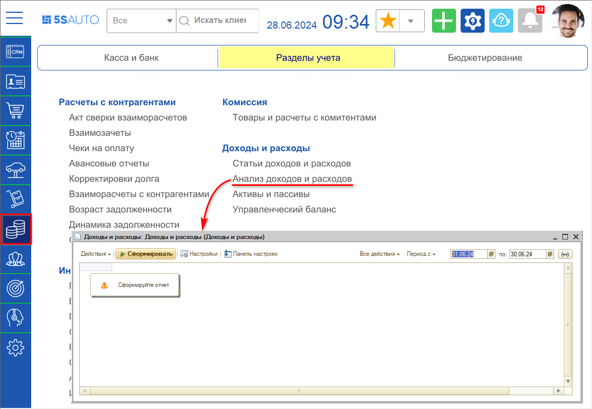
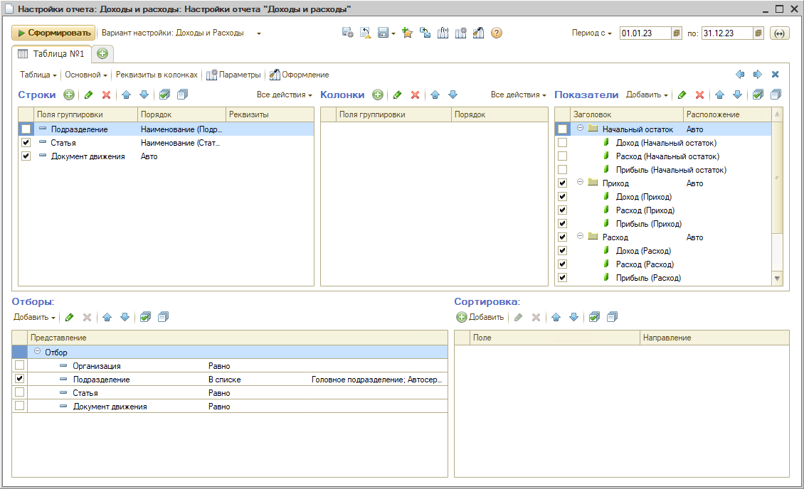
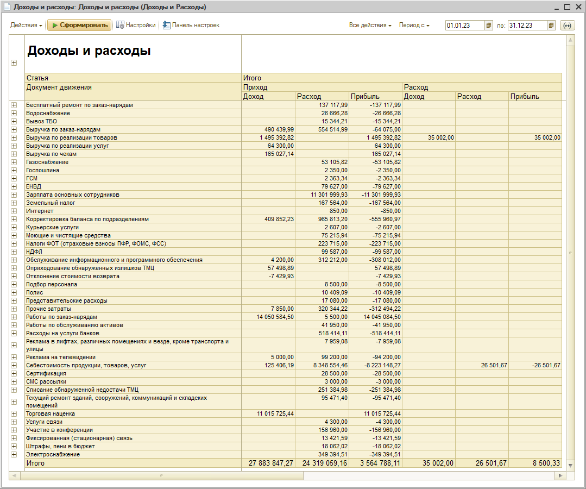
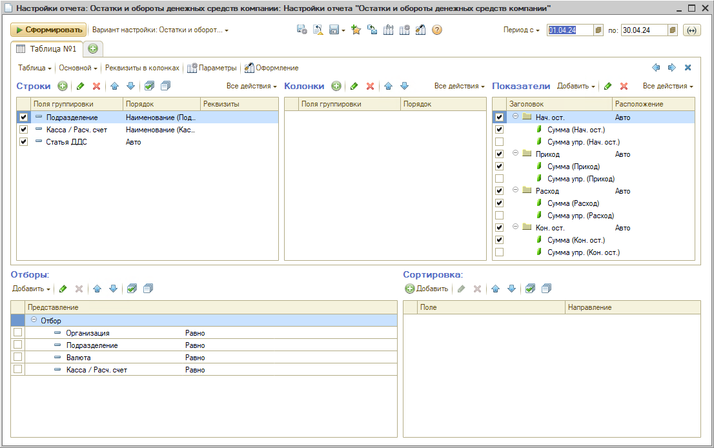
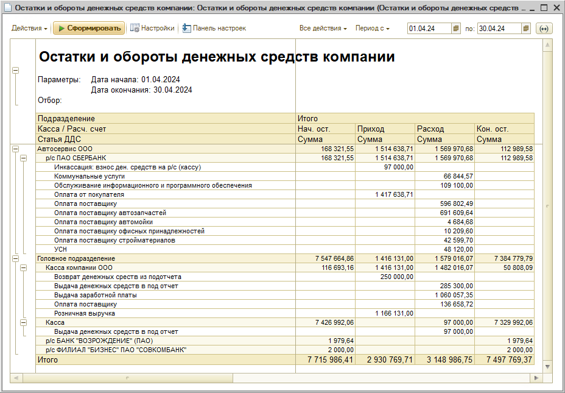

# Как рассчитать доход компании

<table><tr><td><b>Время чтения:</b> 7 мин.</td><td><b>Обновлено:</b> 28.06.2024</td></tr></table>

Источник: https://www.5systems.ru/help/kak-rasschitat-dokhod-kompanii

***Анализ доходов и расходов*** является одним из основных принципов управления. Разница между доходами и расходами позволяет *оценить, насколько предприятие является прибыльным,* и найти узкие места и точки роста.

Для корректного расчета прибыли компании необходимо:

1. Отражать *все* доходы и расходы компании в учете;
2. Произвести *сверку взаиморасчетов* с поставщиками и с клиентами;
3. Сформировать *отчет* “Доходы и расходы”.

*Отчет “Доходы и расходы”* служит для анализа полученных доходов и понесенных расходов в ходе хозяйственной деятельности в разрезе статей.

Расположение отчета в меню — *Финансы → Разделы учета → Доходы и расходы → Анализ доходов и расходов:*

Отчет содержит следующие показатели:

- *Доход* – сумма полученного дохода в валюте управленческого учета;
- *Расход* – сумма понесенного расхода в валюте управленческого учета;
- *Прибыль* – разница между доходом и расходом.

Отчет может формироваться в виде табличного документа, сводной таблицы, диаграммы и сводной диаграммы. Отчет может быть сформирован в разрезе дополнительных свойств.

Следует установить период и задать нужные настройки — показатели, группировку строк и колонок, дополнительных полей и др.:

Например, можно добавить строки с документами движения для более детального анализа, в показателях убрать лишние группы и вывести колонку "Прибыль".

Пример сформированного отчета:

*Пояснение:* В группе показателей "Расход" отображается сумма возвратов. Таким образом, в приведенном примере для расчета итогового дохода компании следует из показателя "Приход: Прибыль" вычесть показатель "Расход: Прибыль".

Также для анализа прибыли компании можно использовать ***альтернативный способ оценки*** по анализу ДДС с помощью *отчета “Остатки и обороты денежных средств компании”.* Расположение отчета в меню: *Финансы → Касса и банк → Касса компании → Денежные средства компании.*

Следует установить нужный период отчета и задать необходимые настройки, например, добавить строки со статьями ДДС и убрать лишние показатели:

Пример сформированного отчета:

Отчет “Доходы и расходы” показывает более точные данные, но для работы с ним необходимо отражать в учете все операции компании. Для крупных предприятий получить точные данные возможно будет только при наличии бухгалтера, который будет тщательно следить за всем учетом.

Отчет “Остатки и обороты денежных средств” дает не вполне точную, но объективную оценку прибыли. Для небольших предприятий этих данных для анализа доходов может быть достаточно.

---

**Теги:** доходы и расходы, доход, прибыль, отчет, финансовый результат

