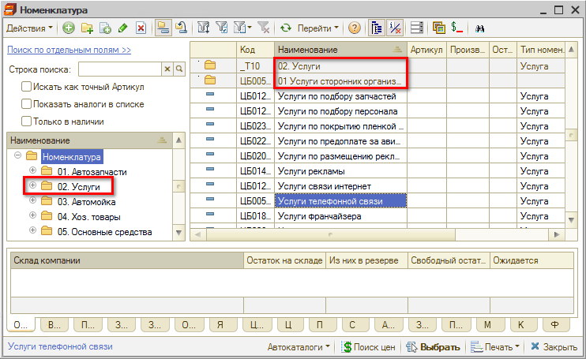
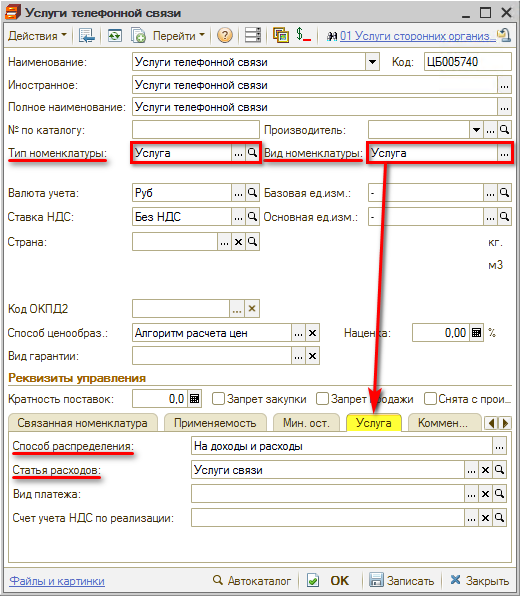

# Как создать карточку услуги

<table><tr><td><b>Время чтения:</b> 2 мин.</td><td><b>Обновлено:</b> 11.07.2022</td></tr></table>

В справочнике *“Номенклатура”* помимо карточек товаров находятся **карточки услуг** (см. уроки [*Номенклатура*](../../Урок%204.%20Запчасти%20и%20автоработы/Как%20работать%20со%20справочником%20«Номенклатура»/nomenklatura.md) и [*Как добавить номенклатуру*](../../Урок%204.%20Запчасти%20и%20автоработы/Как%20добавить%20номенклатуру/kak-dobavit-nomenklaturu.md)). 
Карточки услуг используются в учете [*доходов и расходов*](../Как%20отразить%20расходы%20компании%20%28аренда,%20электроэнергия,%20и%20т.д.%29/kak-otrazit-raskhody-kompanii-arenda-elektroenergiya-i-td.md) компании, [*субподрядных работ*](../Как%20отразить%20оказание%20услуг%20субподряда/kak-otrazit-okazanie-uslug-subpodryada.md), в *Шинном отеле* и др.

Для удобства поиска и работы с карточками услуг как правило в справочнике создается отдельная группа *Услуги*:

При создании карточки услуги требуется выбрать *тип номенклатуры “Услуга”* и *вид номенклатуры “Услуга”* – при этом в информационной панели карточки номенклатуры отобразится дополнительная вкладка *“Услуга”*:

Во вкладке “Услуга”:

- Поле *“Способ распределения”* устанавливает способ распределения доходов при проведении документа: сумма услуг распределяется либо на доходы и расходы, либо на себестоимость перечисленных в документе товаров.
- Поле *“[Статья расходов](../Как%20добавить%20статью%20дохода-расхода/kak-dobavit-statyu-dokhodaraskhoda.md)”* задает статью доходов и расходов (выбирается из справочника “Статьи доходов и расходов”).

*Например*, для [учета расходов компании](../Как%20отразить%20расходы%20компании%20%28аренда,%20электроэнергия,%20и%20т.д.%29/kak-otrazit-raskhody-kompanii-arenda-elektroenergiya-i-td.md) создаются карточки услуг со способом распределения *“На доходы и расходы”* и статьей расходов *“Услуги сторонних организаций”*.

---

**Теги:** доходы и расходы, услуга, номенклатура, карточка услуги

